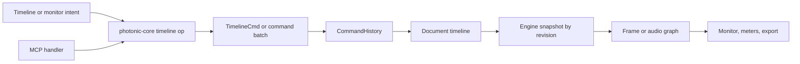
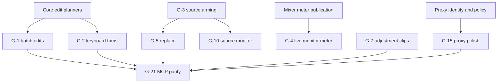

# 19 — Editing Velocity and Shot Management

**Status:** Implementation reference  
**Date:** 2026-07-10  
**Audience:** Photonic maintainers and implementation agents  
**Document type:** Internal technical reference  
**Scope:** G-1–G-5, G-7–G-9, G-13–G-15, G-21

## 1. Purpose

Lock implementation contracts for round-two NLE editing velocity and shot management. Preserve shipped behavior. Specify only missing slices as future work. No product-code change is authorized by this document.

Normative inputs:

- `docs/specs/video-editor/SPEC.md`
- `docs/specs/video-editor/01-data-model.md`
- `docs/specs/video-editor/02-engine.md`
- `docs/specs/video-editor/04-ui-mode-timeline.md`
- `docs/specs/video-editor/09-audio-mixer.md`
- `docs/specs/video-editor/10-mcp-tools.md`
- `docs/specs/video-editor/11-testing-phasing.md`
- `docs/specs/video-editor/13-ux-components.md`
- `docs/specs/video-editor/17-nle-parity-round2.md`
- `DESIGN.md`
- [20 — Pro Editing Workflows](20-pro-workflows.md)
- [Video editor roadmap](ROADMAP.md)

## 2. Current implementation status

Status reflects read-only inspection on 2026-07-10. Status vocabulary is `done`, `partial`, or `open`. `partial` means useful code exists but roadmap acceptance or a required surface remains open.

| ID | Status | Territory | Evidence | Residual scope |
|---|---|---|---|---|
| G-1 | partial | `timeline-panel` / `core-timeline` | `app/command_center.rs`, `app/timeline/ops_bridge.rs`, `commands.rs`; `split_all_tracks`, close-gap variants, through-edit simplification | Move duplicated planning math into `photonic-core`; complete MCP coverage for close-all/simplify; decide disabled-clip cleanup scope |
| G-2 | partial | `timeline-panel` / `core-timeline` | `command_center.rs` Q/W/E and Shift+Q/W handlers; `commands.rs` bindings; sync-lock expansion in `ops_bridge.rs` | Linked-A/V policy; core ownership; MCP parity; cross-track acceptance tests |
| G-3 | partial | `timeline-panel` | `command_center.rs::timeline_match_frame`, `timeline_reveal_in_project`; MCP `match_frame` | Source-monitor presentation depends on [G-10](20-pro-workflows.md#4-g-10--source-monitor-and-true-source-marks); fallback clip-priority decision |
| G-4 | partial | `monitor` / `photonic-video-engine` | Meter UI/ballistics in `app/monitor.rs`; documented `EngineBridge::master_level` seam in `app/engine.rs` | Publish real `Mixer::output_meter()` snapshot through engine status |
| G-5 | partial | `core-timeline` | `timeline::ops::replace_clip_source`; timeline context menu; MCP `replace_clip_source` | EOF behavior verification; Alt-drop path; source-probe validation |
| G-6 | done | `timeline-panel` | Source-patch boxes and target-track routing are wired through Insert, Overwrite, and Paste | Out of scope here; protected behavior, do not regress |
| G-7 | partial | `photonic-video-engine` / `timeline-panel` | Core `add_adjustment_clip`, frame-graph re-rooting, eval tests, and MCP `insert_adjustment_clip` exist | GUI create command/menu/ops-bridge path; timeline paint clarity; golden coverage |
| G-8 | partial | `timeline-panel` | `app/timeline/mod.rs::draw_navigator` | Accessibility, extreme-range precision, per-tab state audit |
| G-9 | partial | `panels-video` | `clip_inspector.rs` hosts `keyframe_editor::draw_embedded`; floating `draw_window` retained | Shared-state regression tests; layout/a11y polish |
| G-13 | open | `timeline-panel` | `TimelineTool` enum and session field in `app/mod.rs` only | Toolbar, drag bias, cursor hints, per-tab state |
| G-14 | partial | `timeline-panel` | Per-track height wrench menu in `timeline/tracks.rs` | Select-forward/all-tracks; thumbnail/waveform/name display options |
| G-15 | partial | `photonic-video-engine` | Attach (G-15A); `ProxyMode` toggle; on-import L7 + `generate_proxies` checkbox | Full ingest-settings modal, size thresholds, batch attach-by-name |
| G-21 | partial | `photonic-mcp` | MCP tools for G-1 add-edit/close-gap, G-3 match-frame, G-5 replace, G-7 adjustment, G-11 speed, G-12 text | Missing GUI-verb parity; duplicated GUI/MCP edit planning; acceptance-story coverage |

G-6 target routing is a dependency for G-1/G-2/G-5. Preserve explicit video/audio targets, enabled/locked validation, and deterministic fallback behavior.

## 3. Shared architecture contract

Rules:

- `photonic-core::timeline` owns deterministic edit planning. GUI and MCP must not keep equivalent private planners.
- GUI owns selection, playhead, navigator, armed tools, source arming, display options, and proxy playback mode.
- Document owns clips, tracks, proxy references, project ingest policy, and active sequence.
- `CommandHistory` owns every document mutation. One user verb produces zero or one undo entry.
- Engine owns decode, graph evaluation, proxy selection, meters, caches, and worker threads.
- Missing media/proxies never corrupt document state. Originals remain correctness source; export always uses originals.

## 4. G-1 — Add Edit, Close Gap, and Simplify Sequence

G-1 is four independent verbs under one roadmap ID.

### 4.1 G-1A — Add Edit to All Tracks

| Concern | Contract |
|---|---|
| Status/scope | `partial`. Split behavior exists; core extraction and parity closure remain. Split every clip whose span strictly contains playhead on every unlocked audio/video track. Clip edges, gaps, locked tracks: no-op. |
| User outcome | One `Ctrl+Shift+K` cut across program stack. |
| Dependencies/ownership | Existing `split_clip`; core planner should own target enumeration. GUI owns shortcut and playhead. |
| State/model | No schema change. New right-hand `ClipId` per split. Preserve source, speed, effects, grade, transitions, link metadata, and automation according to existing split contract. |
| Operation | `add_edit_all_tracks(project, sequence, at) -> Result<Vec<TimelineCmd>, EditError>`. Stable order: video tracks bottom-to-top, then audio tracks; clips in track order. |
| UI/command | `video.split_all_tracks`; rebindable; disabled only outside video mode or without active sequence. |
| MCP | Existing `add_edit_all_tracks`. Return `split_count` and new right-hand IDs. |
| Undo/serialization | Entire fan-out = one batch undo entry. No-op creates no history entry. Normal timeline serialization. |
| Errors/edges | Malformed overlapping track: return validation error before mutation. Track lock wins. Split at transition overlap follows clip-span ownership; transitions remain attached per split semantics. |
| Runtime | O(track count + clips intersecting tick). No decode/GPU work. Engine invalidates through revision/hash changes. |
| Security/offline | Pure document edit; works offline and with offline media. |
| Tests | Mixed A/V stack; locked lanes; boundary tick; speed-ramped clip; linked clips; undo/redo identity; GUI/MCP state equivalence. |
| Acceptance | One invocation splits all and only eligible clips; one undo restores byte-equivalent timeline state. |
| Rollout/deferrals | Core extraction before adding more consumers. No “split all targeted tracks only” variant in this item. |
| Blockers | None. |

### 4.2 G-1B — Close Gap at Playhead

| Concern | Contract |
|---|---|
| Status/scope | `partial`. GUI/MCP behavior exists; duplicated planning remains. Close containing internal/leading gap on one track or every unlocked track. Trailing empty space is not a gap. |
| User outcome | Remove blank program interval without selecting downstream clips. |
| Dependencies/ownership | Core planner owns `close_gap_plan`; current GUI/MCP duplicate must converge. Sync-lock behavior uses same ripple policy as other edits. |
| State/model | Timing deltas only. First post-gap clip and later clips shift left by exact gap width. |
| Operation | `close_gap(project, sequence, at, track: Option<TrackId>) -> Result<Vec<TimelineCmd>, EditError>`. `None` means every unlocked track. |
| UI/command | Context menu for one track; `video.close_gap` for playhead/all-track behavior. Show disabled reason when no closeable gap. |
| MCP | Existing `close_gap`; keep optional `track_id`. |
| Undo/serialization | One `RippleEdit` per changed track inside one batch. No-op: no history. |
| Errors/edges | Negative start forbidden. Locked track skipped for all-track call; explicit locked track returns `TrackLocked`. Exact boundary on prior end counts as gap start only when next clip begins later. |
| Runtime | O(clips after gap). No media access. |
| Security/offline | Pure edit; offline-safe. |
| Tests | Leading/internal/trailing gaps; mixed track gaps; sync-lock; locked track; no-op; undo/redo; GUI/MCP parity. |
| Acceptance | All requested gaps close by exact tick deltas; no clip overlaps; one undo restores all tracks. |
| Rollout/deferrals | Replace GUI/MCP copies with core op first. |
| Blockers | None. |

### 4.3 G-1C — Close All Gaps

| Concern | Contract |
|---|---|
| Status/scope | `partial`. GUI behavior exists; core/MCP closure remains. Repack each unlocked track left-contiguous while preserving its first clip start. |
| User outcome | Compact each track without moving its initial placement. |
| Dependencies/ownership | Same core ripple planner as G-1B. |
| State/model | Clip starts change; duration/source timing unchanged. Cross-track synchronization is not inferred. |
| Operation | `close_all_gaps(project, sequence, tracks: TrackScope)`. `TrackScope = One | UnlockedAll`. |
| UI/command | `video.close_gaps`; command palette and timeline wrench action. |
| MCP | Add `close_all_gaps`; do not overload `close_gap` with an absent tick. |
| Undo/serialization | One batch. No-op: no entry. |
| Errors/edges | Preserve leading offset. Locked tracks untouched. Adjustment/text/nested clips behave like ordinary clips. |
| Runtime/security | Pure O(total clips); offline-safe. |
| Tests/acceptance | Multiple gaps compact deterministically; first start preserved; one undo restores all starts. |
| Rollout/deferrals | Cross-track “remove vertical program gaps” is separate because it needs program-level occupancy semantics. |
| Blockers | None. |

### 4.4 G-1D — Simplify Sequence

| Concern | Contract |
|---|---|
| Status/scope | `partial`. Existing command means lossless through-edit removal only. Merge adjacent clips when source-time continuity and every render/audio property match. Does not remove disabled clips or close gaps. |
| User outcome | Remove redundant cuts without changing output. |
| Dependencies/ownership | Core owns `is_through_edit` and batch planning. |
| State/model | First clip survives; duration expands; redundant clips removed. Preserve surviving ID for references. |
| Operation | `simplify_sequence(project, sequence, track_scope) -> SimplifyPlan`. Plan reports merged runs and skipped reasons. |
| UI/command | `video.simplify_sequence`; confirmation not required because undoable and pixel/audio-preserving. Optional dry-run summary may precede commit. |
| MCP | Add `simplify_sequence`; optional `dry_run`; return merged IDs/count. |
| Undo/serialization | Remove redundant clips before extending survivor; one batch. |
| Errors/edges | Do not merge across transition, differing speed/easing, effect, grade, transform, reframe, composition, audio, enable, label, link/multicam/title metadata, or discontinuous source time. |
| Runtime | O(total clips); equality/hash checks only. |
| Security/offline | Pure edit; offline-safe. |
| Tests | Every equality field gets a negative case; speed-ramp source continuity; linked/multicam/text clips; output golden before/after; undo identity. |
| Acceptance | Simplification changes no rendered frame or mixed PCM at sampled ticks. |
| Rollout/deferrals | “Delete disabled clips” remains separate, potentially content-changing cleanup. |
| Blockers | Product decision: retain the shipped lossless meaning, or add an explicitly destructive cleanup mode. Do not silently broaden current command. |

## 5. G-2 — Keyboard Trims

| Concern | Contract |
|---|---|
| Status/scope | `partial`: GUI commands exist; core/MCP/link-policy closure remains. Q start ripple-trim, W end ripple-trim, E extend selected out-point, Shift+Q/W roll nearest previous/next flush cut. |
| User outcome | Frame-accurate trimming without pointer travel. |
| Dependencies/ownership | Core `trim_clip`, `roll_edit`, ripple planning; GUI target resolution + playhead. G-21 for headless parity. |
| State/model | Timing and source-in deltas only. Q uses `speed.source_delta()`; speed ramps remain correct. |
| Operations | Add core `trim_to_playhead` and `roll_to_playhead` planners so GUI does not compose policy privately. Target priority: selected eligible clip, then eligible clip under playhead, then no-op. Locked tracks excluded. |
| UI/commands | `video.trim_start_to_playhead` Q; `video.trim_end_to_playhead` W; `video.extend_edit` E; Shift+Q/W rolls. Text input and modal focus suppress shortcuts. |
| MCP | Add exact operations using explicit `sequence_id`, `track_id`/`clip_id`, `at_*`; MCP never depends on GUI selection. |
| Undo/serialization | Each keypress = one undo entry, including sync-lock propagation. Repeats do not coalesce across discrete keypresses. |
| Errors/edges | Playhead must be interior for Q/W. E clamps to next clip and source availability policy. Roll rejects non-flush boundaries or zero-duration results. Lock refusal must be atomic. |
| Runtime/threading | Pure tick math; revision invalidates engine snapshot. |
| Security/offline | Offline-safe. |
| Tests | Target priority; Q/W at edges/gaps; speed ramp; roll before/after; sync-lock; locked linked partner; shortcut focus suppression; GUI/MCP equivalence. |
| Acceptance | Exact frame/tick result; no overlaps; synchronized tracks move per policy; one undo restores all changes. |
| Rollout/deferrals | Existing behavior stays until core planners replace GUI composition. |
| Blockers | **D-G2-01:** linked-A/V propagation. Recommendation: linked partners participate atomically when the edit changes shared timing; any locked required partner rejects the verb. Sync-lock then propagates downstream movement. Review before changing shipped single-target behavior. |

## 6. G-3 — Match Frame and Reveal in Project

| Concern | Contract |
|---|---|
| Status/scope | `partial`. Match Frame/reveal exist; source-monitor and overlap-priority closure remain. Match Frame arms source at `source_in + speed.source_delta(playhead - start)`. Reveal selects media-pool asset. |
| User outcome | Move from timeline shot to exact source frame or source asset. |
| Dependencies/ownership | Source arming in timeline session; G-10 displays/auditions it. Media Pool owns selection/scroll. |
| State/model | `PendingSource` remains session-only: source, source in/out, matched scrub tick, name, kind. No document mutation. |
| Operations | Core helper `match_source_tick(clip, sequence_tick)`. Generator/adjustment/text sources return no asset but may still return source-local tick. |
| UI/commands | F = Match Frame. “Reveal in Media Pool” in clip context menu and command palette. Reveal opens Media Pool drawer and scrolls selected row into view. |
| MCP | Existing read-only `match_frame`. Reveal has no MCP value beyond returned `asset_id`; `list_media/get_clip` already expose it. |
| Undo/serialization | Session-only; no undo, dirty bit, autosave, or serialization. |
| Errors/edges | Tick outside clip span: `TickOutOfRange`. Offline asset still reveals. Nested sequence match returns nested-sequence reference; G-10 chooses open-nest vs source view. |
| Runtime/security | Pure math plus UI selection; no file read. Do not reveal filesystem path in UI logs unless user requests it. |
| Tests | Constant/reverse/ramped speed; selected-vs-overlap priority; offline; non-asset; nested; MCP result equality. |
| Acceptance | Armed source tick resolves to same decoded frame as program clip at playhead. Reveal focuses exact asset. |
| Rollout/deferrals | Source preview/marks belong to G-10. |
| Blockers | **D-G3-01:** fallback when multiple unselected video tracks cover playhead. Recommendation: topmost enabled video clip, then enabled audio; current first-iteration behavior must be audited before change. |

## 7. G-4 — Program-Monitor Master Meter

| Concern | Contract |
|---|---|
| Status/scope | `partial`. UI and ballistics exist; live tap missing. Finish engine publication only. |
| User outcome | Continuous L/R peak, RMS, hold, and clip visibility beside program picture. |
| Dependencies/ownership | `photonic-video::audio::Mixer::output_meter`; engine session/status publisher; GUI monitor renderer. |
| State/model | Add session-only `MasterLevel { peak: [f32;2], rms: [f32;2], true_peak: Option<[f32;2]> }` to `EngineStatus` or a dedicated lock-free watch. No document field. |
| Contract | Mixer worker clones output-meter handle once. Engine status samples atomics without locks/allocations. Absent audio/device yields `None`, displayed at floor. Meter source = final output after master fader. |
| UI | Existing 24px `surface-widget` column; `success`→`warning`→`error` fills; -60 dB to +12 dB; clip latch above -0.3 dBTP; 1.2s hold; click LED resets presentation latch only. Tooltip shows peak and tap-unavailable reason. |
| MCP | `get_audio_meters` returns same snapshot when engine mixer is active; headless without audio device returns structured unavailable state, not fabricated values. |
| Undo/serialization | None. |
| Errors/edges | No active sequence/audio; paused playback; mute; xrun; device loss. Last valid level decays to floor; never freeze indefinitely. |
| Performance/threading | Audio callback remains lock/alloc-free. Atomics use relaxed publication per block; UI reads once/frame. No repaint when meter at stable floor and engine idle. Reuse `02-engine.md` §8 and SPEC SS-1/SS-3 budgets; add no new numeric budget. |
| Security/offline | Audio amplitude only; no samples leave process. Fully offline. |
| Tests | Atomic snapshot; channel independence; mute/silence; peak/RMS math; hold/clip reset; device-unavailable; monitor and mixer show same tap within tolerance. |
| Acceptance | Known stereo tone produces expected dB on both meter surfaces; clip LED latches/reset works; audio callback contract unchanged. |
| Rollout/deferrals | True-peak oversampling may reuse limiter/R128 path; peak/RMS required first. |
| Blockers | None; seam is documented in `app/engine.rs`. |

## 8. G-5 — Replace With Clip / Replace Edit

| Concern | Contract |
|---|---|
| Status/scope | `partial`: source replacement exists; validation and drag affordance remain. Preserve timeline slot and clip treatment. |
| User outcome | Swap shot while retaining duration, transforms, effects, grade, transitions, audio settings, labels, links, and keyframes. |
| Dependencies/ownership | Core `replace_clip_source`; source arm from G-3/G-10 or Media Pool selection; engine decode. |
| State/model | No new field. `ClipSource` and optional `source_in` change; all other clip fields remain byte-equal. |
| Operation | Existing `replace_clip_source(project, sequence, track, clip, new_source, new_source_in)`. Nested-cycle and adjustment-composition guards remain mandatory. |
| UI/commands | Context menu shipped. Add Alt-drop onto clip; armed Match Frame source outranks Media Pool selection; show candidate name/tick before commit. |
| MCP | Existing `replace_clip_source`; return preserved slot and effective source range. |
| Undo/serialization | One whole-clip diff; one undo. Proxy refs remain media-asset state, not copied to clip. |
| Errors/edges | Wrong track kind, nested cycle, missing asset, negative source-in, non-positive duration, incompatible adjustment composition. Source shorter than slot: video holds final valid frame; audio outputs silence after EOF; never loop implicitly. Stills/text/solid hold naturally. |
| Performance/cache | Invalidate decode/node results referencing old source; unchanged downstream effect hashes may reuse only when input hash matches. No synchronous probe/decode on GUI thread. Reuse `02-engine.md` §8 seek/warmup budgets and SPEC SS-1/SS-3; add no new numeric budget. |
| Security/offline | Referenced paths remain inside Media Pool. Offline replacement allowed only with explicit warning; renders placeholder until relinked. |
| Tests | Every preserved field; shorter/longer source; reverse/ramp; nested cycle; adjustment; offline; Alt-drop; undo; GUI/MCP render parity. |
| Acceptance | Program slot boundaries and treatments remain unchanged; only source imagery/audio changes; export uses original source. |
| Rollout/deferrals | Slip-to-match heuristics and automatic face matching deferred. |
| Blockers | None. EOF policy above resolves prior trim/freeze/loop ambiguity. |

The EOF rule is a deliberate resolution of architecture decision S8. It overrides the architecture review’s default trim-to-slot recommendation: Photonic preserves the existing timeline slot, holds final video, and emits audio silence after EOF. Do not flip this policy without amending this spec and its fixtures.

## 9. G-7 — Adjustment-Layer Clips

| Concern | Contract |
|---|---|
| Status/scope | `partial`: core, frame graph, tests, and MCP exist. GUI create path is missing. Harden stacked/transition behavior. |
| User outcome | Apply effects/grade to composited lower tracks over adjustment span. |
| Dependencies/ownership | `ClipSource::Adjustment`; frame-graph fold; Clip Inspector effect/grade controls. |
| State/model | Ordinary video-track clip with no media source. Composition graph prohibited. Transform is ignored unless a future masked-adjustment spec enables it. |
| Compile contract | At tick inside adjustment span, take accumulated lower-track image, apply adjustment effect chain then grade, and replace accumulator. Do not merge transparent source. Multiple adjustments apply bottom-to-top. |
| UI/commands | **Residual, not shipped:** add `video.add_adjustment_clip` (or equivalent), timeline menu/command routing, and `ops_bridge` call into core `add_adjustment_clip`. Default duration uses work range when valid, otherwise project default; clip label “Adjustment”. |
| MCP | Existing `insert_adjustment_clip`; normal effect/grade tools target returned clip. |
| Undo/serialization | Insert/effect/grade edits use normal timeline commands. Serde tag `adjustment`; no asset/proxy. |
| Errors/edges | First/bottom track has no lower image: transparent result through stack. Disabled adjustment ignored. Locked target rejects insertion. Transitions on adjustment clips rejected until defined. |
| Performance/cache | Re-roots already-composited lower hash. Cache key includes lower accumulator + adjustment params. Avoid duplicate lower-stack evaluation. Reuse `02-engine.md` §8 graph compile/eval budgets and SPEC SS-1/SS-3; add no new numeric budget. |
| Security/offline | No external asset; fully offline. Effects retain their own licensing constraints. |
| Tests | Two lower clips across adjustment span; stacked adjustments; opacity/effect bypass; disabled/locked; bottom-track; no Merge introduced; CPU/GPU golden parity. |
| Acceptance | Every lower-track pixel inside span receives stack once; upper tracks remain unaffected; outside span matches no-adjustment control. |
| Rollout/deferrals | Masks and node compositions on adjustments deferred to explicit graph semantics. Timeline `clips.rs` still paints Adjustment as an empty labeled fill; that lane/thumbnail paint is only edit-surface chrome. Do not move graph re-rooting into timeline paint. Add a clear adjustment visual after the GUI create path. |
| Blockers | None. |

## 10. G-8 — Timeline Navigator

| Concern | Contract |
|---|---|
| Status/scope | `partial`: navigator/scrollbar exists; acceptance/a11y audit remains. |
| User outcome | Pan and zoom long sequences with a visible viewport thumb. |
| Dependencies/ownership | `TimelineView`; sequence extent; timeline panel only. |
| State/model | Session-only scroll/zoom. Must be per document tab. Full extent includes zero, clip ends, markers, and work-range end. |
| Interaction | Drag body = pan. Drag ends = zoom around opposite edge. Click track = page viewport. Minimum thumb remains grabbable but logical mapping uses unclamped extent. |
| UI/commands | Bottom strip above panel edge; same `surface-widget`/`primary` tokens. Keyboard zoom/pan remains equivalent. |
| MCP/undo/serialization | Not applicable; no document mutation or MCP tool. Optional AppPreferences may persist global feel, never project timing. |
| Errors/edges | Empty sequence; negative/corrupt ticks; one-frame sequence; enormous tick range; resize during drag. Clamp without NaN/overflow. |
| Performance | O(total tracks) extent calculation only on revision/format change, then cached. Pointer math uses f64 at UI edge. |
| Security/offline | None; offline-safe. |
| Tests | Tick↔pixel round trip; min thumb; end drags; empty/huge extent; tab switch; keyboard equivalence. |
| Acceptance | User can reach any sequence tick and fit full sequence without losing precision or changing document state. |
| Rollout/deferrals | Minimap thumbnails deferred. |
| Blockers | None. |

## 11. G-9 — Effect-Controls Unification

| Concern | Contract |
|---|---|
| Status/scope | `partial`: embedded keyframe editor exists and floating editor remains; regression/a11y closure remains. |
| User outcome | Motion, opacity, effects, and animation curves live in one selected-clip surface. |
| Dependencies/ownership | Clip Inspector, keyframe editor, generic `AnimProps`, PanelAction boundary. |
| State/model | One shared editor-state blob keyed by clip/property; session-only viewport/selection. Document keyframes unchanged. |
| UI | Embedded collapsible “Animation” section. Floating window is optional second view, not separate model. Selection changes retarget both. Docked editor obeys drawer width and exposes numeric keyboard fallback. |
| Commands/MCP | Existing generic keyframe commands/tools. Dock/float controls create no document commands. |
| Undo/serialization | Keyframe drags coalesce per gesture; panel layout/session state not serialized in document. |
| Errors/edges | Deleted target closes/clears editor; orphaned PropPath remains visible with diagnostic; multi-selection shows common properties only or explicit unsupported state. |
| Performance | Curves render only visible tracks/range; no engine decode. Preview invalidates affected tick range via history revision. |
| Security/offline | Fully offline. |
| Tests | Same edit from dock and float yields identical command; simultaneous views; target deletion; orphaned paths; narrow drawer; keyboard edit. |
| Acceptance | No parameter/keyframe state diverges between inspector and floating editor; all edits undo once. |
| Rollout/deferrals | Multi-clip curve editing remains separate. |
| Blockers | None. |

## 12. G-13 — Modal Timeline Tool Palette and Cursor Hints

| Concern | Contract |
|---|---|
| Status/scope | `open`. Scaffold only. Implement Select, Razor, Hand, Slip, Slide palette and hover-zone cursors. Modifiers remain authoritative. |
| User outcome | Discover rich trim grammar without memorizing modifier chords. |
| Dependencies/ownership | `TimelineTool` session enum; `interact::resolve_drag_kind`; timeline mini-toolbar. |
| State/model | Move `timeline_tool` into per-`DocTab` session state. No document schema. `Razor` replaces separate `timeline_razor_active` after migration. |
| Resolution contract | Select: current zone/modifier grammar. Razor: click split. Hand: drag scroll only. Slip: body drag defaults Slip. Slide: body drag defaults Slide. Explicit Alt/Shift chord overrides armed bias for expert consistency. |
| UI/commands | Segmented icon strip using `selectable_label`/selected-toolbar tokens. Rebindable commands `video.tool_select`, `video.tool_razor`, `video.tool_hand`, `video.tool_slip`, `video.tool_slide`. Cursor map: move, resize-edge, roll, slip, slide, razor, grab. |
| MCP | Tool mode is GUI-only. Underlying split/slip/slide operations already have or require direct MCP verbs. |
| Undo/serialization | Mode changes: no undo/dirty state. Resulting edits use existing one-gesture commands. |
| Errors/edges | Locked lane uses prohibited cursor and no drag. No clip under Razor click: no-op. Hand never selects/mutates. Modal/text input focus suppresses tool keys. |
| Performance | Hover resolver runs against visible clips only. Cursor selection must not allocate. |
| Security/offline | None. |
| Tests | Every mode × hover zone × modifier; locked tracks; cursor mapping; tab isolation; razor migration; underlying undo. |
| Acceptance | Armed tool predicts drag result visually; modifier behavior remains unchanged; mode never leaks across tabs. |
| Rollout/deferrals | Pen/text timeline tools belong to title workflow, not this palette. |
| Blockers | None. |

## 13. G-14 — Track Select Forward and Display Menu

| Concern | Contract |
|---|---|
| Status/scope | `partial`. Height menu exists. Implement select-forward and global display options. |
| User outcome | Select downstream clips quickly; control timeline visual density. |
| Dependencies/ownership | Timeline selection/session; visible-clip painter; existing wrench popup. |
| State/model | Add `TimelineDisplayOptions { thumbnails, waveforms, clip_names, fx_badges }` to per-tab session with AppPreferences defaults. Do not add display booleans to `Track` document model. |
| Select contract | `select_forward(sequence, at, track_scope, include_locked) -> Vec<ClipId>`. Default scope = clicked track; Shift = all tracks. Include clips with `start >= at`; optionally include clip spanning `at` when click hits it. Locked tracks selectable for inspection but not editable. |
| UI/commands | Tool/action in mini-toolbar and context menu. Wrench retains height presets and adds checkboxes for thumbnails, waveforms, names, badges. Keyboard fallback selects from playhead. |
| MCP | Selection/display are GUI session state; no MCP. Agents use `list_clips` filters. |
| Undo/serialization | No undo, document dirtying, or project serialization. Preferences persist defaults only. |
| Errors/edges | Empty track; hidden/disabled clips remain selectable; caption lanes excluded unless explicit future scope. |
| Performance | Selection via sorted `partition_point`; display toggles must stop cache requests when hidden, not merely hide paint. |
| Security/offline | Hiding thumbnails/waveforms prevents new decode/cache work; existing cache retained per policy. |
| Tests | One/all tracks; spanning clip; locked; option persistence; no hidden cache requests; keyboard focus. |
| Acceptance | Downstream set is deterministic; display toggles update immediately without timeline mutation. |
| Rollout/deferrals | Per-track overrides deferred; global/per-tab options first. |
| Blockers | None. |

## 14. G-15 — Proxy Workflow Polish

G-15 becomes three separately shippable contracts.

All G-15 work reuses `02-engine.md` §8 cached/cold seek budgets and SPEC SS-1/SS-3. Proxy polish adds no new numeric performance budget; original-media export remains the SS-3 authority.

### 14.1 G-15A — Attach Proxies

| Concern | Contract |
|---|---|
| Status/scope | `partial` (lean MVP landed). Link user-supplied proxy without transcoding; batch attach-by-name / full comparison UI still open. |
| User outcome | Reuse camera/editor proxies by file match. |
| Dependencies/ownership | Media Pool, ffprobe, proxy resolver, timeline media model. |
| State/model | Extend `ProxyRef` with `origin: Generated | Attached`, `fingerprint`, and probed duration/frame-rate/resolution. Serde defaults preserve old refs as `Generated`. |
| Operation | `attach_proxy(asset, path, match_policy)`. Validate readable local file, compatible stream kind, duration tolerance, frame-rate/timebase, and optional timecode/content fingerprint. Never mutate original asset path. |
| UI/command | Media Pool context menu “Attach Proxy…”. Show candidate comparison and mismatch override warning. Batch attach by filename/timecode with preview. |
| MCP | Add `attach_proxy` and `detach_proxy`. MCP args require explicit paths and return validation report. |
| Undo/serialization | Proxy ref mutation is undoable. Detaching attached proxy never deletes user file. Generated-proxy removal may delete cache file after confirmation/job success. |
| Errors/edges | Missing path, wrong stream kind, duration/timecode mismatch, VFR, path alias to original, duplicate proxy, offline original. Override records warning state. |
| Performance/threading | Probe on worker job; hash head/tail/length; never block GUI. Cache invalidation after commit. |
| Security/privacy/licensing | No copying or upload. Canonicalize path for identity without exposing it in logs. Attached file remains user-owned. Codec handled through FFmpeg sidecar. |
| Tests/acceptance | Exact/mismatch cases; attached detach leaves file; generated remove deletes only cache-owned file; project move/relink; export ignores proxy. |
| Blockers | Match tolerance policy: recommend duration within one source frame and identical nominal frame rate/timecode when available; explicit override for VFR. |

### 14.2 G-15B — Toggle Proxies

| Concern | Contract |
|---|---|
| Status/scope | `partial`. Proxy mode exists; dedicated one-click control remains. |
| User outcome | Compare proxy/original without navigating settings. |
| State/model | Session-only `ProxyMode`; button toggles `ForceProxy` ↔ `ForceOriginal`. Preserve prior `Auto` as return mode only if UI exposes a three-state menu. |
| UI/command | Transport icon beside playback resolution; active state means ForceProxy. Long-click/menu selects Auto/Proxy/Original. Rebindable `video.toggle_proxies`. |
| MCP | Existing `set_proxy_mode`; optional `toggle_proxy_mode` unnecessary because agents can set explicit state. |
| Undo/serialization | No document mutation. AppPreferences may store default mode, never project export behavior. |
| Errors/edges | Missing/failed proxy falls back to original and surfaces badge; never black frame. Export always ForceOriginal. |
| Performance | Send engine command only on mode change; invalidate decode/node caches by source identity. |
| Security/offline | Fully local. |
| Tests/acceptance | Mode icon/state; missing fallback; mixed proxy availability; cache swap; export original. |
| Blockers | None. |

### 14.3 G-15C — Ingest Settings

| Concern | Contract |
|---|---|
| Status/scope | `partial`. `ProjectVideoSettings.generate_proxies` is undoable + Media Pool “On import” checkbox; L1–L4 completion auto-queues L7 for eligible video. Full ingest-settings modal, size threshold, and MCP still open. |
| User outcome | Generate proxies automatically on import under explicit project policy. |
| State/model | Replace/extend boolean with additive `ProxyIngestSettings { enabled, profile, size_threshold, codec_policy }`; old `true` migrates to enabled default profile. |
| Operation | Import commits asset stub first, probes asynchronously, then queues proxy only when policy matches. Proxy completion commits one asset update. Import remains usable while job runs. |
| UI/command | Media Pool “Ingest Settings…”; import dialog summary; per-asset pending/progress/failure badge and retry. |
| MCP | Add `set_ingest_settings`/`get_ingest_settings`; `import_media` honors setting unless explicit `generate_proxy` override supplied. |
| Undo/serialization | Settings document mutation undoable/persisted. Generated cache files are derived; undo detaches refs and schedules safe cache cleanup, never blocks history. |
| Errors/edges | FFmpeg unavailable, unsupported codec, cancellation, duplicate import, insufficient disk, project unsaved/no sidecar path. Fall back to original. |
| Performance/threading | Bounded worker queue; no more than configured transcodes; import/probe and proxy jobs report separately. |
| Security/privacy/licensing | Local subprocess only; quote paths safely; no network. Disk estimate before queue. Generated files live only in project/cache-owned location. |
| Tests/acceptance | Policy match/non-match; cancel/retry; crash recovery; unsaved project; disk failure; original remains playable; settings round-trip. |
| Blockers | Proxy profile catalog must be locked with import/export spec; current fixed all-intra H.264 profile is default. |

## 15. G-21 — MCP Parity for New Editing Operations

| Concern | Contract |
|---|---|
| Status/scope | `partial`. Parity ships with each operation, never as a tail-end batch. |
| User outcome | Headless agent can create same timeline state as GUI. |
| Dependencies/ownership | Core pure ops are mandatory. MCP deserializes/validates only; no GUI-policy copies. |
| State/model | No MCP-only document fields. Session-only tools use engine bridge and create no history. |
| Tool contract | Exact time args use ticks > timecode > seconds. Mutations return changed IDs/counts and one undo checkpoint. Read operations return structured error codes. |
| Current coverage | `add_edit_all_tracks`, `close_gap`, `match_frame`, `replace_clip_source`, `insert_adjustment_clip`, `set_clip_speed`, `insert_text_clip`. |
| Required additions | Unblocked: `close_all_gaps`, `simplify_sequence`, explicit Q/W/E/roll planners, G-15 attach/ingest, [G-16 nest](20-pro-workflows.md#7-g-16--nested-sequence-ui), and [G-18 transcript edits](20-pro-workflows.md#9-g-18--text-based-transcript-editing). G-8/G-9/G-13/G-14 remain GUI-session-only. |
| SPEC-gated tools | G-20 multicam tools are excluded until SPEC’s multicam non-goal is amended under architecture decision S4. Design inventory lives in [20 §11](20-pro-workflows.md#11-g-20--multicam); it is not an authorized MCP backlog item. |
| Undo/serialization | Same core command/batch as GUI. Job completion observes document-before-history lock order. |
| Errors/edges | `TrackLocked`, `TickOutOfRange`, `CycleDetected`, `AssetOffline`, `ProxyMismatch`, `NotSupportedV1`, and validation payloads. No string-only branching. |
| Performance/threading | Read-only tools avoid history lock. Long proxy/probe tasks use job registry. No GUI dependency. |
| Security/privacy | Audit paths/args with redaction; never return provider tokens; local-file tools require explicit path. |
| Tests | Schema/args/dispatch registry; each GUI/core operation executed by MCP against same fixture; compare serialized state and render/audio outputs; job cancellation. |
| Acceptance | Every document-changing verb in this spec has a direct MCP route or a documented reason it is GUI-session-only. GUI/MCP state hashes match. |
| Rollout/deferrals | Add tool, schema, handler, docs, and acceptance test in same change as operation. |
| Blockers | Core extraction for G-1/G-2 must precede final parity; current duplicated close-gap planning is architectural debt. |

## 16. Dependency graph

## 17. Conflict-free implementation waves

No effort estimates. A later wave starts only after prerequisite contracts merge.

| Wave | Lane | Work | Primary files |
|---|---|---|---|
| 19-W0 | Core timeline | Extract G-1/G-2 planners; lock error types | `photonic-core/src/timeline/ops.rs`, commands/tests |
| 19-W0 | Video engine | Publish real master meter | `photonic-video/src/session.rs`, `audio/mixer.rs` |
| 19-W0 | Timeline UI | G-13 palette/cursors | `photonic-gui/src/app/timeline/*`, `app/mod.rs` |
| 19-W0 | Media/proxy | Proxy identity + attach validation | `photonic-core/.../media.rs`, `photonic-video/src/media/proxy.rs` |
| 19-W1 | Monitor UI | Consume meter tap; dedicated proxy toggle | `app/monitor.rs`, `app/engine.rs` |
| 19-W1 | Timeline UI | G-14 select-forward/display options | `app/timeline/*`, preferences |
| 19-W1 | Media Pool UI | Attach/ingest settings and jobs | video media-pool panel, panel actions |
| 19-W1 | MCP | Add tools backed by merged core/proxy contracts | `photonic-mcp/src/*` |
| 19-W2 | QA/docs | Cross-surface golden/state parity; update detailed specs | tests, MCP docs, roadmap |

## 18. Unresolved decisions

| ID | Decision | Recommendation | Blocks |
|---|---|---|---|
| D-G1-01 | Meaning of “Simplify Sequence” beyond through-edits | Keep current lossless command; add separately named destructive cleanup later | Disabled-clip cleanup only |
| D-G2-01 | Linked-A/V propagation for Q/W/E/roll | Atomic linked timing edits; locked partner rejects entire verb | G-2 parity sign-off/core planner |
| D-G3-01 | Fallback overlap priority | Selected first; otherwise topmost enabled video, then audio | G-3 UX sign-off |
| D-G15-01 | Attached-proxy match tolerance | Same nominal rate/timecode; duration within one frame; explicit VFR override | G-15A |
| D-G15-02 | Ingest profile catalog | Existing all-intra H.264 profile as default; catalog owned by import/export spec | G-15C UI copy/presets |

## 19. Definition of done

- Status matrix updated from verified code, not roadmap assumptions.
- Core owns every document edit plan used by both GUI and MCP.
- Every mutation is one undo entry and round-trips through serialization.
- Offline media/proxy failure degrades to placeholders/originals, never data loss.
- Live audio meter reads real engine data without touching callback safety.
- GUI-only session features never dirty project state.
- GUI/MCP operations produce equivalent timeline state and output.
- Protected round-one editing surfaces remain regression-covered:
  - G-6 source-patch boxes and target-track routing;
  - track locks/sync-lock/Solo and linked A/V;
  - Insert/Overwrite/Lift/Extract and copy/paste;
  - ripple/roll/slip/slide, razor, thumbnails/waveforms, labels, monitor scrub, playback resolution, Fit/100%, and shortcut rebinding.
