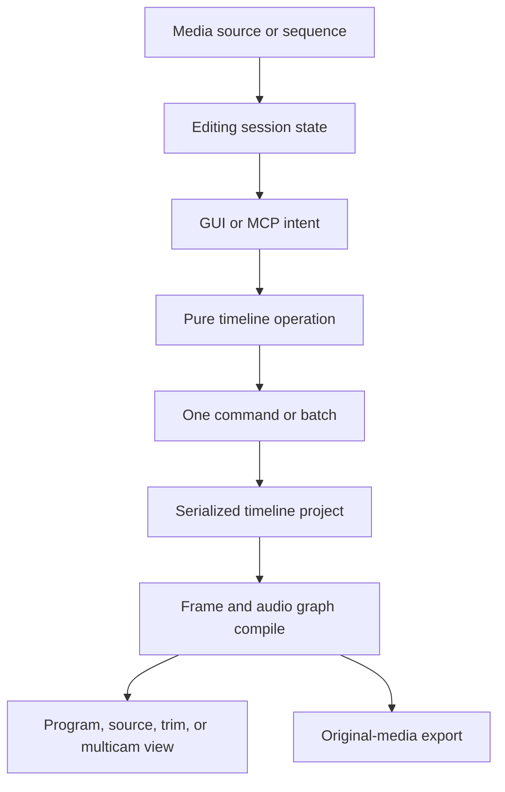
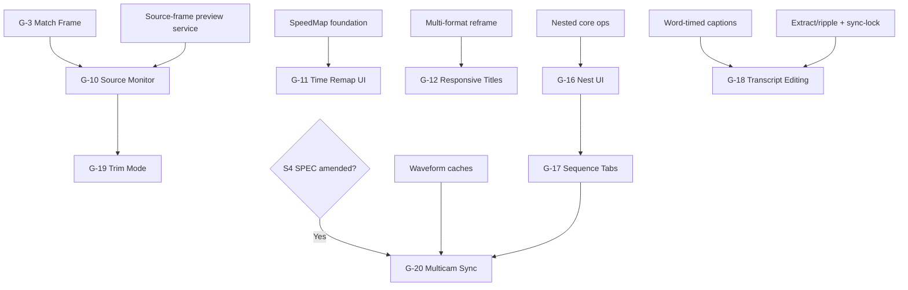

# 20 — Pro Editing Workflows

**Status:** Implementation reference  
**Date:** 2026-07-10  
**Audience:** Photonic maintainers and implementation agents  
**Document type:** Internal technical reference  
**Scope:** G-10–G-12, G-16–G-20

## 1. Purpose

Define implementation contracts for Photonic’s larger NLE workflows: source/program editing, variable speed, titles, nested sequences, sequence tabs, transcript editing, precision trim, and multicam. Preserve shipped foundations. Treat explicit stubs as unimplemented.

Normative inputs:

- `docs/specs/video-editor/SPEC.md`
- `docs/specs/video-editor/01-data-model.md`
- `docs/specs/video-editor/02-engine.md`
- `docs/specs/video-editor/03-render-color-pipeline.md`
- `docs/specs/video-editor/04-ui-mode-timeline.md`
- `docs/specs/video-editor/09-audio-mixer.md`
- `docs/specs/video-editor/10-mcp-tools.md`
- `docs/specs/video-editor/11-testing-phasing.md`
- `docs/specs/video-editor/13-ux-components.md`
- `docs/specs/video-editor/17-nle-parity-round2.md`
- `DESIGN.md`
- [19 — Editing Velocity and Shot Management](19-editing-velocity-shot-management.md)
- [Video editor roadmap](ROADMAP.md)
- [23 — Legal and Open-Source Implementation Routes](23-legal-open-source-implementation-routes.md) — accepted G-20 permissive/native route and S4 amendment; release evidence remains item-gated.

## 2. Current implementation status

Status reflects read-only inspection on 2026-07-10. Status vocabulary is `done`, `partial`, or `open`. Scaffolds are not user-visible completion.

| ID | Status | Territory | Evidence | Residual scope |
|---|---|---|---|---|
| G-10 | open | `monitor` / `photonic-video-engine` | `PendingSource`; `source_monitor_scrub`; `panels/video/source_monitor.rs` explicit stub | Single-surface source peek + true source marks (24 D-PM-1–3; no dual-pane); focus-aware commands |
| G-11 | partial | `core-timeline` / `timeline-panel` / `photonic-video-engine` | `SpeedMap::Keyframed`, eased integration, engine source-time mapping, inspector editor, MCP `set_clip_speed`, timeline badge | On-clip rubber band/Bezier UI, audio behavior, validation/golden/perf closure; amend stale `01-data-model.md` §5.1 non-goal text |
| G-12 | partial | `panels-video` / `core-timeline` / `photonic-video-engine` | `ClipSource::Text`, `TextClipContent`, core insert op, TextGen render, Titles panel presets/editor, MCP `insert_text_clip` | Responsive Position/Time, vector template library, drag placement, template MCP tools |
| G-16 | partial | `core-timeline` / `timeline-panel` | Core `create_nested_sequence`, `nested_target`, ancestry helpers and tests | GUI nest/open/breadcrumb workflow, multi-track policy, MCP tool |
| G-17 | open | `timeline-panel` | Session fields; `panels/video/seq_tabs.rs` explicit unused stub | Timeline header tabs, activation/close/reopen, per-tab view state |
| G-18 | open | `panels-video` / `core-timeline` | Caption/transcription infrastructure exists; `panels/video/transcript.rs` explicit stub | Transcript projection, span-to-timeline edit planning, filler removal, MCP |
| G-19 | open | `monitor` | No dedicated trim-mode implementation found | Trim session state, split monitor, loop playback, numeric offsets, commands |
| G-20 | legal-or-fixture-blocked (S4 accepted) | `photonic-video-engine` / `monitor` | `MulticamGroup`/angles; core create/set-angle ops; session fields; `multicam.rs` explicit stub | Sync corpus, decoder budget, sync analysis, multiview engine/UI, live cut semantics, MCP |

## 3. Shared pro-workflow architecture



Layer rules:

- `photonic-core::timeline` owns persistent types, pure time mapping, cycle/sync validation, and edit plans.
- `photonic-video` owns source preview, frame/audio evaluation, waveform correlation, multicam multiview, caches, and worker jobs.
- `photonic-gui` owns focus, open tabs, breadcrumbs, monitor layout, transcript selection, trim mode, and on-clip interaction.
- `photonic-mcp` calls core/service contracts with explicit IDs/ticks. It never emulates GUI selection.
- Session navigation does not alter clip content. Project-active sequence remains persisted per existing model.
- All rendering stays linear Rec.709/premultiplied through graph evaluation. UI overlays never enter export.

## 4. G-10 — Source Monitor and True Source Marks

G-10 contains **source-mark semantics** and **source audition** on the single central monitor. Presentation is amended by [24-preview-media-load.md](24-preview-media-load.md) (D-PM-1–3): **no permanent dual source/program panes**. Source peek retargets the same surface (`PreviewTarget::Asset`); sequence play wins while playing.

### 4.1 User and scope contract

| Concern | Contract |
|---|---|
| Status/scope | `partial`. Single-surface marks + peek + Match Frame + Insert/Overwrite handoff landed (24 D-PM). Dual-pane, source audio clock, and full source-monitor transport polish remain open. |
| User outcome | Load a clip, audition it on the one monitor, mark a source range, then perform 3-point Insert/Overwrite into the timeline. |
| Dependencies | [19 §6 G-3 Match Frame/source arming](19-editing-velocity-shot-management.md#6-g-3--match-frame-and-reveal-in-project), [19 §8 G-5 replacement arming](19-editing-velocity-shot-management.md#8-g-5--replace-with-clip--replace-edit), shipped G-6 source patch and Insert/Overwrite, media probe/decode, [24 preview/load contract](24-preview-media-load.md), monitor presentation path. |
| Deferrals | Gang sync, external reference monitor, dual-pane source\|program, scopes on raw source, source effects preview. |

### 4.2 Ownership and state

Add session-only state:

```rust
pub struct SourceMonitorState {
    pub loaded: Option<SourceRef>,
    pub scrub: Tick,
    pub mark_in: Option<Tick>,
    pub mark_out: Option<Tick>,
    pub focused: bool,
    pub playing: bool,
    pub loop_range: Option<(Tick, Tick)>,
}

pub enum SourceRef {
    Asset { asset: AssetId, stream: u32 },
    NestedSequence { sequence: SequenceId },
    Generated { clip: ClipId },
}
```

- `loaded`, scrub, marks, focus, and playback are per document tab; never serialize or enter undo.
- Existing `PendingSource` becomes a derived insertion payload from `SourceMonitorState`, not a second source of truth.
- Source marks use source-clock ticks. Program work range uses sequence ticks.
- `mark_in < mark_out`. One mark plus timeline range remains valid 3-point input; two source marks plus playhead remains valid.

This resolves architecture decision S7 for v1: source marks are session-only and non-undoable. Promoting them to document state requires a later SPEC/data-model amendment.

### 4.3 Engine/service contracts

| Contract | Detail |
|---|---|
| Load | `load_source(SourceRef) -> SourceDescriptor`; probe asynchronously if needed. |
| Preview | `request_source_frame(source, source_tick, quality) -> EngineFrame`. Use decode/cache path without changing active sequence. |
| Audio | Separate source-preview voice routes to output; never enters sequence mix. Source and program playback are mutually exclusive in v1. |
| Seek | Latest-wins coalescing; source clock independent from program playhead. |
| Match Frame | Program clip resolves source ref/tick; source monitor loads and parks there. |
| Insert payload | `PendingSource { source, src_in, src_out, name, kind }` derived only when marks/range resolve. |

Add a source-preview channel/service to `EngineSession`; do not synthesize a temporary hidden sequence in the document. Source frames share decode rings by asset/quality/PTS but use separate final-frame cache keys.

### 4.4 UI and commands

- Central monitor header: `[Source | Program]` tabs plus dual-view toggle.
- Single view is default at narrow width. Dual view uses 50/50 split when available; each retains aspect fit.
- Source/program focus ring uses `primary`; transport targets focused monitor.
- Source transport: play/pause, step, source In/Out, clear marks, loop selection, timecode.
- Program transport retains sequence work-range controls, relabeled “Work In/Out.”
- Commands:

| Command | Behavior |
|---|---|
| `video.focus_source_monitor` | Focus/load source view |
| `video.focus_program_monitor` | Focus program view |
| `video.set_source_in` / `video.set_source_out` | Set source-clock marks |
| `video.clear_source_marks` | Clear both source marks |
| `video.set_work_in` / `video.set_work_out` | Set persisted sequence work range |
| `video.toggle_dual_monitor` | Toggle layout only |

I/O shortcuts are focus-aware only after labels/tooltips clearly expose focus. Existing ambiguous `video.set_in/out` aliases migrate to explicit work/source commands without silently changing saved bindings.

### 4.5 MCP, history, serialization

- MCP source-monitor focus/playback is unnecessary. Agents pass explicit source ranges to Insert/Overwrite.
- Add read-only `match_frame` output fields as needed; existing tool remains source-time authority.
- Optional `probe_source_range` returns resolved source duration/marks without creating GUI session state.
- No history/serialization for monitor state. Insert/Overwrite remains one timeline command batch.

### 4.6 Errors, runtime, security

- Offline/unreadable source: striped placeholder, preserved marks, Relink action.
- No video stream: audio waveform/transport view.
- Still/text/solid source: frame holds; mark range defaults to selected clip duration.
- VFR source: source timecode shows exact PTS plus nominal frame display; marks store ticks.
- Decode on workers; GUI never blocks. Source/program cannot start competing audio clocks. Reuse `02-engine.md` §8 cached-seek `< 50 ms`, cold-proxy-seek `< 150 ms`, and SPEC SS-1/SS-3 playback/sync budgets; add no new numeric budget.
- Local media only; no upload. Logs redact full paths by default. FFmpeg remains sidecar-only.

### 4.7 Tests and acceptance

- Asset load, Match Frame, source scrub, marks, source audio, offline/relink, VFR.
- Source and program clocks remain independent.
- Source frame at Match Frame equals program clip source frame within golden tolerance.
- Source I/O never changes `Sequence.work_range`; work I/O never changes source marks.
- 3-point Insert/Overwrite consumes visible marks and produces one undo entry.
- Tab switch restores each tab’s source-monitor session.

**Acceptance:** editor can complete Source In/Out → target playhead → Insert/Overwrite without hidden state or work-range ambiguity.

**Blocker:** decide narrow-window behavior. Recommendation above: tabbed single view by default, optional dual view above minimum width; no forced permanent dual monitor.

## 5. G-11 — Speed and Time-Remap Ramps

### 5.1 Baseline and outcome

| Concern | Contract |
|---|---|
| Status/scope | `partial`. Core/eval/inspector/MCP implementation exists. Finish direct timeline editing and audio/validation semantics. |
| User outcome | Create smooth slow-to-fast/reverse ramps with visible on-clip speed curve. |
| Dependencies | `SpeedMap::Keyframed`, `SpeedKey`, `Interp`, source-time compiler, thumbnail/waveform mapping. |
| Deferrals | Optical flow, AI frame interpolation, motion-compensated retiming, automatic beat ramps. |

Residual documentation gate: amend `01-data-model.md` §5.1 when completing G-11. Its “keyframed speed ramps: post-v1” text is stale against shipped `SpeedMap::Keyframed` code and this contract.

### 5.2 Data and time mapping

Existing model remains:

```rust
pub enum SpeedMap {
    Constant(Ratio),
    Keyframed { keys: Vec<SpeedKey> },
}
```

Rules:

- Keys use clip-relative timeline ticks, sorted and unique.
- First/last ratio holds outside key span.
- `Hold` = exact rational piecewise integration.
- `Linear`/`Bezier` = deterministic numeric integration rounded to nearest source tick.
- Ratio denominator cannot be zero. Zero-speed segment is allowed only as explicit freeze and must not trigger division.
- Negative ratio means reverse. Crossing zero is legal; source direction changes at crossing.
- Editing speed does not change timeline clip duration in v1. It changes consumed source range.
- Source bounds are validated when probe data exists; overrun follows Replace policy: final video frame holds, audio becomes silence.

### 5.3 Operations and UI

Core operations:

- `set_speed_map(sequence, track, clip, SpeedMap)`
- `upsert_speed_key(..., at, ratio, interp)`
- `remove_speed_key(..., at)`
- `move_speed_key(..., old_at, new_at, ratio)`
- `set_speed_key_interp(..., at, interp)`

Timeline UI:

- Expand “Time Remapping > Speed” on clip or choose speed-ramp mode.
- White/primary speed band maps vertical position to signed percentage on a symmetric/log scale.
- `Ctrl`-click band adds key. Drag key horizontally changes tick; vertically changes ratio.
- Split key exposes left/right ramp handles; Bezier handles edit easing, not source position.
- Numeric tooltip shows timeline tick, speed %, direction, and integrated source tick.
- Inspector grid remains precise keyboard fallback and edits same keys.
- Timeline thumbnails/waveforms sample through `speed.source_delta()`; no evenly-spaced-source shortcut.

### 5.4 Audio contract

- Video and audio use identical integrated source-time mapping.
- Baseline v1 audio is resampled with pitch coupled to speed; no hidden pitch preservation.
- Reverse segments play reversed decoded PCM when available.
- Zero-speed/freeze outputs silence, not a repeated DC sample.
- Optional pitch-preserve mode is a future `ClipAudio` property requiring deterministic WSOLA/phase-vocoder design; do not imply it now.
- Each speed discontinuity uses short smoothing/crossfade to prevent clicks without shifting sync boundaries.

### 5.5 MCP, undo, serialization

- Existing `set_clip_speed` accepts constant or key list. Extend key args with `interp` and Bezier handles; add granular key tools only if agents need partial edits.
- One completed drag = one coalesced undo entry. Mode toggle/point insertion/removal = discrete entries.
- Existing serde tag remains additive. Empty key list behaves as identity but UI should normalize it to `Constant(1/1)` on explicit cleanup.
- Unknown future interpolation values must fail load clearly or migrate; never drop keys.

### 5.6 Errors, performance, security

- Reject duplicate ticks after snapping, invalid ratio, non-finite UI input, key outside clip duration, or edits on locked clips.
- Integration must avoid i64 overflow using i128/f64 bounded conversion.
- Compile/eval reuse `02-engine.md` §8 `< 0.5 ms` graph-compile and `< 8 ms` 1080p eval budgets; cache key includes resolved source tick and speed-map hash. SPEC SS-1/SS-3 playback and one-frame A/V sync remain gates; add no new numeric budget.
- Reverse/cross-zero decode may increase seek churn; prefetch splits by monotonic segment and enforces cache budget.
- Fully offline; no new licensed algorithm/library without `cargo deny` review.

### 5.7 Tests and acceptance

- Exact constant/hold integration; linear/Bezier reference values; negative and cross-zero; zero freeze; overflow boundaries.
- Thumbnail, waveform, Match Frame, trim, split, Replace, export, and audio use same map.
- On-clip and inspector edits generate identical `SpeedMap`.
- CPU/GPU frames at sampled ramp ticks match; export deterministic.
- Audio has no clicks at keys and stays within one frame of video.

**Acceptance:** ramped clip previews and exports same source frames/audio mapping; curve is directly editable and fully undoable.

**Blockers:** none. Pitch preservation is explicitly deferred.

## 6. G-12 — Title, Text, and Responsive Graphics Clips

G-12 ships in three layers: existing text baseline, Responsive Position, Responsive Time/template library.

### 6.1 Existing text baseline

| Concern | Contract |
|---|---|
| Status | `partial`: `ClipSource::Text`, caption-style reuse, TextGen render, basic Titles panel, starter plain-text presets, MCP insertion exist. |
| Outcome | Add/edit styled title clips without external media. |
| Ownership | Core text source; video TextGen compile/eval; Titles panel; MCP insert tool. |
| Residual | Drag-to-timeline placement, full style editing, animation/template system, responsive behavior. |

Existing `TextClipContent { text, style }` remains source of truth. Text uses caption font/fill/stroke/background vocabulary. Clip transform/effects/grade/keyframes apply after text generation like any video clip.

### 6.2 Responsive Position model

Add optional data:

```rust
pub struct ResponsivePosition {
    pub pin_x: PinX,
    pub pin_y: PinY,
    pub offset: [f32; 2],
    pub reference: PinReference,
}

pub enum PinX { Left, Center, Right, Stretch }
pub enum PinY { Top, Center, Bottom, Stretch }
pub enum PinReference { Frame, TitleSafe, ActionSafe }
```

- Offset uses normalized reference-rect coordinates.
- Reframe resolves responsive pin first, then clip reframe/animated transform.
- Lower thirds default `Left + Bottom + TitleSafe`.
- Stretch affects layout box, not glyph aspect ratio.
- Absent field preserves current normalized caption-style position.

### 6.3 Responsive Time model

Add optional protected regions:

```rust
pub struct ProtectedTime {
    pub intro: Tick,
    pub outro: Tick,
}
```

- Intro/outro are clip-relative protected animation regions.
- Trim/extend changes only middle hold while duration is at least `intro + outro`.
- Attempt to shorten below protected sum clamps and surfaces reason; no proportional squeeze.
- Slip/Replace do not change protected timing.
- Split inside protected region is allowed only after explicit confirmation or “flatten protection” operation; default split rejects.
- Template keyframes inside protected regions retain their local timing.

### 6.4 Template catalog and rendering

```rust
pub struct TitleTemplate {
    pub id: String,
    pub name: String,
    pub version: u32,
    pub root: TitleTemplateRoot,
    pub editable_fields: Vec<TemplateField>,
    pub responsive_position: Option<ResponsivePosition>,
    pub protected_time: Option<ProtectedTime>,
}

pub enum TitleTemplateRoot {
    Text(TextClipContent),
    EmbeddedVector(VectorRef),
}
```

- Bundled templates are original/permissively licensed and versioned in-app.
- Embedded vector templates use existing vector rasterization and `AnimProps` keyframes; no executable template code.
- Project stores instantiated clip/vector state, not a fragile runtime link to mutable built-in template.
- Template update never changes existing project instances silently.

### 6.5 UI and commands

- Titles drawer: searchable preset cards, keyboard/double-click insert, drag to target video lane/tick.
- Monitor Type tool creates text at click position and focuses text field.
- Inspector edits text, font, style, Pin-To, protected intro/outro, template fields, and animations.
- On-clip protected regions show shaded intro/outro blocks; trim cursor stops at protected boundary.
- Commands: `video.insert_text_clip`, `video.insert_title_template`, `video.set_title_content`, `video.set_responsive_position`, `video.set_protected_time`.

### 6.6 MCP, undo, serialization

- Existing `insert_text_clip` remains.
- Add `list_title_templates`, `insert_title_template`, and patch tool for text/responsive/protected properties.
- Template insertion may create vector nodes/assets plus clip; entire operation = one batch undo entry.
- New fields use `Option` + serde defaults. Project format migration documents them.
- Media remains referenced; embedded vector template content follows native document rules, not external video embedding.

### 6.7 Errors, performance, security

- Missing font uses fallback and diagnostic; never drops text.
- Empty text renders transparent but remains editable.
- Invalid protected duration, missing template field, unsupported template version, or nested cycle returns structured error.
- Text/vector rasters cache by content/style/size/tick. Responsive-format changes invalidate transform/layout, not unrelated media decode.
- Compile/eval reuse `02-engine.md` §8 and SPEC SS-1/SS-3; responsive titles add no new numeric budget.
- Fonts/templates never fetch from network implicitly. External fonts remain user responsibility and export warns on missing license/font.
- Template bundle includes attribution/license manifest.

### 6.8 Tests and acceptance

- Text render, style, Unicode fallback, alpha, transform/effect/grade.
- Pin-To across 16:9, 9:16, 1:1, 4:5 and custom formats.
- Protected intro/outro under trim/extend/split/undo.
- Template insertion and project round-trip independent from later catalog changes.
- GUI/MCP produce same title state and golden frames.

**Acceptance:** lower third preserves intended edge/safe-area relationship across formats; trimming changes hold without destroying entrance/exit; output previews/exports identically.

**Blockers:** bundled template set and font licensing manifest require content approval before catalog release; core responsive contracts can land first.

## 7. G-16 — Nested-Sequence UI

### 7.1 Scope and baseline

| Concern | Contract |
|---|---|
| Status/scope | `partial`. Core single-track nest creation and ancestry helpers exist. Build user workflow and navigation. |
| User outcome | Nest selected clips into a sub-sequence; open/edit it; outer sequence updates live. |
| Dependencies | `ClipSource::NestedSequence`, cycle guard, G-17 tabs/breadcrumbs, frame-graph recursive compile. |
| Deferrals | Multi-track nest selection and audio/video route remapping unless explicitly expanded. |

### 7.2 Data and operation contract

Existing v1 scope stays implementation-ready:

- Selection must contain one or more clips on one track.
- Non-selected clip cannot intersect selection bounding span.
- Internal gaps remain gaps inside nested sequence.
- New sequence inherits frame rate and active format dimensions.
- Selected clips clone into fresh IDs, rebased so earliest start = zero.
- Outer selection is replaced by one nested clip spanning bounding box.
- New sequence + removals + insertion = one command batch.
- New nested sequence cannot cycle. Later nested insertion uses existing cycle guard.

Add core helpers only where absent:

- `create_nested_sequence(...)` already returns sequence ID and command plan.
- `open_nested_target(clip) -> Option<SequenceId>` stays pure.
- `rename_nested_sequence` uses existing sequence-name mutation.

### 7.3 UI and commands

- Timeline context menu “Nest…” enabled for valid same-track selection.
- Dialog asks name, shows clip count/span, and explains single-track scope.
- Double-click nested clip opens target sequence in G-17 tab and pushes breadcrumb.
- Context menu “Open Nested Sequence” mirrors double-click.
- Breadcrumb above timeline: root › … › current; click navigates without closing tabs.
- Returning to parent selects originating nested clip when still present.
- Commands: `video.nest_selection`, `video.open_nested_sequence`, `video.go_to_parent_sequence`.

Open/navigation commands change session/tab focus plus existing active-sequence state; only nest creation enters content undo.

### 7.4 MCP, serialization, errors

- Add `nest_clips { sequence_id, track_id, clip_ids, name }`; returns nested sequence and replacement clip IDs.
- `set_active_sequence`/`list_sequences` already cover headless navigation; no MCP open-tab concept.
- All nested content serializes in `TimelineProject.sequences`. Cache/frames remain derived.
- Errors: empty/mixed-track selection, missing clip, overlap with non-selection, locked track, cycle, invalid name.
- Undo removes nested sequence and replacement, then restores originals atomically. Redo regenerates same stored IDs from command payload.

### 7.5 Runtime, security, tests

- Recursive compile uses cycle/depth guard. Cache nested output by sequence/tick/format/hash.
- Nest creation is pure O(selected clips); no media copy or I/O.
- Offline media stays referenced; no new privacy/licensing impact.
- Tests: gaps, speed/keyframes/effects, locked/mixed/overlap rejection, undo/redo, double-click/breadcrumb, nested edit reflected outside, malformed cycle load.

**Acceptance:** valid selection becomes one nested clip in one undo step; editing inner sequence changes outer preview/export without flattening.

**Blocker:** multi-track nesting. Recommendation: ship verified same-track scope as v1; specify multi-track routing separately.

## 8. G-17 — Sequence Tabs and Multiple Open Sequences

### 8.1 Scope and state

| Concern | Contract |
|---|---|
| Status/scope | `open`. Session fields and unused stub exist. Implement timeline-header tabs and per-sequence view state. |
| User outcome | Keep multiple sequences open, switch quickly, and edit nests without losing parent context. |
| Dependencies | G-16 nested navigation; active sequence; engine `SetActiveSequence`. |
| Deferrals | Side-by-side sequence timelines, cross-sequence drag/drop, detachable tabs. |

Replace flat global scaffolds with per-document-tab state:

```rust
pub struct SequenceWorkspaceState {
    pub open: Vec<SequenceId>,
    pub views: HashMap<SequenceId, SequenceViewState>,
    pub breadcrumbs: Vec<SequenceId>,
}

pub struct SequenceViewState {
    pub timeline_view: TimelineView,
    pub playhead: Tick,
    pub selection: Vec<ClipId>,
}
```

- Open tab order and views are session-only.
- `TimelineProject.active_sequence` remains persisted and changes via existing command contract.
- Missing/deleted sequence prunes tab/view state.
- Opening project seeds one tab from active sequence; otherwise first sequence.

### 8.2 UI and command routing

- Inline tab strip in timeline header; active tab uses `primary` selected treatment.
- `+` opens searchable sequence picker/create action.
- Middle-click or close icon closes session tab; cannot delete sequence.
- Closing active tab selects nearest remaining tab; closing last leaves sequence picker/empty state.
- Nested double-click opens/reuses target tab.
- Engine pauses old active sequence, sets new active sequence, seeks restored playhead, then resumes only if user explicitly requests playback.
- Commands: next/previous tab, close tab, reopen sequence, open sequence picker.

### 8.3 MCP, undo, serialization

- Tabs have no MCP contract. Agents use `set_active_sequence` and explicit sequence IDs.
- Tab open/close/view state: no undo or document dirtying.
- Existing active-sequence mutation remains undoable/persisted. UI must reconcile history-driven active-sequence changes with tab selection.
- No session state in `.photon`; optional app workspace restoration is future preference/session file work.

### 8.4 Errors, performance, security

- Stale/deleted ID: prune and select fallback.
- Engine frame from prior sequence carries sequence ID and must be ignored after switch.
- Per-sequence cached frames remain reusable within engine budget.
- Tab drawing scales with open count; overflow menu after available width.
- No media/path/security change; offline-safe.

### 8.5 Tests and acceptance

- Open/switch/close/reopen; nested open; deletion; history undo of active switch; document-tab isolation.
- Restore per-sequence zoom/playhead/selection.
- Rapid switch never presents wrong-sequence frame/audio.
- Overflow keyboard navigation and accessible close labels.

**Acceptance:** user switches among open sequences with each view restored and no stale program frame or state leak.

**Blocker:** active-sequence navigation currently counts as undoable document state per `01-data-model.md`. Keep it for compatibility; reconsider only through a cross-spec decision, not inside G-17.

## 9. G-18 — Text-Based Transcript Editing

### 9.1 Scope and outcome

| Concern | Contract |
|---|---|
| Status/scope | `open`. Caption/transcription data exists; Transcript drawer is an explicit stub. Build derived transcript view and edit planners. |
| User outcome | Select spoken words, remove corresponding program range, and identify/remove filler words. |
| Dependencies | Caption word timing, G-2/G-1 ripple rules, shipped `extract_edit`, sync-lock, linked A/V. |
| Deferrals | Generative rewrite, speaker diarization UI beyond provider metadata, semantic rearrangement, multicam transcript switching. |

### 9.2 Transcript projection

Do not duplicate transcript text in a new persistent model. Derive tokens from caption cues:

```rust
pub struct TranscriptTokenRef {
    pub track: TrackId,
    pub cue: CueId,
    pub word_index: usize,
    pub text: String,
    pub start: Tick,
    pub end: Tick,
}
```

- Timings are sequence ticks.
- Sort by start, then cue/word order.
- Preserve punctuation/whitespace as display metadata, not editable timing tokens.
- Transcript edits that change wording update `CaptionWord.text` only.
- Timeline deletion uses selected token range `[min(start), max(end))`, frame-snapped outward.

### 9.3 Edit operations

- `edit_transcript_word(cue, index, text)` → caption command only.
- `delete_transcript_range(sequence, range, track_scope, ripple)` → core plan built from `extract_edit`/lift semantics.
- Default scope = targeted linked dialogue A/V tracks plus sync-locked tracks.
- Any locked required track rejects entire operation; no partial desync.
- Filler scan uses normalized exact tokens from configurable local lexicon (`um`, `uh`, `erm`, repeated hesitation). It presents matches before mutation.
- “Remove all fillers” creates one batch across non-overlapping merged ranges, applied from right to left to preserve coordinates.
- Caption cues/words inside removed ranges are deleted/trimmed in same undo batch.

### 9.4 UI and commands

- Transcript drawer groups paragraphs by cue/speaker when available.
- Word hover seeks; click selects word; Shift extends range; playback highlights active word.
- Delete offers “Text only” and “Ripple timeline.” Default button must state chosen behavior.
- Filler filter sidebar lists count/types and supports preview/exclude.
- Timeline and transcript selections cross-highlight without altering document.
- Command: `video.open_transcript`, `video.remove_transcript_selection`, `video.find_fillers`.

### 9.5 MCP, undo, serialization

- Add `get_transcript`, `edit_transcript_word`, `delete_transcript_range`, `find_filler_words`, `remove_filler_words`.
- Read-only analysis creates no history. Each confirmed delete/remove-all action = one command batch.
- Transcript projection is derived/cache-only; caption edits serialize through existing caption model.
- MCP requires explicit sequence/caption track and track scope; never guesses GUI targets.

### 9.6 Errors, performance, security

- Missing/stale cue, overlapping word timing, range with no media, locked required track, ambiguous transcript track.
- Validate provider output and clamp malformed word times; preserve original text for recovery/undo.
- Index tokens by tick for O(log n) active-word lookup; virtualize long transcript rendering.
- No network required after captions exist. Filler detection is local deterministic text matching.
- Transcript may contain sensitive speech: no telemetry/logging of content; MCP audit logs should redact full transcript bodies by default.

### 9.7 Tests and acceptance

- Projection order/punctuation; text-only edit; single/multi-word ripple; multi-track sync; locked refusal; filler preview/remove-all right-to-left; captions and clips remain aligned; undo identity.
- Long transcript virtualization and active-word lookup.
- GUI/MCP output timeline equality.

**Acceptance:** deleting selected transcript words removes exact synchronized program interval and captions in one undo step.

**Blocker:** default target-track scope. Recommendation: explicit dialogue clip’s linked group plus sync-locked tracks; require review before destructive UI default ships.

## 10. G-19 — Dedicated Trim Mode

### 10.1 Scope and state

| Concern | Contract |
|---|---|
| Status/scope | `open`. Build split outgoing/incoming trim monitor around one cut using existing roll/ripple ops. |
| User outcome | Loop and adjust a cut precisely with live two-up feedback and numeric offsets. |
| Dependencies | Existing trim/roll/ripple ops; [G-10 source-frame service](#4-g-10--source-monitor-and-true-source-marks); audio preview. |
| Deferrals | A/B comparison histories, hardware jog/shuttle, asymmetric transition editor. |

Session-only state:

```rust
pub struct TrimModeState {
    pub sequence: SequenceId,
    pub track: TrackId,
    pub outgoing: ClipId,
    pub incoming: ClipId,
    pub edit_kind: TrimEditKind,
    pub preview_delta: Tick,
    pub loop_enabled: bool,
}

pub enum TrimEditKind { Roll, RippleOutgoing, RippleIncoming }
```

Entry validates flush/transition boundary and unlocked clips. State stores IDs, never raw pointers.

### 10.2 Preview and edit contract

- Left frame = outgoing source at candidate out minus one frame.
- Right frame = incoming source at candidate in.
- Dynamic preview applies delta to a cloned snapshot or pure op plan; document changes only on commit/streamed coalesced command.
- Drag center boundary defaults Roll. Drag one side selects outgoing/incoming ripple trim.
- Loop plays pre-roll/outgoing/incoming/post-roll around candidate cut; audio follows preview plan.
- Numeric input `+N`/`-N` frames changes delta; digits route only while trim mode focused.
- Enter commits; Esc restores pre-entry state if streamed edits were applied; leaving mode finalizes one undo step.

### 10.3 UI and commands

- Central monitor switches to two-up with outgoing/incoming labels and frame counters.
- Timeline highlights affected cut and handles.
- Controls: edit kind, delta frames, play loop, apply/cancel.
- `Shift+T` enters/exits; `Tab` cycles edit side; J/K/L controls loop playback; arrows nudge one frame, Shift arrows larger configurable step.

### 10.4 MCP, serialization, errors

- Trim mode itself is GUI-only. MCP uses `roll_edit`/`ripple_edit` with explicit delta.
- No session serialization/undo for layout. Committed edit = one timeline command/batch.
- Reject gap/non-adjacent clips, locked tracks, collapsed duration, source under/overflow, unsupported adjustment boundary, stale IDs after external edit.
- If document revision changes outside active trim transaction, cancel/rebase with explicit message.

### 10.5 Performance, security, tests

- Prefetch both source neighborhoods and loop window; reuse source-preview cache. Reuse `02-engine.md` §8 seek/cut-ahead budgets and SPEC SS-1/SS-3; add no new numeric budget.
- Two-up evaluates only required sources at preview quality; final program refresh uses normal graph.
- Offline source shows placeholder but allows timing edit only with warning.
- Tests: roll/ripple sides, numeric delta, loop frames/audio, transitions, speed ramps, lock/stale IDs, cancel/commit/undo, no wrong-frame flash.

**Acceptance:** editor adjusts eligible cut with accurate two-up frames and loop playback; one undo reverses entire trim gesture.

**Blocker:** none after G-10 source-frame service. G-10 is hard dependency.

## 11. G-20 — Multicam

> **SPEC gate — architecture S4:** `SPEC.md` lists “Multicam editing workflows” as a non-goal. This section is a post-SPEC technical design only. Do not schedule product code, UI, migrations, tests, or MCP tools until the kernel is amended and G-20 is moved into scope. Existing foundation code may be preserved and tested, but it does not authorize feature expansion.

### 11.1 Scope and baseline

| Concern | Contract |
|---|---|
| Status/scope | `open` and SPEC-gated under architecture decision S4. Core group/angle model and basic set-angle ops exist; panel is stub. Full sync, multiview, live cut, and MCP work is unauthorized until SPEC’s multicam non-goal is amended. |
| User outcome | Synchronize camera angles, monitor them together, and cut live with number keys. |
| Dependencies | Media probe/timecode, audio waveforms, markers, nested sequences, monitor presentation, split/set-source ops. |
| Deferrals | Collaborative live switching, more than nine keyboard angles, automatic color matching, ISO audio mixer beyond route selection. |

### 11.2 Model extensions

Retain `MulticamGroup` on primary clip for backward compatibility. Extend angle metadata additively:

| Model surface | Current code | Approved S4 expansion |
|---|---|---|
| `MulticamAngle` | `name`, `source`, `source_in` | Add `sync_offset`, `enabled`, `audio_role` with serde defaults |
| `MulticamGroup` | angles plus active index | Preserve fields; add applied sync report/reference only if needed for reproducibility |
| Session | active angle and view-open fields | Multiview layout, preview selection, pending sync report |
| Cache | No dedicated sync/multiview cache | Waveform-correlation and tile-frame caches; never project-serialized |

```rust
pub struct MulticamAngle {
    pub name: String,
    pub source: ClipSource,
    pub source_in: Tick,
    pub sync_offset: Tick,
    pub enabled: bool,
    pub audio_role: MulticamAudioRole,
}

pub enum MulticamAudioRole { FollowVideo, Camera(u8), MixAll, None }

pub struct MulticamSyncReport {
    pub method: SyncMethod,
    pub confidence: f32,
    pub offsets: Vec<Tick>,
    pub warnings: Vec<String>,
}

pub enum SyncMethod { Timecode, Audio, Marker, Manual }
```

- Existing `active` remains index of angle displayed by unsplit clip.
- Live cut at playhead splits multicam clip and sets right-hand segment angle. It does not rewrite whole prior span.
- Each split keeps same group and sync metadata; only `active` differs.
- Maximum keyboard-visible angles = nine; model may hold more with UI paging.

### 11.3 Creation and sync services

- User selects candidate clips/assets and chooses sync method.
- Timecode sync uses probed start timecode and timebase; unavailable metadata is a hard report warning.
- Audio sync computes normalized cross-correlation on cached mono waveform envelopes in worker job; report confidence and offsets before commit.
- Marker sync requires one named/specified marker per angle.
- Manual sync accepts explicit offsets.
- Creation preserves originals and creates one multicam primary clip/group through one command batch.
- Never silently discard camera audio. User chooses audio role in creation dialog.

### 11.4 Engine and UI

- Multiview service evaluates active tick for each enabled angle at low preview quality, sharing decode rings.
- Central monitor shows grid; Program output remains separate inset or dedicated pane.
- Angle tiles show name, number, offline/proxy status, audio role, and active/program outline.
- During playback, keys 1–9 perform live cut: split at snapped playhead if needed, set right segment active angle, select new segment. Each cut = one undo entry; rapid live session may group into one explicit “multicam take” transaction only if user arms that mode.
- Clicking tile performs same operation. Paused click changes angle at playhead segment without adding redundant split at existing cut.
- Multicam drawer configures sync report, enable/order, audio source, and rebuild sync.

### 11.5 MCP, undo, serialization

- **After S4 approval only:** add `create_multicam_group`, `get_multicam_group`, `sync_multicam`, `set_multicam_angle`, `cut_multicam_angle`.
- Sync analysis is async/read-only until user/agent applies report.
- Creation/application/cut use core commands and normal serialization.
- Cached correlation/multiview frames stay sidecar/session-only.
- Existing projects with current minimal groups load using defaults for new fields.

### 11.6 Errors, performance, security

- Fewer than two angles, incompatible duration/timebase, offline media, missing timecode/marker/audio, low confidence, duplicate source, nested cycle, locked target.
- Audio-sync low confidence never auto-commits; user reviews offsets.
- Bound simultaneous decoders and tile resolution. Prioritize Program/active angle; decimate background tiles under pressure. Reuse `02-engine.md` §8 compile/eval/seek/cut-ahead budgets and SPEC SS-1/SS-3; add no new numeric budget. If approved scope cannot meet them, amend budgets through the mini-spec rather than silently weakening gates.
- Export evaluates only active angle per segment using originals.
- All sync is local. No biometric/face matching. Audio correlation samples never leave process. FFmpeg remains sidecar-only.

### 11.7 Tests and acceptance

- Timecode/marker/manual sync exact offsets; synthetic audio-correlation fixture; low-confidence refusal.
- Create group preserves sources/audio choice; 1–9 cuts create correct segments; existing cut replacement; undo/redo; speed/trim interactions; proxies/offline.
- Multiview tile/program frame agreement; decoder budget; export active-angle correctness; serialization migration.
- GUI/MCP state equivalence.

**Acceptance:** synchronized angles remain aligned, live number-key cuts create frame-accurate active-angle segments, and export matches Program view.

**Blockers:** S4 SPEC amendment is mandatory and first. After approval, select audio-follow policy; recommendation: default FollowVideo only when all angle audio is usable, otherwise preserve primary camera audio and warn.

## 12. Dependency graph



## 13. Conflict-free implementation waves

No effort estimates. Shared-file lanes do not run concurrently within a wave.

| Wave | Lane | Work | Primary files |
|---|---|---|---|
| 20-W0 | Video engine | Source-frame preview service for G-10/G-19 | `photonic-video/src/session.rs`, decode/cache |
| 20-W0 | Core titles | G-12 responsive position/time types and ops | `photonic-core/src/timeline/clip.rs`, `ops.rs` |
| 20-W0 | Core transcript | G-18 derived range planners/caption coordination | core timeline caption/edit modules |
| 20-W1 | Monitor UI | G-10 source/program view | `app/monitor.rs`, `app/engine.rs`, source-monitor panel |
| 20-W1 | Timeline UI | G-11 on-clip ramp editor | `app/timeline/*` |
| 20-W1 | Titles UI | G-12 catalog/editor | `panels/video/titles.rs` |
| 20-W1 | Transcript UI | G-18 drawer | `panels/video/transcript.rs` |
| 20-W2 | Core nesting | Harden G-16 command/error contracts; MCP op | core ops/commands, MCP |
| 20-W2 | Timeline workspace | G-16 open/breadcrumb + G-17 tabs | timeline panel, `seq_tabs.rs`, tab session state |
| 20-W2 | Monitor UI | G-19 Trim Mode after G-10 | monitor + trim module |
| 20-W3 | MCP/QA/docs | Unblocked tools, parity, golden/perf/round-trip | MCP, tests, public specs |
| 20-WG | Legal/fixture-gated | G-20 sync analysis, multiview, cutting, MCP | core/video/monitor/MCP; schedule after item evidence |

## 14. Unresolved decisions

| ID | Decision | Recommendation | Blocks |
|---|---|---|---|
| D-G10-01 | Source vs sequence presentation | Single monitor only; retarget via `PreviewTarget` (24); badge SOURCE/SEQUENCE — dual view not in scope | G-10 UI / 24 |
| D-G12-01 | Bundled title template/font licensing | Ship only original/permissive assets with manifest; instantiate into project | G-12 catalog release |
| D-G16-01 | Multi-track nesting | Ship existing same-track contract first; separate multi-track routing spec | Multi-track Nest only |
| D-G18-01 | Transcript delete track scope | Linked dialogue A/V plus sync-locked tracks; locked participant rejects batch | G-18 destructive default |
| S4 | Amend SPEC multicam non-goal | Required before any G-20 expansion; keep this design research-only until approved | All G-20 implementation/MCP |
| D-G20-01 | Default multicam audio | Preserve primary audio unless user selects FollowVideo/MixAll; never discard silently | G-20 creation UI; accepted 2026-07-12 |

## 15. Cross-cutting test fixtures

- VFR source with truth PTS/timecode for G-10/G-11.
- Reverse/ramp clip with synchronized audio clicks and numbered frames.
- Unicode title templates across all sequence formats and missing-font case.
- Three-level nested sequence with gaps, speed, effects, and offline media.
- Word-timed dialogue/caption fixture with fillers and linked A/V.
- Outgoing/incoming trim fixture with transitions and handles.
- Three-camera fixture with known timecode, marker, waveform offsets, and proxy variants; fixture/test implementation remains S4-gated with G-20.

## 16. Definition of done

- No explicit stub remains for a roadmap item marked delivered.
- Session state is per document tab and never dirties project state.
- Persistent additions are serde-defaulted, migrated, undoable, and backward compatible.
- Source, program, trim, transcript, and multicam use shared time mapping and core operations.
- Playback/preview stays responsive; audio callback remains lock/alloc-free.
- Offline media and provider/device absence degrade visibly without data loss.
- No implicit network access; media/transcripts remain local unless user invokes configured provider.
- GUI/MCP operations produce equivalent project state and output.
- Acceptance/golden/round-trip fixtures cover every item before roadmap completion.
- G-20 remains open and unscheduled until SPEC’s multicam non-goal is amended under S4.
