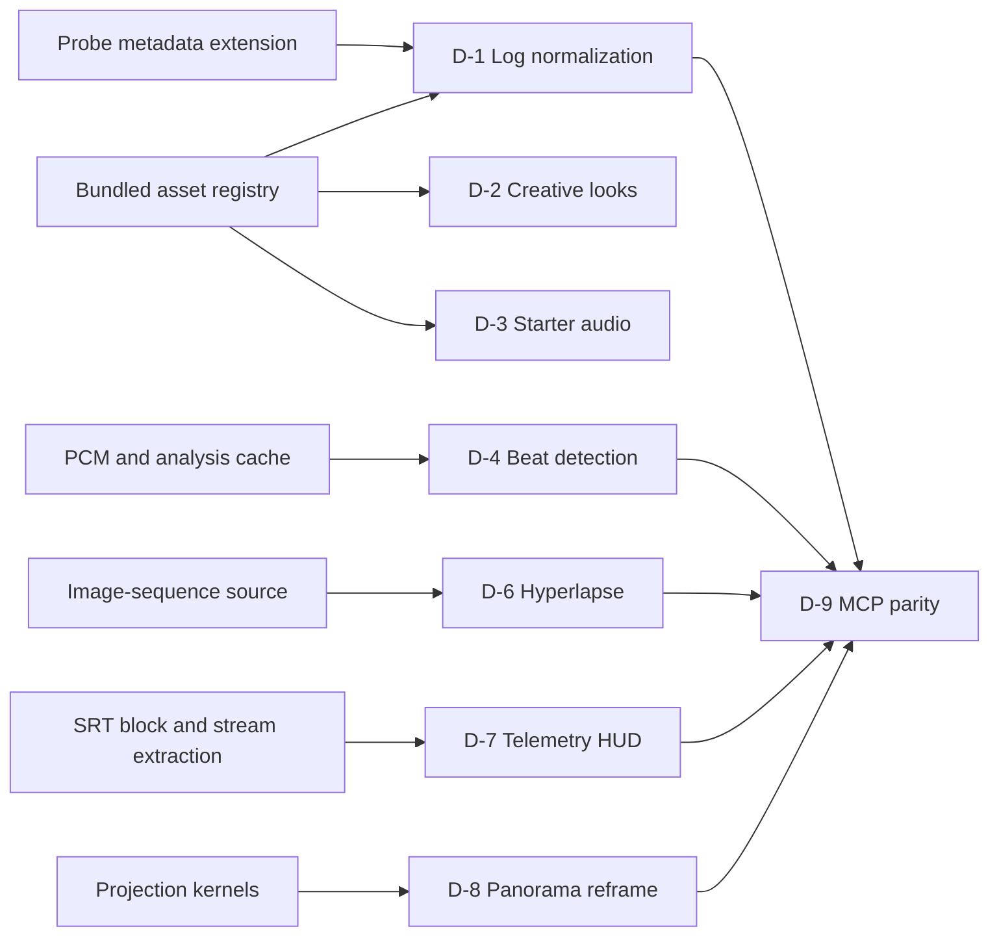

# 21 — DJI Core Workflows

Status: Implementation reference  
Date: 2026-07-10  
Audience: Photonic maintainers and implementation agents  
Scope: D-1–D-4 and D-6–D-9. D-5 appears only as completed dependency context.

## 1. Purpose and Authority

Implementation contract for DJI-focused normalization, starter media, beat editing, timelapse ingest, telemetry HUD, panorama reframe, and MCP parity. Extends existing video architecture; does not replace `01-data-model.md` through `11-testing-phasing.md`.

Normative inputs, in precedence order:

- `SPEC.md`: D-09 linear-light Rec.709/premultiplied-f16 contract, media/undo/licensing constraints, product non-goals.
- `03-render-color-pipeline.md` §3.2 and §4.2: current decode-to-working boundary and color transition table.
- `07-color-grading.md` §3.8: working-space creative `Lut3d` behavior.
- `01-data-model.md`, `02-engine.md`, `10-mcp-tools.md`, `11-testing-phasing.md`: state, frame graph, parity, tests.
- `18-dji-parity.md`: backlog intent only where this document does not explicitly supersede it.
- `23-legal-open-source-implementation-routes.md`: accepted D-3/D-8 rights, native implementation, and S1/S5 routes; release evidence remains item-gated.

Normative rules:

- `photonic-core::timeline`: serializable state, pure ops, undo commands. No I/O, GPU, threads.
- `photonic-video`: probe, analysis, decode, caches, frame-graph lowering.
- `photonic-render`: CPU/GPU pixel kernels and parity.
- `photonic-gui`: intent collection and presentation only.
- `photonic-mcp`: same pure ops/services as GUI.
- Media and derived analysis remain referenced or sidecar-cached; never embed source payloads in project JSON.
- Every document mutation uses `Command::Timeline` or one atomic `Command::Batch`.
- No DJI trademark, LUT, music, SFX, map, or camera asset ships without recorded redistribution rights.
- Offline editing/export works after required source files and optional caches exist locally.

## 2. Evidence-Backed Status Audit

| ID | Status | Shipped foundation | Missing feature slice |
|---|---|---|---|
| D-1 | Partial | `.cube` asset kind, grade op, LUT parser/sampler, color page, `ProbedColor` | Photonic-authored or licensed transform registry, DJI profile classifier, source-domain conversion, one-click apply |
| D-2 | Partial | LUT stack and browser | Licensed device-scoped creative looks, thumbnails, normalization-aware ordering |
| D-3 | Legal-or-fixture-blocked; S1 accepted | Audio import, timeline clips, mixer, waveform cache | Rights-cleared starter pack, manifest, library UI, insertion verbs |
| D-4 | Partial | PCM/DSP modules, markers, undo, waveform, timeline snap spine | Beat analyzer, cache, marker provenance, beat snap toggle, job/API |
| D-5 | Done v1 | Manual roll correction, active-format override, exact centered auto-crop, CPU/GPU `Transform2D` parity | Automatic visual horizon estimation remains deferred |
| D-6 | Partial | Still import and PNG-sequence export | Image-sequence source model, grouped ingest, frame decode, deflicker analysis/op |
| D-7 | Partial | Caption SRT parser, probe/decode sidecars, text/caption renderer | DJI dialect parser, auxiliary-stream extraction, normalized telemetry model, sync, HUD |
| D-8 | Legal-or-fixture-blocked; S5 accepted; CPU/GPU kernels and GPU safety preflight implemented | Still clips, transforms, reframe overlay, keyframes, standalone equirectangular projection kernels | Native still delivery, effect/IR integration, rights-cleared corpus, metadata detection, virtual-camera controls |
| D-9 | Partial | Video MCP surface, jobs, structured errors, generic grade/marker/property tools | DJI-specific verbs, sensitive-data policy, generated-doc parity |

Status authority: `ROADMAP.md` owns live blocked-status enums. `Partial` here describes implementation foundation only; it does not remove ROADMAP product, legal, or fixture blockers.

Evidence paths:

- LUT/model: `crates/photonic-core/src/timeline/{media,grade}.rs`
- LUT UI/eval: `crates/photonic-gui/src/panels/video/color_page.rs`, `crates/photonic-render/src/{lut,grade_gpu}.rs`
- Probe: `crates/photonic-video/src/media/probe.rs`
- Audio DSP: `crates/photonic-video/src/audio/dsp/`
- Markers/commands: `crates/photonic-core/src/timeline/{sequence,ops,commands}.rs`
- SRT: `crates/photonic-video/src/captions/interchange/srt.rs`
- D-5: `crates/photonic-gui/src/panels/video/clip_inspector.rs`, `crates/photonic-gui/src/app/reframe.rs`, `crates/photonic-video/src/graph/{eval,eval_cpu}.rs`
- Current decode is 8-bit `yuv420p`/`yuva444p`: `crates/photonic-video/src/decode/mod.rs`
- MCP jobs and handlers: `crates/photonic-mcp/src/handlers/{video,video_jobs}.rs`

Infrastructure presence does not mark a DJI item complete. Example: generic LUT sampling exists; correct DJI source-profile normalization does not.

## 3. Shared Architecture Contracts

### 3.1 Bundled asset registry

Add generic bundled-source support once; D-1, D-2, and D-3 consume it.

```rust
pub enum AssetSource {
    File { path: PathBuf, rel_path: Option<PathBuf> },
    EmbeddedVector { root: VectorRef },
    Bundled { pack: String, item: String, version: String, sha256: String },
    ImageSequence { spec: ImageSequenceSpec },
}

pub struct BundledAssetManifest {
    pub schema: u32,
    pub pack: String,
    pub version: String,
    pub entries: Vec<BundledAssetEntry>,
}

pub struct BundledAssetEntry {
    pub item: String,
    pub kind: AssetKind,
    pub path: PathBuf,
    pub sha256: String,
    pub license_id: String,
    pub attribution: String,
    pub source_url: String,
    pub redistribution_evidence: String,
}
```

`photonic-video::assets::BuiltinAssetRegistry` resolves `(pack,item,version)` to installed bytes. Missing item behaves as offline media; project state remains intact. `AssetSource::Bundled` stores identity, not bytes or an installation path.

Required repository artifacts:

- `crates/photonic-app/assets/video/manifest.toml`
- `THIRD_PARTY_ASSETS.md`
- per-pack license text under `crates/photonic-app/assets/video/licenses/`
- manifest validation test: file exists, digest matches, required legal fields non-empty, duplicate keys rejected

### 3.2 File-set sources

D-6 uses a compact pattern descriptor; D-14 may later use explicit file sets.

```rust
pub enum AssetKind {
    Video, Audio, Image, VectorDoc, Lut3d,
    ImageSequence,
    Telemetry,
}

pub struct ImageSequenceSpec {
    pub directory: PathBuf,
    pub rel_directory: Option<PathBuf>,
    pub prefix: String,
    pub suffix: String,
    pub digits: u8,
    pub first: i64,
    pub last: i64,
    pub missing: Vec<NumberRange>,
    pub frame_rate: FrameRate,
    pub missing_policy: MissingFramePolicy,
}

pub enum MissingFramePolicy { HoldPrevious, Error }
```

No silent frame skipping. `HoldPrevious` preserves ordinal timing. `Error` blocks playback/export at first missing frame. Import preview reports all gaps before commit.

### 3.3 Serialization and migration

`AssetSource::Bundled`/`ImageSequence` and `AssetKind::ImageSequence`/`Telemetry` are additive in this design but unknown enum variants are not backward-readable automatically. Implementation must update `01-data-model.md` serialization tables, add the next format migration and `docs/format-versions.md` entry, and test old-v4 load plus compatibility-window behavior. New fields use serde defaults; no implementation may rely on serde attributes alone as the migration plan.

### 3.4 Generated-analysis cache

Beat maps and deflicker curves use one versioned cache contract:

```rust
pub struct AnalysisKey {
    pub asset_hash: String,
    pub analyzer: String,
    pub analyzer_version: u32,
    pub config_hash: String,
}
```

Files live under `<project>.photon.cache/analysis/<analyzer>/<key>.json`. Cache payloads include schema, input identity, config, result, warnings. Corruption or version mismatch causes rebuild. Export preflight rebuilds required analysis or fails before encoding. Cache creation/deletion is not undoable; applying results to document state is.

### 3.5 Dependency graph



### 3.6 Existing performance gates

No core DJI item weakens existing budgets from `02-engine.md`, `09-audio-mixer.md`, and `11-testing-phasing.md`.

| ID | Required gate |
|---|---|
| D-1/D-2 | Normalization/look remains inside `< 8 ms` 1080p three-layer grade/caption GPU scenario |
| D-3 | Audition/mix causes zero xruns in SS-1 reference scenario; preview never decodes on GUI/audio callback |
| D-4 | Analysis runs off playback path; active playback keeps zero-xrun gate |
| D-6 | Sequence playback/export retains SS-1 full-frame-rate and `< 25%` export-overhead gates |
| D-7/D-8 | HUD/projection count inside existing `< 8 ms` reference eval unless `11` records a measured amendment |
| D-9 | No second render/cache path; handler dispatch adds no new media-performance budget |

New CPU/GPU pixel ops retain golden thresholds: CPU max absolute difference `<= 0.02`; GPU-vs-CPU PSNR `>= 35 dB`, SSIM `>= 0.98`.

## 4. D-1 — DJI Log and HLG Normalization

### 4.1 Status, scope, outcome

Status: Partial foundation. Deliver one explicit, repeatable conversion from detected/selected DJI capture profile to Photonic working space. Preserve manual `.cube` workflows.

**Normative supersession:** this section supersedes `18-dji-parity.md` D-1's instruction to append a conversion `GradeOpKind::Lut3d`. D-1 normalization uses `InputColorTransform` at the source/decode boundary. Ordinary grade-stack `Lut3d` remains D-2/creative or user grading only; it must not implement D-1 against current decoded working pixels.

In scope:

- D-Log and D-Log M detection and normalization.
- Camera/model evidence and confidence shown before apply.
- One normalization transform per clip.
- HLG-to-SDR command/UI contract; pixel implementation depends on D-13 color-transform/tone-map core.

Out:

- HDR mastering/delivery; D-13.
- Creative look choice; D-2.
- Scene-content classifier.
- D-Log/D-Log M still-image normalization; v1 D-1 accepts media-backed video clips only.
- Redistribution of any DJI file without written permission.

User outcome: imported flat DJI footage offers a profile-matched conversion; user confirms or overrides profile; repeated apply replaces prior normalization instead of stacking transforms.

#### Transform-source priority and official references

Resolve each device/profile transform in this order:

1. Published profile math and colorimetry implemented analytically by Photonic.
2. Photonic clean-room calibration derived only from camera/chart footage and published technical facts.
3. Licensed vendor conversion cube with explicit redistribution rights.
4. User-supplied conversion cube with explicit signal contract.

Photonic-authored analytical transforms are preferred. Native renderer may apply analytical curve/matrix/gamut math directly; same pipeline may be sampled to a Photonic-authored `.cube` for interchange, inspection, or external NLE use. Native and sampled forms share one transform identity and must pass equivalence fixtures.

Official inputs:

- [DJI Zenmuse X7 downloads](https://www.dji.com/cz/downloads/products/zenmuse-x7) publishes the D-Log/D-Gamut whitepaper used where its documented profile applies.
- [DJI model and LUT availability guidance](https://repair.dji.com/help/content?customId=01700007105&lang=en&paperDocType=ARTICLE&re=US&spaceId=17) informs model/profile mapping and availability; it does not grant redistribution rights.
- [ITU-R BT.2100-3](https://www.itu.int/rec/R-REC-BT.2100-3-202502-I/en) is the HLG normative source consumed by D-13. Citing it here does not reopen or bypass the D-13 gate.

### 4.2 Dependencies and ownership

- Core: capture-profile types, clip input-transform state, pure apply/replace op.
- Video: metadata extraction, classifier, bundled resolver, source-domain transform lowering.
- Render: source-domain LUT/transfer kernel plus CPU reference.
- GUI: import nudge and Color Controls action.
- MCP: D-9 tools.
- D-13: HLG inverse transfer, gamut conversion, tone map.

### 4.3 Data and serialization

```rust
pub enum CaptureColorProfile {
    Rec709,
    DjiDLog,
    DjiDLogM,
    DjiHlg,
    Unknown(String),
}

pub struct ColorProfileGuess {
    pub profile: CaptureColorProfile,
    pub confidence: GuessConfidence,
    pub evidence: Vec<String>,
    pub detector_version: u32,
}

pub struct InputColorTransform {
    pub source_profile: CaptureColorProfile,
    pub transform: ConversionTransformRef,
    pub conversion_output: InputConversionOutput,
    pub user_overrode_detection: bool,
}

pub enum ConversionTransformRef {
    PhotonicAnalytical(PhotonicTransformId),
    Bundled(BundledAssetRef),
    UserAsset(AssetId),
}

pub struct PhotonicTransformId {
    pub device: String,
    pub firmware: String,
    pub profile: CaptureColorProfile,
    pub bit_depth: u8,
    pub full_range: bool,
    pub transform_version: u32,
    pub calibration_digest: String,
}

pub enum InputConversionOutput {
    EncodedRec709Full,
    EncodedRec709Legal { black_code: u16, white_code: u16, bit_depth: u8 },
}
```

`InputConversionOutput` names the conversion cube/curve output before EOTF. Photonic working output is always post-EOTF linear Rec.709, premultiplied `Rgba16Float`; no pre-EOTF value is called “working.”

Add `VideoStreamInfo.profile_guess: Option<ColorProfileGuess>` and `Clip.input_color_transform: Option<InputColorTransform>` with serde defaults. Persist guess for explainability; re-probe may offer updated classification but never rewrites a user override. `PhotonicTransformId` prevents applying calibration across unvalidated device/firmware/profile/bit-depth/range combinations. `ConversionTransformRef::UserAsset` enables a rights-safe user-installed conversion cube when neither a validated Photonic transform nor redistributable vendor transform exists.

### 4.4 Probe and classification contract

Extend ffprobe fold to retain stream/container tags: make, model, encoder, creation tool, color mode, gamma/profile strings, handler names. Classifier returns evidence, never a bare enum.

Precedence:

1. Explicit standardized transfer/primaries plus DJI profile tag.
2. DJI make/model and camera-specific color-mode metadata.
3. Filename/sidecar tag only when documented by a fixture.
4. Unknown; no automatic transform.

Matrix and transfer are independent decisions:

- YUV-to-RGB matrix comes from probed `matrix`/`color_space` or an explicit user override.
- Encoded-RGB inverse transfer or conversion cube comes from `CaptureColorProfile`.
- A Rec.709 matrix tag does not prove BT.709 OETF; DJI log can use a Rec.709 YUV matrix with a log transfer.
- A `transfer=bt709` tag does not override stronger camera/profile evidence because DJI files may carry generic tags.
- With no reliable profile evidence, classification stays unknown; do not assume D-Log from matrix/model alone.

`DjiHlg` requires HLG transfer evidence. Ambiguous D-Log vs D-Log M remains unknown and prompts device/profile selection.

### 4.5 Pixel contract

Current `DecodeVideo` always produces linear Rec.709 after BT.709 EOTF. Applying an ordinary grade LUT after that boundary is not a correct source-profile transform. D-1 therefore adds source-domain lowering:

```text
YUV range expand -> YUV matrix -> encoded source RGB
  -> profile-matched conversion LUT/transfer
  -> encoded Rec.709 RGB -> BT.709 EOTF
  -> premultiply -> Rgba16Float working texture
```

This amends `03-render-color-pipeline.md` §3.2 only when a clip carries `InputColorTransform`. Clips without it retain the exact shipped range → matrix → BT.709 EOTF path and SDR goldens. Existing `GradeOpKind::Lut3d` keeps `07-color-grading.md` §3.8 working-space semantics.

#### Conversion cube signal contract

Every bundled or user-mapped conversion cube carries explicit side metadata:

```rust
pub struct ConversionCubeContract {
    pub profile: CaptureColorProfile,
    pub domain_min: [f32; 3],
    pub domain_max: [f32; 3],
    pub out_of_domain: CubeOutOfDomainPolicy,
    pub output: InputConversionOutput,
}

pub enum CubeOutOfDomainPolicy { ClampToDomain, RejectFrame }
```

Signal order and levels are normative:

1. Expand source YUV limited/full code range from probe/override.
2. Apply independently-resolved YUV matrix, producing encoded source RGB without an EOTF.
3. Map RGB through `.cube` `DOMAIN_MIN`/`DOMAIN_MAX`: `coord = (rgb - min) / (max - min)`.
4. Apply manifest-declared out-of-domain policy. No hidden pre-LUT `clamp01`; log superwhites survive unless declared cube domain/policy clips them.
5. Interpret LUT output using `InputConversionOutput`. Legal-range output expands to full normalized encoded Rec.709 using declared black/white codes; full output passes unchanged.
6. Apply BT.709 EOTF, premultiply, enter linear working space. Export later performs its normal target-range compression; D-1 never leaves legal-range code values disguised as linear RGB.

`.cube` headers and side metadata must agree; mismatch rejects transform registration. User cubes require profile, output-range, and out-of-domain choices before use as conversion transforms. Creative LUT import remains unaffected.

#### Photonic analytical and clean-room transform contract

Published profile math path implements documented transfer/gamut behavior from official technical sources, with constants and operation order shared by CPU/GPU paths. Clean-room calibration path may use only independently captured source footage, physical chart references, published profile facts, and Photonic-authored fitting code.

**MUST NOT:** sample, copy, decompile, numerically probe, fit against, or reconstruct DJI/vendor LUT values. Vendor cube output cannot be calibration ground truth or regression oracle for a Photonic-authored transform. Team must retain fixture provenance and calibration notes proving independent inputs.

Required calibration corpus:

- controlled color chart under recorded illuminants;
- neutral gray ramp and exposure-step ramp spanning shadows through highlight headroom;
- skin-tone patches/subjects under multiple illuminants;
- saturated gamut-edge patches;
- held-out real footage never used during fit.

Version calibration by device, firmware, capture profile, bit depth, YUV matrix, and full/limited range. Any changed fit, source facts, fixture set, or rendering math increments `transform_version` and changes `calibration_digest`/IR hash.

Validation report records:

- CIEDE2000 delta-E distribution on chart patches;
- neutral-axis chroma and exposure-ramp monotonicity;
- skin-tone hue/chroma error;
- gamut mapping/clipping and out-of-domain behavior;
- highlight roll-off/headroom preservation;
- held-out-footage review outcome;
- native analytical vs sampled-`.cube` equivalence;
- CPU/GPU golden differences.

Fixture-specific thresholds are frozen before release review and stored with transform manifest. Transform cannot ship or auto-apply until accuracy, held-out, and CPU/GPU gates pass for its exact `PhotonicTransformId`.

#### IR, cache, and invalidation

Either extend `DecodeVideo` or add a decode-adjacent op. Chosen implementation must expose equivalent resolved identity:

```rust
pub struct ResolvedInputColorTransform {
    pub source_profile: CaptureColorProfile,
    pub matrix: ResolvedYuvMatrix,
    pub source_range: ResolvedCodeRange,
    pub transform_digest: String,
    pub transform_version: String,
    pub implementation: ResolvedConversionImpl,
}

pub enum ResolvedConversionImpl {
    PhotonicAnalytical {
        id: PhotonicTransformId,
        math_digest: String,
        output: InputConversionOutput,
    },
    Cube { contract: ConversionCubeContract },
}

IrOp::DecodeVideo {
    asset: AssetId,
    src_time: Tick,
    proxy: bool,
    input_transform: Option<ResolvedInputColorTransform>,
}
```

Node/content hash includes every resolved field above—including analytical identity/math/calibration digest or cube contract—plus proxy color-domain identity. Set/remove/replace transform, relink transform asset, profile override, matrix/range override, proxy replacement, analytical version, calibration digest, or bundle-version change yields a new hash and invalidates affected decode/final-frame caches. No manual stale-cache reuse is permitted.

#### Proxy policy and no-double-conversion invariant

Preferred v1 policy: proxies preserve the source's encoded profile, YUV matrix, code range, and color tags. Proxy generation runs before `InputColorTransform`; proxy and original decode both apply the same resolved transform. Export always decodes originals and applies the full transform.

Extend proxy metadata:

```rust
pub enum ProxyColorDomain {
    Unknown,
    MatchesSourceEncoded { source_profile: CaptureColorProfile, matrix: String, full_range: bool },
    BakedInputTransform { transform_digest: String },
}
```

Add `ProxyRef.color_domain` with serde default `Unknown`. v1 generation must emit `MatchesSourceEncoded`. A legacy/unknown-domain proxy is ineligible for a clip with D-1 enabled and must regenerate or fall back to original. `BakedInputTransform` is reserved for future compatibility: decode must skip D-1 only when stored digest exactly matches active transform; any mismatch invalidates proxy. Applying D-1 twice is a correctness failure, never an acceptable preview approximation.

Nested-sequence/adjustment rule: input transform belongs only to media-backed source clip. Nested sequences inherit already-normalized inner clips; outer nest, Adjustment, Text, Vector, and SolidColor sources reject D-1 attachment. Merge, adjustment processing, and project graph never reapply it.

Scope rule: existing `03` §3.6/`07` scope read point after Grade remains unchanged. Correctly normalized linear pixels now feed that point; scopes do not sample pre-transform log values unless a future explicit input-scope mode is specified.

HLG path:

- D-1 owns detection, state, UI, and command.
- D-13 owns HLG inverse transfer, Rec.2020 conversion, and BT.2446A SDR tone map.
- Until D-13 core exists, HLG action is disabled with dependency text; never apply a D-Log LUT as substitute.

### 4.6 UI, commands, MCP

Color Controls adds `INPUT COLOR` section above grade stack:

- detected profile, confidence, evidence tooltip;
- device/profile override picker;
- resolved source/version, preferring validated Photonic analytical transform;
- licensed bundled or user-installed conversion cube mapping with required signal-contract fields;
- `Normalize to Rec.709`;
- `Remove input transform`;
- warning tint only for ambiguous/mismatched profile.

Pure ops:

```rust
ops::set_input_color_transform(project, seq, track, clip, Option<InputColorTransform>)
```

`photonic-video::assets::resolve_input_transform(profile, registry)` resolves bundled identity outside core; GUI/MCP passes returned pure state into `ops::set_input_color_transform`. Op returns one `TimelineCmd::SetClipProp`. D-9 adds `get_capture_profile` and `set_input_color_transform`.

### 4.7 Errors, performance, privacy, licensing

- Missing bundled transform: `BundledAssetMissing`; clip renders unnormalized with diagnostic.
- Missing/unvalidated Photonic transform version: `InputTransformUnvalidated`; never fall through to a different firmware/profile calibration silently.
- Missing/relinked user cube or incomplete signal contract: reject apply/export preflight; preserve authored reference.
- Legacy/unknown proxy color domain: bypass proxy and regenerate/fall back to original; never guess.
- Non-media-backed source: `UnsupportedInputTransformSource`.
- Digest mismatch: reject asset; never execute unverified bundled bytes.
- Profile mismatch: block automatic apply; allow explicit override with persisted flag.
- Unsupported HLG: `DependencyUnavailable` with D-13 reference.
- Source transform becomes part of decode/node cache hash. No per-frame file reads.
- All classification local. Metadata stays in project; no upload.
- Vendor-byte release blocker: written redistribution grant or license permitting binary redistribution for every DJI LUT. Download availability is not redistribution permission.
- Photonic-authored transform bytes/math avoid vendor-LUT redistribution, but still require trademark/naming review and the full accuracy/fixture gate. Do not label them “official DJI LUTs,” imply endorsement, or use unapproved compatibility naming.
- If vendor permission remains absent, ship validated Photonic analytical/sampled transforms and/or user-installed mapping; do not ship DJI bytes.

### 4.8 Tests and acceptance

Fixtures: D-Log, D-Log M, HLG, Rec.709, ambiguous/untagged clips from redistributable test sources; manifest digest fixtures; known LUT color patches.

Acceptance:

- D-Log and D-Log M fixtures classify correctly with evidence.
- Every Photonic transform passes its chart, gray/exposure, skin, gamut/highlight, held-out-footage, native-vs-sampled, and CPU/GPU validation report.
- Transform registry selects only exact validated device/firmware/profile/bit-depth/range identity; unvalidated combinations stay unknown/manual.
- Photonic-authored transform fixture provenance contains no vendor LUT input or sampled vendor values.
- Ambiguous fixture never auto-applies.
- Apply creates exactly one input transform; second apply replaces it.
- User-supplied identity/conversion cube with explicit signal contract applies without bundled DJI bytes, survives relink/save/reopen, and renders identically through GUI/MCP.
- CPU/GPU source-transform outputs meet grade golden tolerance.
- Full/limited source range, cube-domain, superwhite, and legal/full output fixtures match reference values without hidden clamp.
- Proxy/original renders match within proxy codec/resolution tolerance; active transform appears exactly once in both paths; export uses original.
- Transform/profile/matrix/range/digest edits produce distinct IR hashes and no stale frame-cache hit.
- Nested sequence renders inner transform once; outer nest and adjustment attachment are rejected.
- Post-grade scopes match normalized Rec.709 reference patches.
- Normal grade ops remain after input normalization and preserve order.
- Missing bundle keeps project loadable and export preflight names missing item.
- HLG control stays blocked until D-13 transform tests pass.
- Asset license manifest gate passes for every shipped byte.

### 4.9 Rollout, deferrals, blockers

Rollout order: metadata retention; official-math review; clean-room fixture/provenance harness; validated Photonic analytical transform and optional sampled `.cube`; profile classifier; GUI/MCP; licensed vendor/user cube fallbacks; HLG enablement after D-13.

Deferred: automatic creative look; ML classification; HDR output.

Blocking decisions:

- Photonic transform accuracy thresholds, fixture provenance, and camera/profile mapping backed by representative files.
- Trademark/compatibility naming review for Photonic-authored transforms.
- Vendor LUT redistribution permission and attribution only if vendor bytes are shipped.
- Proxy transcode settings proven to preserve source encoded domain/tags for supported codecs.

## 5. D-2 — Device-Scoped Creative Look Picker

### 5.1 Status, scope, outcome

Status: Partial foundation. Manual, local gallery of rights-cleared creative LUTs. No scene classifier.

User outcome: after normalization, user previews and applies a creative look matched to selected camera/profile without browsing files.

### 5.2 Dependencies and ownership

Depends on bundled registry and D-1 profile state. Existing grade stack/LUT sampler remain implementation path. GUI owns gallery; video owns thumbnails/cache; core uses existing `SetGrade`.

### 5.3 Formats and state

Manifest entries add:

```rust
pub struct LookMetadata {
    pub display_name: String,
    pub compatible_inputs: Vec<CaptureColorProfile>,
    pub expects_normalized_rec709: bool,
    pub category: String,
    pub preview_fixture: String,
}
```

Creative looks are ordinary `GradeOpKind::Lut3d` ops tagged with additive provenance:

```rust
pub enum GradeOpProvenance {
    BundledLook { pack: String, item: String, version: String },
}
```

Add optional `GradeOp.provenance`; serde default `None`. Applying another bundled look replaces only prior `BundledLook`; user LUTs and correction ops remain.

### 5.4 UI, commands, MCP

LUT tab adds device/profile filter and thumbnail grid. `None` removes bundled look. Preview uses selected clip frame with input normalization active. Use existing drawer-card, section header, selectable-label, violet active border, no new accent.

`ops::apply_bundled_look` returns one `SetGrade`. D-9 adds `list_bundled_looks` and `apply_bundled_look`.

### 5.5 Undo, errors, performance, security

- Apply/remove: one undo step; project serializes provenance plus bundled source identity.
- Incompatible input: warn and require explicit override.
- Missing look: inert op diagnostic; never drop op on load.
- Thumbnail cache key: look digest + normalized preview frame hash + renderer version.
- Generate thumbnails off GUI thread. Bound queue; cancel stale filter requests.
- No network. No camera metadata sent elsewhere.
- Same licensing gate as D-1. If DJI creative LUT rights are unclear, ship Photonic-authored/commissioned looks only; label accurately.

### 5.6 Tests, acceptance, deferrals, blockers

- Registry filters compatible looks deterministically.
- Apply replaces prior bundled look, preserves user LUT/corrections, remains undoable.
- Preview and final render use same LUT asset/digest.
- Missing/corrupt look reports stable error.
- Gallery is keyboard reachable and readable in dark/light themes.

Rollout order: rights-cleared manifest; provenance field/op; thumbnail cache; gallery; MCP.

Deferred: scene-aware recommendation, cloud catalog, automatic template pairing.

Blocker: rights-cleared look set and naming/attribution review.

## 6. D-3 — Starter Music and Ambient SFX Library

### 6.1 Status, scope, outcome

Status: Legal-or-fixture-blocked; S1 accepted 2026-07-12. Bundle small offline starter pack: music beds plus Forest, Sea, Field, and Urban SFX. Manual browse/search/preview/insert only. Per-asset rights evidence remains required.

User outcome: editor can add a usable rights-cleared track without external download. No auto-theme classifier.

### 6.2 Dependencies and ownership

Uses bundled registry, existing `AssetKind::Audio`, audio clips, waveform/mixer, media-pool import path. GUI owns library browser and audition state. Audio engine owns preview. Core owns resulting asset/clip commands.

### 6.3 Manifest and contracts

Audio manifest metadata:

```rust
pub struct StarterAudioMetadata {
    pub display_name: String,
    pub category: StarterAudioCategory,
    pub bpm: Option<f32>,
    pub musical_key: Option<String>,
    pub loopable: bool,
    pub attribution_required: bool,
}

pub enum StarterAudioCategory { Music, Forest, Sea, Field, Urban }
```

Allowed source licenses require redistribution and derivative-use permission. Attribution-required entries surface credits and append export credits metadata only when user opts in; project stores asset identity and attribution snapshot.

### 6.4 UI, commands, MCP

Media drawer adds `STARTER AUDIO`: category filters, search, play/stop audition, waveform, BPM/key badges, `Add to pool`, `Insert at playhead`. Audition is session state; insertion is document state.

Insert transaction:

1. Reuse existing matching `AssetSource::Bundled` asset or add it.
2. Insert audio clip on targeted/first unlocked audio track.
3. Batch both commands into one undo step.

D-9 adds `list_starter_audio` and `insert_starter_audio`.

### 6.5 Undo, errors, performance, privacy, licensing

- Undo removes inserted clip and newly-added unreferenced pool asset through inverse batch.
- Missing asset/digest mismatch disables audition/insertion.
- Audio preview reads through existing decode worker; one active audition; switching item cancels prior stream.
- Waveforms use content-hash sidecar cache.
- No analytics, classifier, or network fetch.
- No DJI-bundled music may be copied without explicit rights. Prefer commissioned, CC0, or equivalently clear assets. License obligations ship in-app and in repository.

### 6.6 Tests, acceptance, deferrals, blockers

- Every manifest audio file decodes, hashes, and reports expected duration/channels.
- Audition never mutates document/history.
- Insert creates audible clip at requested tick; undo restores prior document.
- Repeated insert reuses media-pool asset.
- Export contains same decoded samples subject to normal mix.
- Attribution view lists every required credit.

Rollout order: rights-cleared pack/manifest; bundled audio resolution; audition; insert transaction; MCP.

Deferred: automatic ambient recommendation, online catalog, license-account services.

Blocker: final pack selection and recorded redistribution/derivative terms.

Residual blocker: approve each bundled asset's release-grade rights manifest before scheduling D-3 content.

## 7. D-4 — Beat Detection, Beat Markers, and Beat Snap

### 7.1 Status, scope, outcome

Status: Partial foundation. Add deterministic local music analysis and generated marker provenance. No template assembly; D-11.

User outcome: select audio clip, detect beats, see beat/downbeat markers, snap razor/trim/insert to them, rerun without deleting manual markers.

### 7.2 Dependencies and ownership

- Video audio/DSP: PCM decode, beat analyzer, analysis cache.
- Core: marker provenance and pure replace-generated-markers op.
- GUI timeline: command, progress, marker styling, snap toggle.
- MCP: async job and status.

### 7.3 Analyzer contract

```rust
pub struct BeatAnalysisConfig {
    pub min_bpm: f32,
    pub max_bpm: f32,
    pub sensitivity: f32,
    pub meter_hint: Option<u8>,
}

pub struct BeatMap {
    pub tempo_bpm: f32,
    pub confidence: f32,
    pub beats: Vec<BeatEvent>,
}

pub struct BeatEvent {
    pub source_at: Tick,
    pub strength: f32,
    pub downbeat_confidence: f32,
}
```

Pipeline: downmix to mono; resample to 48 kHz; Hann STFT; positive spectral flux; adaptive median threshold; peak pick; tempo candidates by autocorrelation/tempogram; dynamic-program phase tracking; optional meter grouping. Constants live in one module and analyzer version increments when changed.

Clip mapping: `sequence_at = clip.start + (source_at - clip.source_in) / clip.speed`. Ignore beats outside clip source span. Reverse clips unsupported for marker generation; return explicit error. Constant positive speed supported.

### 7.4 Marker model, commands, serialization

```rust
pub enum MarkerKind {
    User,
    Beat {
        source_asset: AssetId,
        source_clip: ClipId,
        analysis_key: String,
        ordinal: u32,
        strength: f32,
        downbeat: bool,
    },
    ShotBoundary { /* D-15 additive */ },
}
```

Add `Marker.kind` with serde default `User`. `ops::replace_generated_beats` removes only `Beat` markers matching source clip, then creates mapped results. Return one `Command::Batch` containing removals/additions; undo atomic. Analysis cache is not serialized; generated markers are.

### 7.5 UI, snap, MCP

Commands:

- `video.detect_beats`
- `video.clear_detected_beats`
- `video.toggle_snap_beats`

Marker paint: normal beat = muted tick; downbeat = stronger violet tick; generated badge in marker context menu. Snap preference is session/app config, not document history. Existing snap arbitration chooses nearest candidate by pixel distance; beat candidates participate only when toggle enabled.

D-9: `detect_beats { clip_id, config, replace } -> job_id`, `clear_detected_beats`, `get_beat_map`. Job completion commits marker batch under document-before-history lock order.

### 7.6 Errors, threading, cache, privacy

- No audio stream: `NoAudioStream`.
- Offline source: `AssetOffline`.
- Reverse/variable speed: `UnsupportedSpeedMap`.
- Low confidence: return map + warning; do not silently claim reliable tempo.
- Analyze on worker pool, cancellable, never audio callback or GUI thread.
- Cache key includes audio content hash, selected stream/channel map, analyzer version/config.
- No network; PCM and beat maps remain local.

### 7.7 DSP fixtures and acceptance

Fixtures:

- synthetic click tracks at fixed tempos, meter changes, offbeats, silence, tempo ramp;
- licensed drum/music excerpt with hand-labeled beats;
- clips with trim and 0.5x/2x constant speed.

Acceptance:

- Fixed-tempo fixtures estimate tempo within configured tolerance and markers land within one analysis hop or one sequence frame, whichever is larger.
- Silence returns empty map and `LowConfidence`, no false beat carpet.
- Trim/speed mapping produces exact sequence ticks.
- Rerun replaces only generated markers for selected clip.
- User markers survive analyze/clear.
- One undo removes entire generated set; redo restores identical IDs/ticks.
- Snap-enabled razor/trim/insert select nearest beat under existing snap threshold.
- Cached and cold analysis return byte-equivalent `BeatMap`.

### 7.8 Rollout, deferrals, blockers

Rollout order: analyzer fixtures; cache; marker provenance/op; timeline paint/snap; GUI job; MCP.

Deferred: semantic music sections, stem separation, automatic template selection.

Blocker: representative licensed music fixture and agreed tempo/marker tolerance.

## 8. D-5 — Completed Horizon Leveling Context

D-5 v1 is complete and excluded from new implementation scope. Current behavior:

- active-format roll correction in degrees;
- radians persisted in `ClipTransform.rotation`;
- exact minimum shared scale for centered auto-crop;
- finite/geometry guards;
- CPU/GPU `Transform2D` parity.

D-9 residual: expose exact auto-crop calculation to headless callers. Move or wrap pure math from GUI-only `app/reframe.rs` into a shared core operation; do not duplicate formulas in MCP. Automatic image-based horizon estimation remains deferred and must use a separate ID if promoted.

## 9. D-6 — Hyperlapse and Timelapse Assembly

### 9.1 Status, scope, outcome

Status: Partial foundation. Input-side numbered image sequence plus optional luminance deflicker. Output image-sequence export already exists and is not reimplemented.

User outcome: select one frame or a folder, confirm detected run/rate/gaps, create one media asset and timeline clip, optionally deflicker, then edit/export like video.

Out: optical stabilization, RAW/DNG development, motion interpolation.

### 9.2 Dependencies and ownership

- Core: `AssetKind::ImageSequence`, `AssetSource::ImageSequence`, deflicker spec on clip/effect.
- Video media/decode: discovery, probe, ordinal frame loader, analysis cache.
- Video graph/render: resolved exposure correction.
- GUI media pool: import review dialog.
- MCP: assembly job.

### 9.3 Discovery and probe contract

Filename grammar: same directory, extension, prefix/suffix, and terminal digit width. Build maximal numeric run. User review chooses first/last, frame rate, gap policy. Detection never merges two prefixes or digit widths.

Probe:

- validate first, middle, last present frames;
- require identical dimensions and supported pixel format;
- duration = ordinal count × ticks-per-frame, including held gaps;
- content hash = descriptor plus ordered `(number,file-size,content-hash)` manifest digest;
- flag mixed dimensions/color metadata before commit.

### 9.4 Decode, deflicker, and cache

Frame at source tick maps to exact ordinal by asset frame rate. Decoder loads still through existing image path and caches recent frames. `HoldPrevious` searches backward within declared range; no prior present frame is an error.

```rust
pub struct DeflickerSpec {
    pub enabled: bool,
    pub window_frames: u32,
    pub strength: f32,
    pub max_correction_stops: f32,
    pub analysis_key: Option<String>,
}
```

Analysis downsamples frames, computes robust log-luma percentile excluding clipped tails, derives rolling-median target, clamps exposure stops, smooths correction curve. Store curve in analysis sidecar. Compiler receives immutable analysis snapshot and lowers current correction to a resolved linear exposure multiply before user grade. Missing analysis bypasses preview with diagnostic; export preflight rebuilds or fails.

### 9.5 UI, commands, MCP, undo

Import dialog: detected pattern, count, gaps, dimensions, frame-rate presets/custom, gap policy, deflicker checkbox/settings. Commit creates asset; optional timeline drop adds clip. Asset behaves as one pool row.

Pure state changes use `AddAsset`, `InsertClip`, `SetClipProp`; combined import+insert is one batch. Source files and analysis cache are never deleted on undo.

D-9 adds `assemble_image_sequence { path, first?, last?, frame_rate, missing_policy, deflicker?, track_id?, start_*? } -> job_id` and `set_deflicker`.

### 9.6 Errors, performance, privacy, security

- Mixed dimensions/format: reject with offending filenames.
- Gap under `Error`: block; under `HoldPrevious`: warning plus deterministic hold.
- File changes after import: content-manifest mismatch marks asset stale and invalidates caches.
- Decode/prefetch on workers; GUI never scans or decodes synchronously.
- Bound still cache by existing media budget; analysis streams frames without retaining full-resolution set.
- Treat paths as untrusted; canonicalize for access but preserve original/relative identity; never follow import outside user-selected root through symlink without confirmation.
- Fully local.

### 9.7 Tests and acceptance

- Contiguous, gapped, two-prefix, mixed-padding, mixed-dimension, missing-first fixtures.
- Exact duration/ordinal mapping for integer and 1001-denominator frame rates.
- Gap policy behavior deterministic.
- Deflicker synthetic exposure oscillation reduces measured luma variance without exceeding correction clamp.
- CPU/GPU resolved exposure parity.
- Save/reopen retains descriptor and settings; moving project uses relative directory fallback.
- Undo/redo import+insert preserves document identity.
- Export frame count equals declared ordinal count.

### 9.8 Rollout, deferrals, blockers

Rollout order: source model; discovery/probe; decoder; GUI/MCP; deflicker analyzer/eval.

Deferred: RAW/DNG decode, optical stabilization, interval metadata reconstruction.

Blocker: decide supported still formats for first release and whether gap default is `HoldPrevious` or `Error`. This spec recommends `HoldPrevious` with explicit warning.

## 10. D-7 — DJI Telemetry SRT and Text HUD

### 10.1 Status, scope, outcome

Status: Partial foundation. Parse sidecar or embedded DJI telemetry SRT, bind to a footage clip, render configurable text HUD. D-10 owns gauges, graphs, map.

User outcome: import DJI clip, accept matched telemetry, choose fields/units/layout, preview and export deterministic HUD.

### 10.2 Dependencies and ownership

- Core: telemetry asset kind, overlay binding/state, units/privacy config.
- Video media: sidecar discovery, subtitle-stream probe/extraction.
- Video telemetry module: dialect parser, normalization, interpolation, cache.
- Graph/render: text HUD batch and CPU/GPU parity.
- GUI: association prompt and HUD inspector.
- MCP: import/query/apply with sensitive-data guard.

### 10.3 Telemetry model and serialization

Raw SRT remains referenced as `AssetKind::Telemetry`; normalized samples remain derived sidecar cache.

```rust
pub enum DjiSrtDialect { BracketedLegacy, FramePrefixBracketed, Unknown }

pub struct TelemetryOverlay {
    pub asset: AssetId,
    pub source_offset: Tick,
    pub fields: Vec<TelemetryField>,
    pub units: TelemetryUnits,
    pub layout: TelemetryHudLayout,
    pub privacy: TelemetryPrivacy,
}

pub struct TelemetrySample {
    pub start: Tick,
    pub end: Tick,
    pub frame_count: Option<u64>,
    pub device_time_utc: Option<String>,
    pub latitude_deg: Option<f64>,
    pub longitude_deg: Option<f64>,
    pub relative_altitude_m: Option<f64>,
    pub absolute_altitude_m: Option<f64>,
    pub horizontal_speed_mps: Option<f64>,
    pub vertical_speed_mps: Option<f64>,
    pub distance_m: Option<f64>,
    pub heading_deg: Option<f64>,
    pub gimbal_yaw_deg: Option<f64>,
    pub gimbal_pitch_deg: Option<f64>,
    pub gimbal_roll_deg: Option<f64>,
    pub iso: Option<u32>,
    pub shutter_seconds: Option<f64>,
    pub aperture_f: Option<f64>,
    pub focal_length_mm: Option<f64>,
    pub unknown: BTreeMap<String, String>,
}
```

Add `Clip.telemetry_overlay: Option<TelemetryOverlay>` with serde default. Mapping uses clip source clock:

```text
telemetry_tick = clip.source_in + (sequence_tick - clip.start) * speed + source_offset
```

Positive constant speed only in D-7. Reverse/ramp returns diagnostic and hides overlay unless user bakes/conforms.

### 10.4 Detection, dialects, and sync

Discovery:

- sidecar: same normalized stem, `.srt` case-insensitive;
- embedded: probe subtitle streams, extract selected stream with FFmpeg to cache;
- never parse caption SRT as telemetry solely by extension.

Dialect parser first reads SRT timing blocks, strips allowed formatting tags, then parses bracket/prefix key-value records. Key aliases normalize into typed fields; unknown pairs survive for diagnostics. Locale decimal comma is accepted only where unambiguous. NaN/inf rejected.

Required fixture dialects:

1. bracket records with GPS, `rel_alt`/`abs_alt`, camera settings;
2. `FrameCnt`/`DiffTime` prefix plus bracket records;
3. sparse records and missing GPS;
4. malformed/foreign caption SRT.

Clock policy:

- default: SRT cue time relative to media start;
- optional: frame-count alignment against video rate;
- optional manual source offset;
- device UTC is metadata, not default sync clock;
- detect drift by comparing first/last frame-count-derived and cue-derived time; warn when over one sequence frame;
- continuous telemetry interpolates linearly across bounded gaps; camera settings hold previous; longitude unwraps across dateline; missing values display placeholder, never zero.

### 10.5 Render contract

Compiler samples the clip-bound telemetry from source time, collects active HUDs during track traversal, then emits them after video-track fold and before caption/project overlays. Text stays sequence-space upright and above program video. HUD order follows source video-track order, then clip ID for deterministic ties. `IrOp::TelemetryOverlay` carries resolved strings, positions, and style; evaluator performs no parsing. D-7 and D-10 use this single IR family.

Default text HUD fields: relative altitude, horizontal speed, vertical speed, distance, optional coordinates. Style reuses caption typography/background and normalized position. Coordinates default hidden in exported preset until user enables them.

### 10.6 UI, commands, MCP, undo

Import nudge: `Telemetry found for <clip>` with Review/Attach/Ignore. Inspector section: source, sync offset, field checklist, units, coordinate privacy, position/style, live sample readout. Follow `DESIGN.md`: drawer-card surface/border, dim section headers, `mono-data` telemetry values, violet selected controls, warning/error as text/icon tint only.

`ops::set_telemetry_overlay` returns one `SetClipProp`. Import telemetry asset plus attach uses one batch. Re-parse/cache updates are derived, not history entries.

D-9 adds:

- `import_dji_telemetry { clip_id, path?, embedded_stream? }`
- `set_telemetry_overlay { clip_id, ... }`
- `get_telemetry_summary { asset_id, include_sensitive: false }`

### 10.7 Errors, performance, privacy, security

- Unknown dialect: preserve file, return parser diagnostics, no attachment.
- Empty/no telemetry fields: reject as `NotTelemetrySrt`.
- Multiple sidecars/streams: require selection.
- Missing cache/source: preview diagnostic; export preflight attempts rebuild then blocks.
- Parse once on worker; binary-search samples by tick; renderer receives one resolved sample.
- Bound unknown field/value lengths; strip markup; HUD renderer receives plain text only.
- GPS is sensitive. No network. Logs/audit messages omit coordinates. MCP hides precise GPS unless `include_sensitive=true`. UI provides Hidden, Rounded, Exact and home-radius redaction modes.
- Project file stores source path and privacy choices, not parsed GPS series. Cache clear removes derived coordinates.

### 10.8 Tests and acceptance

- Each required dialect fixture parses expected normalized values/units/ticks.
- Foreign caption SRT is rejected without data loss.
- Sidecar and embedded extraction yield identical series.
- Trim/speed/manual-offset mapping returns expected samples.
- Missing fields never become numeric zero.
- Dateline interpolation and sparse-gap behavior are deterministic.
- HUD CPU/GPU golden frames match.
- Undo attach restores clip exactly; save/reopen retains binding/privacy/layout.
- Export with coordinates hidden contains no coordinate text.
- MCP default response contains no exact GPS.

### 10.9 Rollout, deferrals, blockers

Rollout order: real fixture corpus; parser/cache; asset and binding model; extraction/discovery; HUD render; GUI; MCP.

Deferred: map/gauges/graphs (D-10), live map fetch, telemetry editing, FIT/GPX import.

Blockers:

- Representative redistributable SRT samples across target DJI camera generations.
- Supported dialect matrix and unit semantics verified against source recordings.
- Product decision for default coordinate export privacy. This spec recommends Hidden.

## 11. D-8 — DJI Panorama Reframe and Little Planet

### 11.1 Status, scope, outcome

Status: Legal-or-fixture-blocked; S5 accepted and standalone CPU/GPU projection kernels plus checked GPU device/layout preflight implemented 2026-07-12. Reframe an already-stitched equirectangular still. No stitching; D-14. Native still delivery, effect integration, and real-corpus release evidence remain gated.

User outcome: mark still as panorama, choose rectilinear or little-planet projection, animate virtual camera, grade/export through normal clip path.

Scope fence: the completed first implementation contains the normative CPU reference and a standalone one-pass GPU parity kernel. It does not add persisted effect state, graph/IR lowering, GUI, MCP, fixture files, metadata detection, or D-14 stitching. Each later surface is a separate reviewed slice.

### 11.2 Dependencies and ownership

- Core: additive effect kind/params only.
- Render/video graph: projection CPU/GPU kernels.
- GUI monitor/inspector: virtual-camera handles and numeric controls.
- MCP: same parameter paths.

### 11.3 State and format contracts

Use normal `ClipEffect`:

```rust
EffectKind::PanoramaProjection

params.projection       // enum Rectilinear | StereographicLittlePlanet
params.yaw_deg          // keyframeable
params.pitch_deg        // keyframeable
params.roll_deg         // keyframeable
params.fov_deg          // keyframeable, rectilinear
params.zoom             // keyframeable, stereographic
params.seam_offset_deg  // keyframeable
params.edge_mode        // enum Wrap | Transparent
```

Input baseline: 2:1 equirectangular JPEG/PNG/TIFF already stitched by camera/app. Metadata/aspect detection may suggest effect but never auto-adds. Projection output enters normal clip transform/effects/grade chain.

### 11.4 Projection contract

Inverse mapping per output pixel:

1. Build virtual-camera ray from normalized output coordinate and projection parameters.
2. Rotate ray by yaw/pitch/roll quaternion.
3. Convert ray to longitude/latitude.
4. Map longitude to wrapped U and latitude to clamped V.
5. Sample source with bilinear filtering and seam-aware U wrap.

Coordinate contract: right-handed camera space is `+X` right, `+Y` up, `+Z` forward. Sample output pixel centers. Apply `R_y(yaw) * R_x(pitch) * R_z(roll)` to each camera ray. Map longitude to wrapped U; map latitude to clamped V. Rectilinear `fov_deg` is horizontal; vertical extent derives from output aspect ratio. Accept only `1° < fov_deg < 179°`; non-finite values reject at edit boundary. Stereographic plane has +X right and +Y toward screen top; divide both plane axes by positive `zoom`, with aspect applied to horizontal axis. Inverse mapping is tangent at south pole: center maps to `-Y`, radius 1 to horizon, infinity tends to `+Y`. CPU reference is normative for constants, operation order, seam wrap, pole handling, and alpha behavior; the standalone GPU kernel proves parity against it before effect integration.

### 11.5 UI, commands, MCP, undo

Inspector adds `Panorama Reframe` group. Monitor overlay supports drag-to-look, wheel/FOV, horizon/roll; every control has numeric keyboard path. Gesture edits coalesce; release commits one existing `SetClipProp`/effect-param command.

D-9 adds `set_panorama_reframe` convenience tool; generic effect/keyframe tools remain valid parity path.

### 11.6 Errors, performance, privacy, serialization

- Non-2:1 input: warn; allow explicit override.
- Unsupported/failed decode: effect inert with diagnostic.
- Invalid finite/range params rejected at edit boundary.
- Standalone kernel rejects source/output dimensions beyond active GPU texture limits and uses checked upload/readback pitch/allocation arithmetic; direct-texture effect integration must preserve the same structured pre-resource diagnostic boundary.
- One shader pass; cache key includes source frame and resolved params.
- Preview may use proxy-sized panorama; export uses original.
- Fully local; EXIF GPS follows existing metadata privacy and is not needed by renderer.
- Effect params serialize through existing model; no new media payload.
- Projection samples/interpolates in the normal linear-premultiplied video working convention defined by `03-render-color-pipeline.md`; no hidden straight-alpha or gamma-space path.

### 11.7 Tests and acceptance

- Grid/longitude-latitude fixture verifies axes, seam, poles, yaw/pitch/roll.
- Rectilinear center view and little-planet known points match closed-form CPU reference.
- CPU/GPU golden tolerance passes at seam and poles.
- CPU/GPU kernel slices use generated in-memory analytic pixels only; 14 focused tests cover repeatability, invalid-parameter parity, seam-aware bilinear wrap, vertical clamp, alpha preservation, rotations, and deterministic poles. Worst observed GPU/CPU absolute channel error is `0.00061941147`.
- Keyframed yaw/FOV render correct intermediate frame.
- Undo/redo and save/reopen preserve effect and keyframes.
- Non-panorama still never receives effect without user action.
- Alpha/edge behavior matches selected mode.

### 11.8 Rollout, deferrals, blockers

Rollout order: CPU reference/in-memory analytic tests; standalone GPU kernel/parity; rights-cleared projection corpus; effect registration/compile; inspector/monitor; MCP. The real corpus remains mandatory before effect/release acceptance even though isolated analytic GPU parity is complete.

Deferred: raw-frame stitching (D-14), cubemap input, video 360 metadata standards, spatial audio.

Blockers: no qualifying real 2:1 panorama or `FixtureRightsManifest` exists in the repository; name an acquisition owner and approve at least one owned/commissioned corpus item. Production `MediaSources::still_texture` still returns no frame, and both evaluators normalize stills to canvas before effects; native dimensions must reach projection first. Freeze explicit effect defaults/edit-boundary validation before typed effect/IR registration. No external service blocker.

Product scope resolved by S5 on 2026-07-12. Motion-360 and VR playback remain out of scope.

## 12. D-9 — MCP Parity for DJI Core Verbs

### 12.1 Status, scope, outcome

Status: Partial. General video MCP/jobs exist. Add explicit DJI verbs, common structured errors, sensitive-data defaults, and docs/tests alongside each shipped feature.

User outcome: every DJI GUI operation is reproducible headlessly with identical document/render result.

### 12.2 Tool contract

| Feature | Tools |
|---|---|
| D-1 | `get_capture_profile`, `set_input_color_transform` |
| D-2 | `list_bundled_looks`, `apply_bundled_look` |
| D-3 | `list_starter_audio`, `insert_starter_audio` |
| D-4 | `detect_beats`, `get_beat_map`, `clear_detected_beats` |
| D-5 | `level_horizon` convenience verb using shared pure auto-crop math |
| D-6 | `assemble_image_sequence`, `set_deflicker` |
| D-7 | `import_dji_telemetry`, `set_telemetry_overlay`, `get_telemetry_summary` |
| D-8 | `set_panorama_reframe` |

Long work uses existing `JobRegistry`; status/cancel remain `get_job_status`/`cancel_job`. Time args follow ticks > timecode > seconds. Mutations call core ops and commit one command/batch. Queries never take history lock.

### 12.3 Errors, security, serialization

Add codes:

- `BundledAssetMissing`
- `LicenseUnavailable`
- `CaptureProfileAmbiguous`
- `NotTelemetrySrt`
- `TelemetrySensitiveDataDenied`
- `AnalysisUnavailable`
- `ImageSequenceInvalid`
- `UnsupportedProjection`
- `DependencyUnavailable`

MCP never returns precise GPS without explicit `include_sensitive: true`. Paths remain subject to existing local-server trust boundary; handlers canonicalize and reject paths outside configured allowed roots when that policy is enabled. Tokens/secrets never enter args or audit log.

D-9 adds no parallel document model. Each tool serializes through its owner feature state and inherits that feature's undo contract. Session-only actions, job progress, and analysis queries create no history entry. Mutating job completion uses existing document-before-history lock order and one owner command/batch.

Performance/threading/cache:

- handlers perform bounded validation and dispatch; analysis remains on existing workers;
- queries read cached/normalized results and never run decode/analysis under server lock;
- cancellation uses existing cooperative job flag;
- tool output caps large beat/telemetry/candidate arrays and supports range/summary queries;
- MCP does not create a second cache or renderer path.

### 12.4 Tests and acceptance

For each verb:

- schema/args/dispatch registry test;
- GUI-vs-MCP command equality or final document equality;
- undo/redo where mutating;
- job cancel and terminal-state test where asynchronous;
- headless render/export parity;
- generated `docs/mcp-api.md` byte-identical gate.

D-9 is complete only when every shipped D-item verb lands in same change wave. No tail-end parity batch.

### 12.5 Rollout and blockers

Add tools with their owner feature. Do not reserve names with nonfunctional stubs. D-5 convenience tool may land independently because feature already ships.

Blocker: approve exact tool names and sensitive telemetry response policy before schema generation.

## 13. Conflict-Free Delivery Waves

| Wave | Core/model lane | Engine/render lane | GUI lane | MCP lane | Gate |
|---|---|---|---|---|---|
| 21-C0 | Bundled/File-set source types | Registry + manifest validator | — | — | Legal fields/digests validated |
| 21-C1 | Input transform/profile state | Probe classifier + D-Log kernels | D-1 input-color UI | D-1 tools | LUT rights + color golden tests |
| 21-C2 | Grade provenance | Look thumbnail cache | D-2 gallery | D-2 tools | Look rights + ordering tests |
| 21-C3 | — | Starter audio resolver/audition | D-3 library | D-3 tools | Audio licenses + decode fixtures |
| 21-C4 | Marker provenance/op | Beat analyzer/cache | Marker paint/snap | D-4 tools | DSP fixtures |
| 21-C5 | Image-sequence source | Discovery/decode/deflicker | Import review | D-6 tools | Sequence/gap fixtures |
| 21-C6 | Telemetry binding/model | Parser/extraction/HUD render | Telemetry inspector | D-7 tools | Dialect/privacy fixtures |
| 21-C7 | Projection effect params | CPU/GPU projection | Monitor controls | D-8 tool | Projection goldens |
| 21-C8 | Shared horizon op | — | D-5 calls shared op | `level_horizon` | GUI/MCP equality |

Within a wave, lanes own disjoint roots. Sequence waves sharing `media.rs`, `clip.rs`, `effect_kind.rs`, `schema_gen.rs`, or `handlers/video.rs`. D-9 work travels with each feature lane; do not parallel-edit MCP registries across waves.

## 14. Cloud and ML Boundary

Explicitly out of this document:

- scene classification that chooses D-2 look or D-3 ambience;
- semantic music/template recommendation;
- ML or gradient/Hough automatic horizon estimation;
- semantic highlight quality scoring;
- cloud render or media upload.

D-1/D-2 classification uses file/camera metadata only. D-4 beat detection, D-6 deflicker, D-7 telemetry, and D-8 projection are deterministic local processing.

## 15. Cross-Cutting Acceptance Gate

- Current shipped video/vector behavior remains unchanged when no DJI feature state exists.
- Old v4 files load unchanged; additive fields default inert.
- New state round-trips and every mutation undo/redo returns byte-equivalent document state.
- CPU/GPU golden parity covers each new pixel operation.
- Worker jobs never block GUI/audio callback.
- Derived caches clear/rebuild without correctness loss.
- Offline export either succeeds from local assets/caches or fails preflight before partial output.
- Manifest/legal gate covers every bundled byte.
- Photonic-authored transforms pass clean-room provenance, accuracy, CPU/GPU, and trademark/naming gates independently of vendor-byte licensing.
- MCP parity and generated docs land with each feature.
- No precise telemetry appears in default logs, audit entries, or MCP query output.

## 16. Unresolved Decisions

1. D-1/D-2 vendor bytes: redistribution and attribution rights; optional when validated Photonic/user transforms cover D-1.
2. D-1 Photonic transforms: accuracy thresholds, clean-room fixture provenance, device/firmware/profile/bit-depth/range matrix, and trademark-compatible naming; HLG stays blocked on D-13.
3. D-3: final rights-cleared starter pack and attribution UX.
4. D-4: beat tolerance and licensed real-music fixture.
5. D-6: first-release still formats and default gap policy.
6. D-7: supported DJI SRT generations, verified units, and default coordinate privacy.
7. D-8: `SPEC.md` 360°/VR exception plus first-release projection/input matrix.
8. D-9: final tool naming and sensitive-data authorization contract.
9. D-3: `SPEC.md` stock-content exception/amendment.
