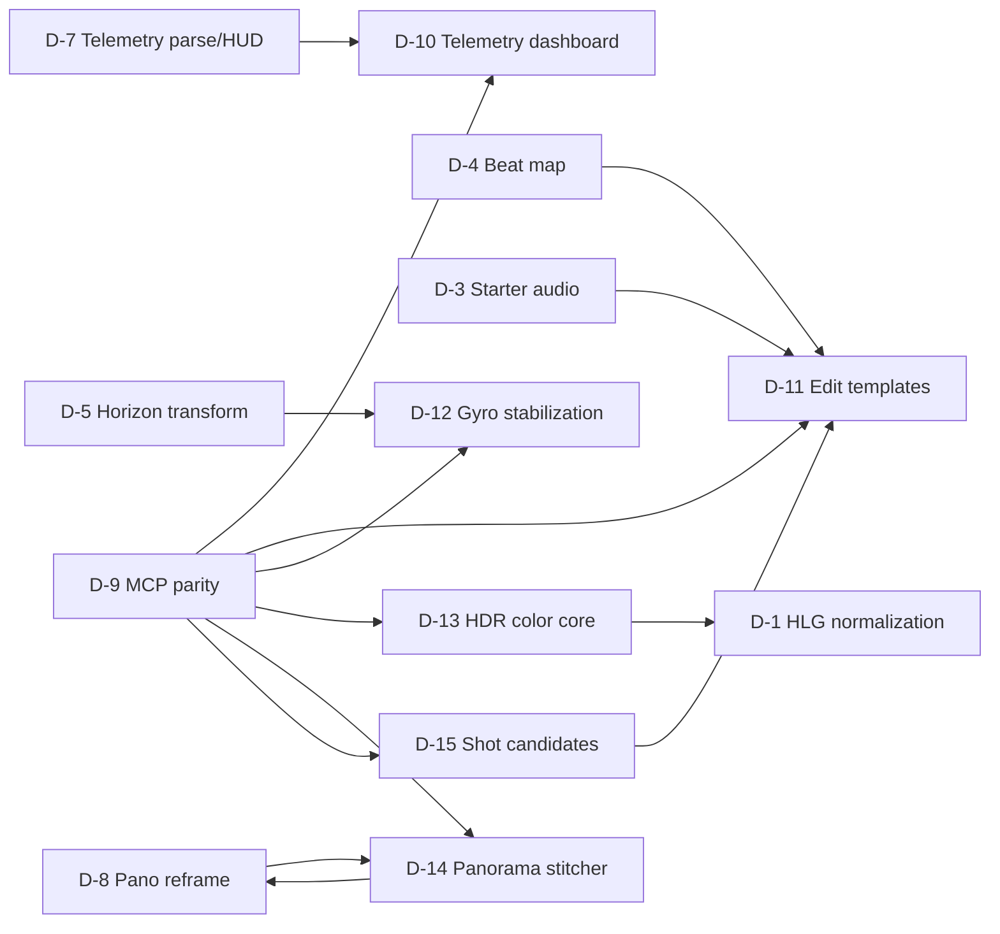

# 22 — DJI Advanced Workflows

Status: Implementation reference  
Date: 2026-07-10  
Audience: Photonic maintainers and implementation agents  
Scope: D-10–D-15

## 1. Purpose and Authority

Implementation contract for advanced telemetry presentation, beat-conformed edit templates, gyro stabilization, HDR/HLG color, panorama stitching, and deterministic highlight analysis.

Normative inputs, in precedence order:

- `SPEC.md`: D-09 SDR working-space contract, codec/licensing constraints, and non-goal gates for stabilization, HDR/10-bit, and 360°/VR.
- `03-render-color-pipeline.md` §3.2 and §4.2: shipped Rec.709 decode/working/display/export boundaries that D-13 may amend only behind explicit sequence color state.
- `07-color-grading.md` §3.8: current working-space LUT semantics; D-13 must preserve SDR behavior.
- `21-dji-core-workflows.md` D-1: HLG controls remain disabled until D-13 reference-vector, tone-map, scope, and export acceptance passes.
- `01-data-model.md`, `02-engine.md`, `10-mcp-tools.md`, `11-testing-phasing.md`: state, frame graph, parity, tests.
- `23-legal-open-source-implementation-routes.md`: accepted D-12/D-13/D-14 permissive/native routes and S2/S3/S5 amendments; release evidence remains item-gated.

This document consumes core contracts from `21-dji-core-workflows.md`:

- bundled/file-set asset registry;
- generated-analysis cache;
- D-4 beat maps and marker provenance;
- D-7 normalized telemetry and privacy policy;
- D-8 projection effect;
- D-9 ship-with-feature MCP rule.

Existing layer boundaries remain normative: core stores pure state/ops; video owns I/O/analysis; render owns kernels; GUI forwards intent; MCP uses same services and commands.

Any `AssetKind`, `AssetSource`, `Sequence`, or derived-recipe enum added here must update `01-data-model.md`, the next format migration, and `docs/format-versions.md`; serde-additive fields alone are not a compatibility plan.

## 2. Evidence-Backed Status Audit

| ID | Status | Shipped foundation | Missing feature slice |
|---|---|---|---|
| D-10 | Open | Caption/text rendering, scopes, normal overlay composition | D-7 telemetry model, widget layout, gauges/graphs/map, tile cache/privacy |
| D-11 | Open | Timeline edit ops, transitions, grades, audio clips, partial title preset UI | D-4 beats, edit-template schema/planner/preview/atomic apply |
| D-12 | Legal-or-fixture-blocked; S2 accepted | Manual horizon correction, keyframes, inverse-affine transform CPU/GPU parity | Gyro dialects, clock sync, lens calibration, orientation integration, stabilization warp |
| D-13 | Partial | `Rgba16Float` working textures, color probe tags, SDR scopes, LUT/grade, AV1/ProRes export | 10-bit decode, Rec.2020 working config, HLG/PQ transforms, nit scopes, tone map, 10-bit export |
| D-14 | Legal-or-fixture-blocked; S5 accepted | Still import, D-6 file-set contract, D-8 projection target | Capture-set model, feature matching, pose solve, warp/exposure/blend, RAW path |
| D-15 | Open | Decode/proxy path, markers, timeline ops, analysis-cache contract | Shot boundary detector, quality heuristics, candidate UI, reel assembly |

Status authority: `ROADMAP.md` owns live blocked-status enums. `Partial` here describes implementation foundation only; it does not remove ROADMAP product, legal, or fixture blockers.

Evidence paths:

- Current working format: `crates/photonic-render/src/pipeline.rs`, `crates/photonic-video/src/{pool,graph}`
- Current decode formats: `crates/photonic-video/src/decode/mod.rs` (`yuv420p`, `yuva444p`, 8-bit planes)
- Current SDR scopes: `crates/photonic-render/src/scopes.rs`
- Current probe color tags: `crates/photonic-video/src/media/probe.rs`
- Current horizon transform: `crates/photonic-gui/src/{app/reframe.rs,panels/video/clip_inspector.rs}`
- Current timeline/marker ops: `crates/photonic-core/src/timeline/{ops,commands,sequence}.rs`
- No product-code hits for DJI telemetry, panorama projection/stitching, gyro stabilization, HDR transfer, beat analysis, or shot detection beyond unrelated terms.

Shared infrastructure does not complete an advanced feature. `Rgba16Float` storage alone is not an HDR pipeline; a transform matrix alone is not gyro stabilization.

## 3. Dependency and Delivery Model

### 3.1 Dependency graph



D-15 may ship independently as analysis/markers. D-11 optionally consumes its candidates. D-14 produces a stitched asset consumed by D-8; D-8 does not depend on D-14.

### 3.2 Shared execution rules

- Analyses run on worker pools and support cooperative cancellation.
- Analysis results use versioned sidecar cache keys; project state stores recipes/bindings, not large derived arrays.
- Export preflight resolves every required source, analysis, LUT, lens profile, and map tile before encoder start.
- Preview degradation must remain explicit: warning/bypass/low-resolution proxy, never silent semantic change.
- GUI gestures coalesce; accepted plans and batch generation commit one undo step.
- MCP parity lands in same wave as GUI behavior.

### 3.3 Performance gates

| ID | Required gate |
|---|---|
| D-10 | Dashboard remains inside existing `< 8 ms` reference GPU eval through widget/vertex/tile caps |
| D-11 | Generated timeline obeys existing compile/eval/export budgets; planner never runs on GUI/audio callback |
| D-12 | Stabilization warp must fit existing reference eval or record measured `11` amendment before release |
| D-13 | S3 is accepted; existing SDR budgets still do not authorize HDR. Freeze measured HDR decode/eval/scope/export budgets before D-13 code. |
| D-14 | Stitch is cancellable offline work; preview/update never blocks GUI/audio callback; output render uses existing D-8 budget |
| D-15 | Sequential analysis runs off playback path; marker/reel output uses existing timeline budgets |

New pixel ops retain existing CPU/GPU golden thresholds. D-13 may add HDR-specific numeric tolerances only with reference-vector justification.

## 4. D-10 — Full Telemetry Dashboard

### 4.1 Status, scope, outcome

Status: Open; blocked on D-7 normalized telemetry.

User outcome: configure speed/altitude gauges, camera readouts, time-series graphs, route, and GPS mini-map; preview/export locally; render remains offline after tile preparation.

In scope:

- text/numeric readouts;
- linear/radial gauges;
- altitude/speed graphs;
- route polyline;
- mini-map from offline MBTiles or explicitly cached network tiles;
- field/unit/style/position keyframes;
- privacy redaction and attribution.

Out: live tracking, cloud render, social telemetry upload, terrain/3D maps, route planning.

### 4.2 Dependencies and ownership

- Core: dashboard/widget layout and map-source references.
- Video: telemetry sample resolution, graph-series preparation, tile preflight/cache.
- Render: dashboard primitive GPU/CPU rendering.
- GUI: overlay designer and monitor handles.
- MCP: layout CRUD, tile status/prefetch, render parity.
- D-7: normalized samples, sync, sensitive-data policy.

### 4.3 Data and serialization

Extend D-7 `TelemetryOverlay.layout`:

```rust
pub enum TelemetryLayout {
    TextHud(TelemetryHudLayout),
    Dashboard(TelemetryDashboard),
}

pub struct TelemetryDashboard {
    pub widgets: Vec<TelemetryWidget>,
    pub safe_area: bool,
}

pub struct TelemetryWidget {
    pub id: TelemetryWidgetId,
    pub rect: NormalizedRect,
    pub z: i32,
    pub enabled: bool,
    pub style: TelemetryWidgetStyle,
    pub kind: TelemetryWidgetKind,
}

pub enum TelemetryWidgetKind {
    Numeric { field: TelemetryField, format: String },
    LinearGauge { field: TelemetryField, min: f64, max: f64 },
    RadialGauge { field: TelemetryField, min: f64, max: f64 },
    Graph { field: TelemetryField, window: Tick, range: GraphRange },
    Route { source: RouteSource, show_current: bool },
    Map { map_style: MapStyleRef, zoom: f32, follow: MapFollowMode },
    CameraReadout { fields: Vec<TelemetryField> },
}
```

Widget IDs persist across reorder/keyframe edits. Widget params use `AnimProps` only for bounded scalar/layout properties; field bindings, map source, and format strings remain static.

Map credentials never serialize. `MapStyleRef` stores provider/style key only. App config resolves provider URL/token. Offline `Mbtiles { path, rel_path, sha256 }` may serialize as user source.

### 4.4 Sampling and render contracts

At tick:

1. Resolve D-7 telemetry sample and privacy transform.
2. Resolve widget animation/style.
3. Build `ResolvedTelemetryOverlay`: text runs, paths, quads, graph vertices, tile quads.
4. Collect active clip-bound dashboards during track traversal.
5. Evaluate `IrOp::TelemetryOverlay` after video-track fold and before caption/project overlays.

Graph windows use bounded sample decimation: preserve endpoints and extrema per pixel column. Gauge smoothing is a display parameter applied to normalized telemetry, not source mutation. Export uses tick-derived smoothing history, never wall time.

Route projection:

- unwrap longitude around route centroid;
- Web Mercator for supported latitude range;
- clip outside range and report warning;
- map/route consume privacy-transformed coordinates, not raw sample coordinates.

### 4.5 Map tile and cloud boundary

Supported sources:

1. User-selected MBTiles: complete offline path.
2. User-configured XYZ provider: explicit opt-in prefetch only.
3. No-provider mode: route on neutral grid, no basemap.

Network provider contract:

- token stored in OS credential/config layer, not project;
- HTTPS only;
- provider attribution and usage policy required;
- prefetch dialog shows bounding box, zoom range, tile count, cache destination, attribution;
- no background location upload before confirmation;
- cache key includes provider/style/z/x/y and response validator;
- export never fetches; missing tiles block or use user-selected neutral-grid fallback.

Cache: `<project>.photon.cache/maps/<provider>/<style>/<z>/<x>/<y>`. Cache clear removes tiles. Project privacy mode may disable network map sources globally.

### 4.6 UI, commands, MCP

Telemetry Inspector adds `Dashboard` mode and widget list. Add/reorder/delete, field/type picker, numeric bounds, style, normalized position/size, safe-area guides. Monitor handles edit selected widget; keyboard/numeric fallback mandatory. Follow `DESIGN.md`: drawer-card surface/border, dim section headers, `mono-data` values, violet selection only, muted always-visible map attribution strip; no new chrome accent.

Commands use `SetClipProp` for whole-overlay replacement initially; add granular `TelemetryCmd` only if command memory/profile proves necessary. Drag coalesces by `(clip,widget)`.

MCP:

- `set_telemetry_dashboard`
- `add_telemetry_widget`
- `set_telemetry_widget`
- `remove_telemetry_widget`
- `get_map_tile_status`
- `prefetch_map_tiles` job

Sensitive coordinates stay hidden unless explicitly requested.

### 4.7 Errors, performance, security, licensing

- Missing field: widget shows `—`; optional hide-on-missing.
- Invalid range/format: reject at edit boundary.
- Missing tiles: preflight names coverage; no surprise live fetch.
- Provider denial/rate limit: preserve cached tiles and report provider error.
- Limit widget count, graph sample vertices, text length, and tile decode dimensions by documented engine caps.
- Tile decode/prefetch runs on workers. Renderer receives immutable atlas/batches.
- Cache tile textures in GPU LRU keyed by digest; route/graph vertices by telemetry-analysis key + widget params.
- Exact GPS never enters logs, default MCP, or crash metadata.
- Tile provider license/attribution must allow application use and cached render output. User-supplied MBTiles remain user's responsibility; UI states that boundary.

### 4.8 Tests and acceptance

- Synthetic telemetry drives each widget to known visual/value output.
- Graph decimator preserves spikes/endpoints.
- Route handles dateline and high-latitude rejection.
- CPU/GPU dashboard goldens pass.
- Save/reopen and undo/redo preserve IDs/order/layout.
- Neutral-grid export works fully offline.
- MBTiles export performs zero network calls.
- XYZ export after prefetch performs zero network calls and includes attribution.
- Hidden/rounded/home-redacted privacy modes affect map, route, text, MCP consistently.
- Missing tile preflight occurs before encoder starts.

### 4.9 Rollout, deferrals, blockers

Rollout order: widget model; text/gauge/graph primitives; route; MBTiles; optional XYZ prefetch; GUI/MCP.

Deferred: terrain, 3D globe, live feeds, cloud route services.

Blockers:

- D-7 dialect/sync/privacy acceptance.
- Default map mode decision. This spec recommends neutral grid plus user MBTiles; no default online provider.
- Provider attribution/cache/output rights if XYZ support ships.

## 5. D-11 — Beat-Conformed Edit Templates

### 5.1 Status, scope, outcome

Status: Open. D-4 required; D-3 optional; D-15 optional.

User outcome: choose music and template, assign source clips/candidates, preview deterministic cut plan, apply one atomic timeline edit with cuts on beat grid.

In scope: local user-picked templates, beat-relative slots, trims, transitions, look refs, music placement, deterministic segment selection, preview/commit.

Out: scene classifier, semantic highlight model, automatic template recommendation, remote catalog.

### 5.2 Dependencies and ownership

- Core: versioned template and pure planning constraints; no file I/O.
- Video: template registry, beat-map resolution, preview plan.
- GUI timeline: source assignment, plan review, apply.
- MCP: list/plan/apply.
- D-4: beats; D-3: bundled music; D-15: optional candidates.

### 5.3 Template format

Templates are app-level JSON/TOML, not document state or live links.

```rust
pub struct EditTemplate {
    pub schema: u32,
    pub id: String,
    pub name: String,
    pub supported_meter: Vec<u8>,
    pub required_slots: usize,
    pub music: Option<BundledAssetRef>,
    pub slots: Vec<EditSlot>,
}

pub struct EditSlot {
    pub start_beat: Rational,
    pub length_beats: Rational,
    pub role: SlotRole,
    pub transition_in: Option<TransitionRecipe>,
    pub transition_out: Option<TransitionRecipe>,
    pub look: Option<BundledAssetRef>,
    pub min_source_duration: Tick,
}

pub enum SlotRole { Establishing, Action, Detail, Closing, Any }
```

No arbitrary scripting. Parser rejects unknown schema, path traversal, duplicate IDs, negative/overlapping slot intervals, incompatible transition lengths, unlicensed bundled refs.

### 5.4 Planning algorithm

Inputs: target sequence/track, beat map, selected source ranges or D-15 candidates, template, start beat, replacement policy.

Pure planner:

1. Convert rational beat positions to exact sequence ticks using selected beat events, not floating BPM extrapolation when events exist.
2. Validate each slot duration against transition handles and source range.
3. Select candidate deterministically: explicit assignment first; else source order filtered by role/duration; optional D-15 score breaks ties; stable asset/clip ID final tie-break.
4. Choose centered source trim unless user pin exists.
5. Emit proposed inserts/trims/transitions/grade look/music clip.
6. Validate track locks, overlap policy, offline media, handles, and sequence bounds.
7. Return `EditPlan` plus warnings; no mutation.

Replacement policies: insert-and-ripple, overwrite-target-range, create-new-sequence. Default create-new-sequence protects existing edit.

### 5.5 Apply, undo, serialization

Accepted plan converts to existing pure timeline ops. Apply wraps all commands in one `Command::Batch`. Failure before commit leaves document unchanged. Template link is discarded after apply; resulting clips/transitions/grades are normal editable state. Store plan provenance only in optional sequence note/audit data, not required for render.

Undo removes entire generated edit. Redo restores identical IDs/order. Preview plan is session state and not saved unless user exports plan JSON.

### 5.6 UI and MCP

Template panel:

- template/music picker;
- source clip/candidate list with slot assignments;
- beat grid and slot strip;
- replacement policy and destination;
- warnings;
- preview plan, apply, cancel.

Preview uses temporary render snapshot; never mutates project/history. Generated status uses inline success/error tints per DESIGN.

MCP:

- `list_edit_templates`
- `plan_edit_template`
- `apply_edit_template { plan_id }`
- `export_edit_plan`

`plan_id` identifies session job result and expires with job registry; apply revalidates document revision and rejects stale plan.

### 5.7 Errors, performance, privacy, licensing

- Beat confidence too low: require user confirmation or explicit fixed grid.
- Insufficient source/handles: plan error lists slots and needed range.
- Stale document revision: `PlanStale`; regenerate.
- Missing bundled music/look: allow user substitution; no silent omission.
- Planner remains pure and bounded by slot/candidate caps. Candidate scoring may run in worker job; preview snapshot uses existing engine.
- No cloud. Source frames/audio remain local.
- Bundled template/music/look manifests use D-1/D-3 legal gate. Do not copy DJI templates/music without rights.

### 5.8 Tests and acceptance

- Fixed beat/template fixture yields exact expected ticks and command list.
- Rational half/double-beat slots avoid cumulative drift.
- Explicit assignment beats heuristic; stable tie-break produces repeatable plan.
- Each replacement policy preserves track invariants.
- Locked/offline/short-handle inputs fail before mutation.
- Preview leaves document/history byte-identical.
- Apply is one undo step; redo is byte-identical.
- GUI and MCP applying same plan produce equal document state and render.
- Template parser rejects unsafe refs and malformed slot graphs.

### 5.9 Rollout, deferrals, blockers

Rollout order: schema/parser; pure planner fixtures; plan preview; atomic apply; bundled starter templates; GUI/MCP.

Deferred: automatic template recommendation, semantic slot assignment, cloud catalog, collaborative templates.

Blockers:

- D-4 beat-map acceptance.
- First rights-cleared template/music set.
- Default replacement policy. This spec recommends create-new-sequence.

## 6. D-12 — Gyro Metadata Stabilization

### 6.1 Status, scope, outcome

Status: Legal-or-fixture-blocked; S2 accepted 2026-07-12. D-5 transform/auto-crop is useful foundation but not stabilization. Parser, lens-profile, and owned-fixture evidence remain required.

User outcome: bind synchronized gyro metadata and lens profile to compatible DJI/FPV/action clip, choose stabilization/horizon strength and crop policy, preview/export repeatable stabilized result.

In scope: gyro-backed orientation correction, horizon lock, lens calibration, dynamic crop/zoom, sidecar/interchange adapter, native DJI adapter after fixtures.

Out: optical-flow stabilization without gyro, rolling-shutter correction, ML horizon detection.

### 6.2 Dependencies and ownership

- Core: motion binding and stabilization recipe.
- Video media: metadata adapters, clock sync, analysis cache.
- Video analysis: calibration, quaternion integration/smoothing, crop path.
- Render: lens undistort plus projective warp CPU/GPU.
- GUI: stabilization inspector/monitor diagnostics.
- MCP: import/analyze/apply.

### 6.3 Motion and lens contracts

```rust
pub struct MotionBinding {
    pub source: MotionSourceRef,
    pub sync: MotionSync,
    pub lens: LensProfileRef,
}

pub struct MotionSample {
    pub sensor_time_ns: i64,
    pub gyro_rad_s: [f64; 3],
    pub accel_mps2: Option<[f64; 3]>,
    pub orientation: Option<[f64; 4]>,
}

pub struct StabilizationSpec {
    pub binding: MotionBinding,
    pub smoothness: f32,
    pub horizon_lock: f32,
    pub crop_mode: StabilizationCropMode,
    pub max_zoom: f32,
    pub analysis_key: Option<String>,
}

pub enum StabilizationCropMode { StaticSafe, Dynamic, TransparentEdges }
```

Add `Clip.stabilization: Option<StabilizationSpec>` with serde default. Motion samples/orientation path stay in versioned analysis cache; project stores source ref, sync anchors, lens profile identity, recipe.

Adapters implement:

```rust
trait MotionMetadataAdapter {
    fn sniff(&self, source: &Path) -> AdapterConfidence;
    fn parse(&self, source: &Path) -> Result<MotionSeries, MotionError>;
}
```

Required test adapter: documented Photonic gyro JSON interchange. Native DJI/embedded adapter cannot claim support until real fixtures define boxes/timescale/axes/units. Optional external Gyroflow interchange adapter requires format/license review.

### 6.4 Sync, integration, and warp

Sync supports explicit `(video_tick,sensor_time_ns)` anchors. One anchor = offset; two or more = affine clock mapping and drift diagnostic. Auto-sync may use metadata timestamps; never assume sensor time equals video PTS.

Analysis pipeline:

1. Normalize coordinate axes/units from adapter.
2. Estimate gyro bias from eligible low-motion spans or supplied calibration.
3. Resample angular velocity onto video frame times.
4. Integrate orientation with normalized quaternion midpoint update.
5. Derive desired path using deterministic low-pass smoothing over orientation.
6. Blend gravity/horizon correction when accelerometer confidence permits.
7. Compute correction quaternion and lens-aware frame homography/mesh.
8. Solve static or dynamic crop path under `max_zoom`.

Render operation order: lens undistort to calibrated rays, apply orientation warp, resample source, then ordinary clip transform/effects/grade. `IrOp::StabilizeWarp` carries resolved mesh/homography for current tick. CPU reference matches coordinate conventions and sampling.

### 6.5 UI, commands, MCP, undo

Inspector: metadata source/status, sync offset/anchors, lens profile, smoothness, horizon lock, crop mode/max zoom, analyze/reanalyze, diagnostic plots. Monitor shows crop boundary and motion path; overlays do not export.

Setting recipe uses `SetClipProp`; analysis cache generation not history. Removing stabilization restores source path without deleting metadata/cache. Coalesced sliders commit one command.

MCP:

- `import_motion_metadata`
- `analyze_stabilization` job
- `set_stabilization`
- `get_stabilization_status`

### 6.6 Errors, performance, privacy, security

- Unknown dialect/axis/units: hard fail, never guess.
- Missing lens profile: allow rotation-only preview only if explicitly selected; full acceptance requires calibrated lens.
- Insufficient samples/gaps/drift: diagnostic with affected ranges; export blocks unless user chooses bypass.
- Invalid quaternion/NaN: discard sample and report count; excessive invalid data fails.
- Parse/analyze on workers; cache resampled orientation/crop path by motion hash + lens + recipe.
- GPU warp one pass; proxy preview uses same path at proxy dimensions.
- Motion/GPS metadata stays local and follows telemetry log redaction.
- Treat metadata as untrusted binary: bounded box sizes/sample counts, checked arithmetic, no unsafe parser shortcuts.
- Any third-party lens/profile database needs license and redistribution review.

### 6.7 Tests and acceptance

- Synthetic constant-rate rotations integrate to known quaternions.
- Axis/sign/unit adapter fixtures normalize correctly.
- Two-anchor drift mapping aligns first/last samples within one video frame.
- Static camera with injected gyro noise becomes stable without false motion.
- Horizon-lock fixture converges while respecting strength.
- Crop solver never exposes edges under StaticSafe within max-zoom feasibility; impossible case reports range.
- CPU/GPU warp goldens pass on grid/lens fixtures.
- Save/reopen/undo preserve recipe; cache rebuild yields equivalent path.
- Offline render makes no network calls.

### 6.8 Rollout, deferrals, blockers

Rollout order: interchange fixture/adapter; sync/integration tests; lens model; CPU warp/crop; GPU; GUI/MCP; native DJI adapters one dialect at a time.

Deferred: optical flow, rolling shutter, automatic lens calibration, ML horizon.

Blockers:

- `SPEC.md` stabilization non-goal amendment/exception.
- Representative legally usable DJI/Avata/Action metadata fixtures.
- Verified container dialect, axes, units, sample clock, camera-lens mapping.
- Rights-cleared lens-profile database or user-supplied profile format.

## 7. D-13 — HDR/HLG 10-Bit Color Pipeline

### 7.1 Status, scope, outcome

Status: Partial foundation and legal-or-fixture-blocked; S3 accepted 2026-07-12. `Rgba16Float` storage exists, but current semantics are SDR linear Rec.709 and decode truncates to 8-bit planes. Reference vectors, measured budgets, and encoder/distribution evidence remain required.

User outcome: preserve 10-bit HLG/PQ precision through decode/grade/scopes/export; provide deterministic HLG-to-SDR conversion; keep all existing SDR projects pixel-stable.

In scope:

- 10-bit YUV decode/upload;
- explicit sequence working color config;
- Rec.2020 linear HDR working path;
- HLG/PQ input/output transfers;
- nit-scaled scopes and gamut warnings;
- BT.2446A HLG-to-SDR tone map;
- AV1 Main10 and compatible ProRes 10-bit export where encoder supports;
- SDR display fallback.

Out: Dolby Vision metadata, ACES/OCIO, platform HDR-monitor swapchains, HEVC in shipped build.

### 7.2 Dependencies and ownership

- Core: color-space/config enums and serialized sequence/export state.
- Video decode/export: 10-bit planes, color metadata, transform selection.
- Render: transfer/matrix/tone-map/scopes CPU/GPU.
- GUI: project/sequence color settings, HDR scopes/export validation.
- MCP: color config, scopes units, export fields.
- D-1 HLG enablement depends on this core.

### 7.3 Color state and compatibility

```rust
pub struct SequenceColorConfig {
    pub working: WorkingColorSpace,
    pub reference_white_nits: f32,
    pub mastering_peak_nits: f32,
    pub preview: PreviewTransform,
}

pub enum WorkingColorSpace {
    LinearRec709Sdr,
    LinearRec2020Hdr,
}

pub enum TransferFunction { Bt709, Srgb, Hlg, Pq }
pub enum ColorPrimaries { Rec709, Rec2020 }
pub enum PreviewTransform { SdrToneMapped, HdrNative }
```

Add `Sequence.color` with serde default `LinearRec709Sdr`; old v4 projects remain byte/pixel compatible. Never infer sequence HDR working mode solely from one clip. Import may suggest change/create-HDR-sequence.

Color values in `LinearRec2020Hdr` use relative linear luminance with `1.0 == reference_white_nits`; values above 1 remain valid up to mastering range. Alpha stays linear/premultiplied.

### 7.4 Decode and working transforms

Extend pixel formats:

```rust
pub enum PixFmt {
    Yuv420p,
    Yuva444p,
    Yuv420p10le,
    Yuv444p10le,
}
```

10-bit planes store `u16`, upload `R16Unorm`, mask/normalize valid 10 bits, preserve range metadata. Probe retains bit depth, chroma location, mastering metadata, content-light metadata when present.

Input pipeline:

```text
range expand -> YCbCr matrix -> encoded RGB
  -> transfer inverse (BT.709/HLG/PQ)
  -> primary conversion (Rec.709/Rec.2020)
  -> working luminance normalization -> premultiply -> Rgba16Float
```

HLG inverse OETF constants:

```text
a = 0.17883277
b = 0.28466892
c = 0.55991073
E = E'^2 / 3                                  when E' <= 0.5
E = (exp((E' - c) / a) + b) / 12             otherwise
```

PQ uses ST 2084 constants from one shared module:

```text
m1 = 2610 / 16384
m2 = 2523 / 32
c1 = 3424 / 4096
c2 = 2413 / 128
c3 = 2392 / 128
L = 10000 * max((N^(1/m2)-c1)/(c2-c3*N^(1/m2)),0)^(1/m1)
```

HLG OOTF/system gamma and Rec.2020 matrices follow ITU-R BT.2100 centralized constants. Rust/WGSL literal parity tests required.

### 7.5 Grade, scopes, preview, tone map

Grade operators continue on linear working values. Ops historically wrapped in sRGB for perceptual feel must select encoding based on working config; HDR path must not run Rec.2020 values through SDR sRGB without explicit display-referred transform. LUT ops require declared input/output color-space metadata; untagged `.cube` requires user assignment.

Scopes:

- waveform modes: normalized, nits, HDR stops;
- vectorscope: Rec.709 or Rec.2020 targets matching working space;
- histogram range extends above reference white;
- maxCLL/peak readout and Rec.709/Rec.2020 gamut warning;
- UI labels signal domain and nits reference.

SDR preview/export transform: ITU-R BT.2446 Method A, one normative implementation in `photonic-render::color`. Operator maps HLG/Rec.2020 working output to SDR Rec.709, preserves highlight roll-off, applies gamut mapping, then BT.709 encode. Do not use generic clamp/Reinhard as release behavior. Validate against published reference vectors.

Existing SDR monitor path remains default. Native HDR display presentation stays disabled unless platform swapchain/color-management implementation exists and passes platform tests.

### 7.6 Export contract

Extend preset fields:

```rust
pub struct HdrOutputSpec {
    pub primaries: ColorPrimaries,
    pub transfer: TransferFunction,
    pub bit_depth: u8,
    pub mastering_peak_nits: Option<f32>,
}
```

Supported shipped targets depend on encoder capability discovered at runtime:

- AV1 Main10, 10-bit YUV, HLG/PQ tags;
- ProRes 10-bit MOV profiles supported by shipped FFmpeg;
- HLG/PQ image sequence where file format carries precision/metadata;
- user FFmpeg escape hatch for HEVC; no built-in HEVC promise.

Encoder preflight validates codec/container/pix-fmt/tags. Decode-back tests verify tag and 10-bit plane retention, not only visual appearance.

### 7.7 UI, commands, MCP, undo

Sequence settings: working space, reference white, mastering peak, preview transform. Changing working space is undoable document state and requires explicit confirmation because clip grades/LUT meaning may change. Export dialog filters incompatible presets and shows signal tags/bit depth.

MCP:

- `get_sequence_color_config`
- `set_sequence_color_config`
- `get_hdr_scopes`
- HDR fields on `export_sequence`
- `apply_hlg_to_sdr` input/tone-map setup

### 7.8 Errors, performance, security, licensing

- Unknown/missing color tags: require user input for HDR; never default to HLG/PQ.
- Mixed SDR/HDR: input-transform each clip into sequence working space; diagnostic per clip.
- GPU lacks required R16 sampling/storage: disable HDR mode and report capability.
- Encoder lacks 10-bit target: preflight reject; no 8-bit fallback under HDR preset.
- Texture storage remains `Rgba16Float`; 10-bit decode increases upload bandwidth/cache size. Cache keys include source color transform and sequence color config.
- Scopes may decimate samples under measured load but must retain signal-domain accuracy.
- No network. Color metadata contains no user secret.
- FFmpeg remains sidecar per D-03; no GPL/AGPL codec code links into Photonic. Codec/license constraints unchanged; new encoder selection must pass `cargo deny` and distribution review.

### 7.9 Tests and acceptance

- 10-bit ramps retain more than 256 distinct code values through decode/readback.
- BT.2100 HLG and ST 2084 PQ reference vectors pass CPU and GPU.
- Rec.2020/Rec.709 matrices and round trips meet numeric tolerance.
- HDR scope fixtures report expected nit/code positions.
- BT.2446A reference images/vectors meet target output and CPU/GPU parity.
- AV1/ProRes exports probe as 10-bit with correct primaries/transfer/matrix tags.
- HDR preset never silently emits 8-bit.
- Mixed SDR/HDR clip project renders deterministic working-space conversions.
- Every pre-existing SDR golden remains unchanged.
- D-1 HLG normalization enables only after these input/tone-map tests pass.

### 7.10 Rollout, deferrals, blockers

Rollout order: color-state compatibility; 10-bit decode/upload; HLG/PQ transforms; HDR scopes; BT.2446A SDR output; 10-bit export; D-1 HLG enablement.

Deferred: native HDR monitor output, Dolby Vision, ACES/OCIO, HEVC built-in.

Blockers:

- `SPEC.md` HDR-delivery/10-bit non-goal amendment.
- Reference HLG/PQ/BT.2446 test vectors with redistribution rights.
- Target encoder/container matrix validated against shipped FFmpeg.
- Reference-white/mastering defaults approved by color review.

## 8. D-14 — Panorama Stitcher

### 8.1 Status, scope, outcome

Status: Legal-or-fixture-blocked; S5 accepted 2026-07-12. D-8 handles already-stitched output; D-14 creates it from overlapping captures. D-8 output-contract acceptance and capture fixtures remain required.

User outcome: import DJI panorama capture set, validate/match frames, stitch higher-quality panorama locally, inspect seams, then reframe through D-8.

In scope: processed JPEG/TIFF capture sets first; feature matching, camera solve, spherical/equirectangular warp, exposure compensation, seam/multiband blend, cached output.

Full RAW/DNG path is a separate slice blocked on RAW development/color pipeline.

### 8.2 Dependencies and ownership

- Core: panorama capture-set source and stitch recipe.
- Video media: set discovery/EXIF/manifest and output cache.
- Video CV: features, matching, pose solve, exposure/seam/blend.
- Render: warp/blend kernels where GPU path chosen.
- GUI: stitch review/diagnostics.
- D-8: final reframe/effect.

### 8.3 Data and serialization

```rust
pub enum AssetKind { /* existing + */ PanoramaSet, Panorama }

pub struct PanoramaSetSpec {
    pub files: Vec<FileRef>,
    pub capture_layout: PanoramaCaptureLayout,
    pub camera: Option<CameraMetadata>,
}

pub enum PanoramaCaptureLayout { Sphere, Wide, Vertical, Auto }

pub struct PanoramaStitchRecipe {
    pub source: AssetId,
    pub projection: StitchProjection,
    pub match_config: MatchConfig,
    pub exposure_compensation: bool,
    pub blend: BlendConfig,
    pub crop: PanoramaCropMode,
    pub analysis_key: Option<String>,
}

pub enum DerivedMediaRecipeRef {
    Panorama { recipe_id: PanoramaRecipeId, cache_key: String },
}
```

Add `TimelineProject.panorama_recipes: HashMap<PanoramaRecipeId, PanoramaStitchRecipe>` with serde default. Extend `AssetSource` with `Derived { recipe: DerivedMediaRecipeRef }`. Source set and recipe serialize; feature descriptors, matches, solved cameras, masks, pyramids, and stitched raster live in analysis cache. Stitched result registers as derived `AssetKind::Panorama` with recipe identity. Export/copy-to-file makes durable user output; cache remains rebuildable. Missing cache triggers rebuild from recipe/source set.

### 8.4 Stitch pipeline

1. Validate dimensions/orientation/EXIF/capture count; detect duplicates/missing frames.
2. Build normalized previews with consistent color transform.
3. Extract multi-scale rotation-invariant binary features.
4. Match expected neighbors using Hamming distance, mutual check, and ratio filter.
5. Estimate pair transforms with RANSAC; reject weak/disconnected edges.
6. Solve global camera orientation/focal parameters with robust bundle adjustment.
7. Choose spherical/equirectangular output bounds.
8. Estimate per-image exposure/gain from overlaps.
9. Warp images/masks into output.
10. Find seams minimizing gradient/exposure disagreement.
11. Multiband blend; crop according to recipe.
12. Write cached high-bit-depth panorama plus diagnostics.

All random sampling uses recipe-derived deterministic seed. Algorithm/version enters cache key.

### 8.5 Formats and RAW boundary

First supported inputs: formats already decoded reliably by Photonic image stack with retained dimensions/color metadata. DNG/RAW acceptance requires:

- permissively licensed RAW decoder;
- camera black/white level and color matrix handling;
- demosaic choice;
- D-13 precision/color integration;
- camera fixture corpus.

Do not label JPEG/TIFF-only delivery as full RAW parity. UI states supported source types.

### 8.6 UI, commands, MCP, undo

Stitch workspace: capture grid/order, missing/duplicate warnings, match graph, projection/output preview, exposure/blend/crop controls, seam diagnostic, create panorama. User can disable bad frame and rerun.

Analysis recipe changes are document state; cached recomputation is not. Creating source set + recipe + derived panorama asset uses one atomic batch. Undo removes derived references, not source files/cache.

MCP:

- `import_panorama_set`
- `analyze_panorama` job
- `set_panorama_stitch_recipe`
- `stitch_panorama` job
- `get_panorama_diagnostics`

### 8.7 Errors, performance, privacy, security, licensing

- Disconnected match graph: show components and weak edges; no output.
- Missing capture: allow attempt only after explicit confirmation; mark quality warning.
- Solve divergence/singular camera: diagnostic, preserve recipe.
- Exposure mismatch beyond compensation: warn, continue only by user choice.
- Bound image count/dimensions/feature count/output pixels before allocation.
- Worker/GPU job only; preview uses downscaled pyramid; final streams tiles where possible.
- Cache intermediates by stage so parameter-only blend rerun reuses features/poses.
- Fully local. EXIF GPS follows telemetry privacy and never uploads.
- New CV/RAW dependencies need license, unsafe-code, and supply-chain review.

### 8.8 Tests and acceptance

- Synthetic transformed overlap set recovers known transforms.
- Match outliers are rejected; disconnected graph fails clearly.
- Exposure compensation reduces overlap luminance delta.
- Seam/multiband blend golden has no threshold-exceeding seam on fixture.
- Deterministic seed yields byte-equivalent diagnostics/output before lossy encode.
- Missing/duplicate/mixed-dimension fixtures produce expected diagnostics.
- Output registers as panorama and D-8 projection can reframe it.
- Save/reopen/undo preserve recipe/derived links; cache clear rebuilds equivalent result.
- Resource caps reject malicious dimensions/counts before allocation.

### 8.9 Rollout, deferrals, blockers

Rollout order: capture-set model/fixtures; deterministic feature/match tests; solve/warp; exposure/seam/blend; derived asset/D-8 handoff; GUI/MCP; RAW slice.

Deferred: learned feature matchers, HDR merge, focus stacking, video stitching.

Blockers:

- `SPEC.md` 360°/VR exception/amendment for panorama stills.
- Representative DJI capture grids and expected ordering across Sphere/Wide/Vertical.
- CV dependency/implementation choice with permissive license and deterministic behavior.
- RAW/DNG decoder and camera color pipeline for full advertised scope.

## 9. D-15 — Shot Detection and Deterministic Highlight Reel

### 9.1 Status, scope, outcome

Status: Open. Local hard-cut/dissolve segmentation plus nonsemantic quality ranking. Can emit markers independently or feed D-11.

User outcome: analyze long footage, review shot boundaries/candidates and objective quality signals, add markers or assemble a simple select reel without uploading footage.

Out: semantic “best moment” judgment, object/face recognition, cloud scoring, auto-template choice.

### 9.2 Dependencies and ownership

- Video decode/proxy: sequential frames.
- Video analysis: boundary metrics and quality features.
- Core: shot marker provenance and optional candidate recipe.
- GUI timeline: candidate browser/markers/select reel.
- D-11: optional beat-template assembly.
- MCP: analyze/list/apply.

### 9.3 Analysis contract

```rust
pub struct ShotAnalysisConfig {
    pub cut_sensitivity: f32,
    pub detect_dissolves: bool,
    pub min_shot: Tick,
    pub ranking_weights: ShotRankingWeights,
}

pub struct ShotCandidate {
    pub source_asset: AssetId,
    pub start: Tick,
    pub end: Tick,
    pub boundary_confidence: f32,
    pub sharpness: f32,
    pub exposure_quality: f32,
    pub stability: f32,
    pub motion_energy: f32,
    pub score: f32,
    pub warnings: Vec<ShotWarning>,
}
```

Boundary pipeline decodes proxy/full preview sequentially at source frame cadence, computes luma/chroma histogram distance, edge-change ratio, mean/variance delta, and sustained-change curve. Adaptive local thresholds detect hard cuts; sustained moderate change detects dissolves when enabled. Enforce min-shot by confidence-aware merge, not blind deletion.

Ranking is explicitly nonsemantic:

- sharpness: normalized Laplacian variance;
- exposure: clipped-shadow/highlight penalty and usable luma spread;
- stability/motion: block-motion consistency and global-motion variance;
- duration suitability;
- user-pinned/excluded ranges override all scores.

Weights and analyzer version enter cache key. Stable source-tick ordering breaks equal scores.

### 9.4 Cache, state, markers, reel assembly

Candidates live in analysis cache. Applying boundaries creates `MarkerKind::ShotBoundary { asset, analysis_key, ordinal, confidence }`; user markers remain untouched. Applying selection creates ordinary clips in a new sequence by default.

Simple select-reel policy:

1. Exclude warnings/pinned-off candidates.
2. Include pinned-on candidates.
3. Rank remaining by deterministic score.
4. Avoid overlapping source ranges.
5. Trim only at candidate boundaries unless user permits centered duration trim.
6. Place in source-time order or explicit score order.

No live link after apply. D-11 may use candidates as slot inputs; it remains owner of beat-conformed template edits.

### 9.5 UI, commands, MCP, undo

Analyze command opens progress; candidate panel shows thumbnail, range, score components, warnings, include/exclude/pin, preview. Timeline overlays boundaries; generated markers visually distinct. `Create Select Reel` previews plan and defaults to new sequence.

Analysis/cache is not undoable. Marker apply/clear and reel apply each commit one command/batch. Undo never deletes cache/source.

MCP:

- `analyze_shots { asset_id|clip_id, config } -> job_id`
- `list_shot_candidates`
- `apply_shot_markers`
- `create_select_reel`
- `clear_shot_markers`

### 9.6 Errors, performance, privacy, security

- Offline/unsupported media: stable structured error.
- Too-short source: empty result plus warning, not failure.
- VFR: use source PTS, never ordinal-derived time.
- Low boundary confidence: retain candidate warning; do not fabricate certainty.
- Decode/analyze workers only; sequential decode reuses proxy and bounded frame buffers.
- Cache feature vectors/results, not decoded frames.
- Fully local. Thumbnails remain project cache. No biometric/semantic inference.
- Bound frame dimensions, duration-derived work units, candidate count, and serialized diagnostic lengths.

### 9.7 Tests and acceptance

- Synthetic hard-cut, flash, camera-pan, fade/dissolve, and no-cut fixtures.
- Flash does not become a two-frame shot under default config.
- Known cuts land within one source frame.
- VFR fixture boundaries use exact PTS.
- Sharp/blurred, clipped/well-exposed, stable/shaky fixtures rank expected component directions.
- Same input/config returns byte-equivalent candidates.
- User pins/exclusions override score deterministically.
- Generated marker rerun replaces only same-analysis shot markers; user/beat markers survive.
- Select reel is one undo step and preserves source track invariants.
- GUI and MCP candidate/reel results match.

### 9.8 Rollout, deferrals, blockers

Rollout order: boundary fixture corpus; analyzer/cache; marker provenance/UI; quality features; select-reel planner; D-11 integration; MCP.

Deferred: semantic ranking, subject framing, face/object analysis, soundtrack-aware selection outside D-11.

Blockers:

- Rights-cleared footage corpus with labeled cuts/dissolves and objective quality variants.
- Default metric thresholds/weights approved against corpus.
- Product naming must say deterministic shot analysis, not AI highlight quality, until semantic model exists.

## 10. Conflict-Free Delivery Waves

| Wave | Core/model lane | Engine/render lane | GUI lane | MCP lane | Gate |
|---|---|---|---|---|---|
| 22-A0 | — | D-7 prerequisite completion | — | D-7 parity | Telemetry fixtures/privacy |
| 22-A1 | Dashboard/widget types | D-10 primitives + MBTiles | Dashboard designer | D-10 tools | Offline/privacy/map attribution |
| 22-A2 | Template schema/planner types | D-11 registry/preview | Template panel | D-11 tools | D-4 beats + planner fixtures |
| 22-A3 | Motion/stabilization state | D-12 adapters/analysis/warp | Stabilization inspector | D-12 tools | Gyro/lens fixtures |
| 22-A4 | Sequence color config | D-13 10-bit decode/transforms | HDR settings/scopes | D-13 tools | SDR regression + color vectors |
| 22-A5 | Panorama set/recipe | D-14 CV/warp/blend | Stitch workspace | D-14 tools | Capture fixtures/resource caps |
| 22-A6 | Shot marker provenance | D-15 analysis/cache | Candidate panel | D-15 tools | Labeled cut/quality corpus |
| 22-A7 | Template planner extension | D-11 consumes D-15 | Candidate-to-template UI | Tool extension | Cross-feature parity |

Avoid parallel waves touching shared hot files:

- `timeline/{media,clip,commands,ops,sequence}.rs`
- `graph/{ir,compile,eval,eval_cpu}.rs`
- `photonic-render/src/{color,scopes}.rs`
- `photonic-mcp/src/{schema_gen,dispatch,handlers/video,protocol/args/video}.rs`
- `photonic-gui/src/panels/video/mod.rs`

D-10 and D-13 can run independently only if render file ownership is split before work. D-11 and D-15 can run independently until their planner integration wave. D-12 and D-14 both add heavy analysis caches but use separate modules/keys.

## 11. Cloud and ML Boundary

Explicitly out:

- D-11 scene classification, semantic segment assignment, and automatic template choice;
- D-12 optical-flow/ML stabilization without gyro;
- learned D-14 feature matching;
- D-15 semantic “best moment,” subject, face, or object scoring;
- cloud render and automatic media/telemetry upload.

D-10 optional map tiles are asset fetch, not AI or cloud render. Fetch requires explicit consent; export stays offline. All remaining analysis and rendering is local.

## 12. Cross-Cutting Acceptance Gate

- No advanced state: existing SDR/video/vector goldens unchanged.
- New fields default inert on old v4 project load.
- Every accepted edit round-trips and undo/redo restores byte-equivalent document state.
- CPU/GPU parity exists for dashboard, stabilization, HDR transforms/tone map, and panorama projection/blend paths.
- Analysis cache deletion never loses authored state or source references.
- Jobs cancel safely and never run on GUI/audio callback.
- Export preflight resolves analysis, map tiles, lens profiles, color capabilities, and source media before encoder start.
- Local-only features make zero network calls.
- Any optional network map path requires explicit user action and offline export.
- GPS/motion metadata stays out of default logs/MCP/crash reports.
- Bundled assets/dependencies pass license and digest gates.
- MCP schemas/docs/tests ship with each advanced feature.

## 13. Unresolved Decisions

1. D-10: neutral-grid/MBTiles-only default versus bundled online map provider; provider rights if enabled.
2. D-11: template storage location, first rights-cleared template set, and default create-new-sequence policy.
3. D-12: `SPEC.md` stabilization gate; supported DJI gyro dialects, axis/time semantics, and lens-profile source/license.
4. D-13: `SPEC.md` HDR/10-bit gate; reference white/mastering defaults, color-vector corpus, shipped 10-bit encoder matrix.
5. D-14: `SPEC.md` 360°/VR gate; target DJI capture layouts, CV dependency choice, and RAW/DNG decoder/color pipeline.
6. D-15: labeled fixture corpus, metric thresholds/weights, and non-AI product naming.
