# 26 — Kdenlive / MLT Parity Pass and Engine Lessons

**Status:** Draft — gap inventory and engineering lessons; no code authorization
**Date:** 2026-07-20
**Audience:** Photonic product owner, maintainers, implementation agents, legal reviewer

**Depends on:** [SPEC.md](SPEC.md), [01-data-model.md](01-data-model.md), [02-engine.md](02-engine.md), [11-testing-phasing.md](11-testing-phasing.md), [23-legal-open-source-implementation-routes.md](23-legal-open-source-implementation-routes.md), [ROADMAP.md](ROADMAP.md).
**Owns:** the `K-*` (Kdenlive-derived feature gaps), `E-*` (MLT-derived engine lessons), and `X-*` (interop/format) inventories, plus the **Photonic-ahead register**.
**Does not own:** captions ([06](06-captions-ai.md)), colour grading ([07](07-color-grading.md)), the render/colour pipeline ([03](03-render-color-pipeline.md)), import/export contracts ([05](05-import-export.md)), the audio mixer ([09](09-audio-mixer.md)), DJI workflows ([21](21-dji-core-workflows.md)/[22](22-dji-advanced-workflows.md)), or the existing `G-*`/`D-*` backlogs ([19](19-editing-velocity-shot-management.md)/[20](20-pro-workflows.md)). Several items below *land in* those territories — [K-B9](#k-b9--rotoscoping-spline-masks) edits `grade.rs`, [K-F](#14-k-f--render-and-export) edits the export path, [K-D](#12-k-d--audio) edits the mixer, [K-E1](#k-e1--scope-depth) edits scopes. In every such case **the owner doc's contract governs**; this document contributes the requirement and the ranking, never the design authority. Where a `K-*` item touches an existing `G-*`/`D-*`, it cross-references rather than forking.

---

## 1. Purpose

Rounds 1 and 2 ([14](14-nle-parity.md), [17](17-nle-parity-round2.md)) benchmarked Photonic against **Premiere, CapCut and Resolve**; [18](18-dji-parity.md) added **DJI**. None audited **Kdenlive**, and none audited **MLT** — the framework beneath both Kdenlive and Shotcut.

Those two matter for different reasons and are therefore inventoried separately:

- **Kdenlive** is the most feature-complete open-source NLE, and its feature surface is documented in public, user-facing prose. It is the closest analogue to what Photonic is building, and it has had two decades to accumulate workflow affordances the commercial NLEs express differently or not at all.
- **MLT** is a mature NLE *engine* whose architecture is thoroughly documented — including its own maintainers' account of what it got wrong. Photonic's frame-graph engine already avoids several of MLT's structural mistakes; this document records **which**, so they are protected rather than accidentally regressed, and records the remaining lessons as `E-*` items.

This is the last unmined public reference. After this pass, parity research is complete and the backlog is feature-driven.

---

## 2. Clean-room and licensing fence

**This section is binding on every item below.**

| Component | Licence | Disposition under [23 §3.2](23-legal-open-source-implementation-routes.md#32-default-license-policy) |
|---|---|---|
| Photonic | `MIT` | — |
| Kdenlive (`KDE/kdenlive`) | `GPL-3.0` | **`REJECT`** — already named in [23 §5](23-legal-open-source-implementation-routes.md#5-upstream-evidence-and-dispositions) |
| MLT core / `mlt++` | `LGPL-2.1+` | **`REJECT` for this document.** LGPL requires written legal and architecture approval; none is sought here |
| MLT modules `plusgpl`, `jackrack`, `qt`, `resample`, `rubberband`, `vid.stab`, `xine`, `openfx`, `melt`, SWIG bindings | `GPL-2+` / `GPL-3+` | **`REJECT`** |
| frei0r plugin set, LADSPA/SWH/CMT/TAP plugin sets | `GPL` | **`REJECT`** |
| Kdenlive documentation (`docs.kdenlive.org`) | `CC-BY-SA-4.0` | Readable as a **requirements source**; cite, never paste |
| `mlt-xml.dtd`, MLT online format docs | published format description | Readable as a **format specification** (see [X-1](#x-1--mlt-xml--kdenlive-project-import)) |
| OpenTimelineIO (ASWF) | `Apache-2.0` | Preferred-licence intake candidate (see [X-2](#x-2--opentimelineio-interchange)) |

**Functionality and ideas are not copyrightable; source expression is.** Every item below is therefore a **requirements statement**, never a port. Concretely:

1. **Allowed sources**: the user-facing documentation and release notes above, published file-format descriptions, standards, mathematical facts, and observed public product behaviour under [23 §3.4](23-legal-open-source-implementation-routes.md#34-clean-room-protocol)'s written-observation rule.
2. **Excluded sources**: the Kdenlive source tree, the MLT source tree, frei0r, and any GPL/LGPL derivative. **This attestation is blanket-binding on every item in this document** — an implementer assigned any `K-*`/`E-*`/`X-*` subsystem records the [23 §3.4](23-legal-open-source-implementation-routes.md#34-clean-room-protocol) attestation that they did not inspect them for that subsystem, and an independent reviewer checks identifiers, comments, constants, control flow and test provenance before merge. Individual items carry an explicit **Clean-room** line only where the provenance risk is *specific* (a bundled asset, a file format, a published standard, an algorithm with patent exposure); the absence of that line never implies exemption.
3. **MLT appears only as design principles restated in Photonic's vocabulary.** No `E-*` item names an MLT symbol as a thing to reproduce; each states a property Photonic's own IR should hold.
4. **No dependency is *authorized* by this document.** The effect-catalogue route is native WGSL (§6, [E-3](#e-3--effects-as-data-not-code)); frei0r, LADSPA, vid.stab and an OpenCV *runtime* are all out of scope, and OpenCV remains `VALIDATE`-only per [23 §5](23-legal-open-source-implementation-routes.md#5-upstream-evidence-and-dispositions). Two items *contemplate* a dependency and must route through [23 §3.3](23-legal-open-source-implementation-routes.md#33-required-evidence-record)'s evidence record before any intake: [X-2](#x-2--opentimelineio-interchange) (an OTIO library, if the Photonic-authored reader is rejected) and [K-E1](#k-e1--scope-depth) (an FFT crate for the audio spectrum — `rustfft` is an `ADOPT` *candidate* in [23 §5](23-legal-open-source-implementation-routes.md#5-upstream-evidence-and-dispositions), not an approved one).
5. **This document carries no code authorization.** [23 §14](23-legal-open-source-implementation-routes.md#14-stopgo-checklist-before-any-code)'s agent-proof boundary continues to apply: planning documents may be edited; product crates, manifests, assets, fixtures and migrations may not, until an item is separately authorized.

Naming discipline: describe compatibility as “imports Kdenlive/Shotcut projects”, never as endorsement, certification, or an official relationship with the KDE project.

---

## 3. Method and as-of

- **Reference versions:** Kdenlive **26.04** (KDE Gear), MLT **7.x**. Feature claims are dated to those releases; Kdenlive ships quarterly and this inventory will drift.
- **Photonic baseline:** branch `feat/video-editor-module`, audited 2026-07-20.
- **Evidence rule:** every “Photonic lacks X” claim below carries either a `file:line` citation or the **exact grep** that returned clean, so any reader can re-run it. Absence claims are recorded in [§4.3](#43-confirmed-absent).
- **Two independent research sweeps** (Kdenlive feature surface; MLT architecture) were reconciled against a direct code inventory of `crates/photonic-{video,core,gui,render,mcp}`. Where the sweeps disagreed with the code, the code wins.

Kdenlive-side claims that the sweep could not confirm from primary documentation are marked *(unverified)* at their point of use and must not be used as acceptance criteria.

---

## 4. Status corrections

Two corrections that change how the backlog should be read. **Both were found by reading code, not documents.**

### 4.1 Panel files are not capabilities — the roadmap is right, the file tree is misleading

GUI files exist for four roadmap items, and three are **placeholders**. Checked against [ROADMAP.md §2](ROADMAP.md#2-nle-inventory), **all four statuses are already correct** — this subsection records the trap, not a defect:

| File | Roadmap item | Roadmap status | Reality |
|---|---|---|---|
| `panels/video/source_monitor.rs` | G-10 | `partial` ✅ | Real (single-surface marks/peek) |
| `panels/video/seq_tabs.rs` | G-17 | `open` ✅ | **`draw_seq_tabs(_ui, _vid)` is a no-op** (`seq_tabs.rs:25`); only session state exists |
| `panels/video/multicam.rs` | G-20 | `legal-or-fixture-blocked` ✅ | Session-state placeholder; `MulticamGroup` is data-model only |
| `panels/video/transcript.rs` | G-18 | `open` ✅ | Session-state placeholder |

**Action:** none against the roadmap. The rule to carry forward is that **the presence of a panel file is not evidence of a landed capability** — [ROADMAP.md §10](ROADMAP.md#10-definition-of-done)'s goal-backward L1–L4 gate is what settles status, and a future status audit must apply it rather than infer from the file tree. [20 §2](20-pro-workflows.md) already called these three “explicit stub” on 2026-07-10 and should be read alongside the roadmap.

### 4.2 Phase-gated seams that `K-*` items depend on

The repository contains **zero** `TODO`/`FIXME`/`todo!()`/`unimplemented!()` markers. Deferrals are documented in prose doc-comments instead, which makes them invisible to a grep-based audit. These are **planned phase deferrals** (P3 shipped; P5/P7/P8 pending) — *not defects* — but several `K-*` items are meaningless until they land, so they are gathered here as **band K-0**.

| Seam | Evidence | Planned phase |
|---|---|---|
| `EngineCmd::Export` returns a `NotImplemented` failure; the 924-line GUI export dialog sends it and therefore **cannot export** | `session.rs:642-648`; `export_dialog.rs:295-303`; `app/mod.rs:3856` | P4 |
| Only `Effect{Invert}` renders — Blur/Sharpen/Glow/ChromaKey/LumaKey/MaskShapeGen are **blit-passthrough** pending `ResolvedParams` finalization | `graph/eval.rs:20-22`; `eval_cpu.rs:141` | P5/P7 |
| **The GPU evaluator's `Merge` is Normal-only** — it destructures `mode` away (`IrOp::Merge { opacity, .. }`) and its pass is a hard-coded premultiplied `over` | `graph/eval.rs:15-16,319` | P7 |
| **⚠ CPU/GPU compositing divergence.** The *CPU reference* implements all 26 modes — `eval_cpu.rs:154` passes `mode` into `ops::merge`, which does full W3C backdrop blending via `photonic_core::raster::blend::blend_rgb` (`graph/ops.rs:198-243`). The GPU path above does not. **CPU and GPU therefore disagree on every non-`Normal` blend mode**, which is a direct SS-3 determinism and golden-parity hazard, not merely a missing feature | `eval_cpu.rs:154` vs `eval.rs:319` | see [E-9](#e-9--cpugpu-evaluator-equivalence-as-a-bug-class) |
| `EngineCmd::Probe` deferred to direct `media::probe` calls | `session.rs:649-654` | P4 |
| `Wipe`/`Push` transitions emit a diagnostic and render as cross-dissolve | `graph/compile.rs:580-586` | P6 |
| `Lut3d` resolves **inert** — the compile layer has no `MediaPool` to resolve the asset | `graph/compile.rs:800,1304` | P7 |
| Audio `fx_chain` **inert** — ~1,900 lines of EQ/Compressor/Gate/Limiter DSP never process audio | `audio/mixer.rs:9-14`; `audio/dsp/mod.rs:8` | P8 |
| `LoudnessTarget` carried on every `ExportPreset` but never applied on export | `audio/dsp/loudness.rs` exists; `export/render_loop.rs` never calls it | P8 |
| Audio mixer panel unbound to the document — renders the literal banner *“meters simulated (wiring seam)”* | `panels/video/audio_mixer.rs:397` | P8 |
| `EngineBridge::master_level()` returns `None` — this **is** roadmap G-4 | `app/engine.rs:40-45,178` | — (G-4) |
| MCP `export_sequence` is **video-only**; sequence audio muxing skipped | `handlers/video.rs` (`audio_skipped`) | P4 |
| **`sync_lock` is inert** — `toggle_sync_lock` flips a bit with no consumer, yet the control is user-visible and [17](17-nle-parity-round2.md) records M-9 as ✅ DONE. [ROADMAP §9](ROADMAP.md#9-protected-surfaces) **excluded it from the protected list on 2026-07-20** pending K-0.9 — there is currently no behaviour to regress | `timeline/ops.rs:359-369`; `app/timeline/tracks.rs:463-472` | K-0.9 |

### 4.3 Confirmed absent

Recorded so the claim is falsifiable. Run with `grep -rniE '<pattern>' crates --include=*.rs` at the repository root; each returned **zero** hits on 2026-07-20:

```
timeline_preview|render_chunk|preview_chunk     render_queue
archive_project|collect_media                   scene_detect|shot_detect
motion_track|object_track                       freeze_frame
subclip                                         project_profile
audio_align|align_audio                         clip_job
\bEDL\b|opentimelineio|\botio\b|fcpxml|\baaf\b   \brating\b
```

Two patterns need care and are **not** safe shorthands:

- `preview_render` matches 9 hits, all of them `preview_renderer` — the raster/doc-export `HeadlessRenderer` (`app/raster_ops.rs:192`, `handlers/doc_export.rs:885`), unrelated to timeline preview chunks. Hence the tighter pattern above.
- `\btags\b` matches 90 hits, all of them document/node/caption tags. **Asset tagging is absent structurally, not by grep:** `MediaAsset` (`core/src/timeline/media.rs`) has no tag or rating field. Cite the struct, not a pattern.
- `spacer` matches one incidental prose hit.

### 4.4 Confirmed thin

| Surface | Today | Reference |
|---|---|---|
| `EffectKind` | **7** — Blur, Sharpen, Glow, ChromaKey, LumaKey, Invert, MaskShapeGen (`effect_kind.rs:18`) | Kdenlive exposes ~200+ video effects across 11 categories |
| `TransitionKind` | **5** — CrossDissolve, DipToBlack, DipToColor, Wipe, Push (`clip.rs:611`) | plus data-driven luma wipes ([K-B7](#k-b7--luma-map-wipes)) |
| `Marker` | `{id, at, name, color, note}` on `Sequence` only (`sequence.rs:394`) | no category taxonomy, no duration/range, no clip-level markers, no panel |
| Groups | `link_group: Option<LinkGroupId>` (A/V only) | no general or nested clip groups |

---

## 5. Photonic-ahead register (`PA-*`) — do not port backwards

Several things Photonic already does are **strictly better** than the reference. They are recorded here because a parity document is otherwise a one-way ratchet, and because an implementer reading Kdenlive's docs may mistake a Kdenlive limitation for a requirement.

| # | Photonic | Reference state |
|---|---|---|
| **PA-1** | **Explicit content-hashed frame graph** with per-node caching and hash-natural invalidation (`graph/ir.rs`, `cache.rs`, [02 §2/§5](02-engine.md)) | MLT has **no graph object at all** — the “graph” is an emergent per-frame stack of callbacks, so it cannot cache renders, cannot answer “what does frame N depend on”, and is throughput-bound rather than reuse-bound |
| **PA-2** | **Colour-managed linear working space** — linear-light Rec.709, premultiplied, `Rgba16Float` (D-09, [03](03-render-color-pipeline.md)) | MLT carries colour *tags* but has no linear working space and no transform stage; the Kdenlive manual ships a page titled “Color Hell” documenting the resulting round-trip failures |
| **PA-3** | **GPU-first** evaluation on wgpu, one backend | Kdenlive ships Movit **disabled** (MLT/Movit incompatibility); MLT's GPU path is a parallel universe with its own image format, consumer, ordering rules and a strict subset of the CPU filter set |
| **PA-4** | **Roll and slide trim** (`ops.rs:741,775`) plus slip and ripple | Kdenlive 26.04's **tool palette** ships Selection/Razor/Spacer/Slip/Ripple/Multicam — no roll or slide *tool*. *(unverified: rolling edits may still be reachable by dragging a cut junction; this is a claim about the tool palette, not about capability)* |
| **PA-5** | **Sidechain ducking** in the model (`apply_ducking_preset`, cycle-checked) | Kdenlive has **no native ducking/sidechain effect**; the documented workaround is manual volume keyframing |
| **PA-6** | **Per-sequence formats and aspect ratios** (`SequenceFormat`, CAP-012) | **All Kdenlive sequences share one project profile**; per-sequence settings are impossible |
| **PA-7** | **Half-open ranges** — `start` + `duration` | MLT's inclusive `out` alongside a separate mutable `length` is a documented, permanent off-by-one hazard |
| **PA-8** | **Flicks `Tick`** (`TICKS_PER_SECOND = 705_600_000`) with exact rational `FrameRate`; no float time in the model | MLT's `mlt_position` is an `int32_t` frame count in one profile timebase; sub-frame positioning is an opt-in build flag |
| **PA-9** | **Typed model throughout** — `PropValue`, `prop_registry`, typed `EditError` | MLT is stringly-typed end to end; a misspelled property silently reads as zero. Both Kdenlive and Shotcut maintain large hand-written parameter databases to compensate |
| **PA-12** | **Dead-branch elimination** in compile (disabled clips, opacity 0) | MLT's `hide` *selects* rather than prunes — a hidden track still produces and traverses frames |
| **PA-13** | **VFR handled correctly at source** — `ProbeDetails.is_vfr` detects it and `PtsIndex` gives pts-true playback | Shotcut's answer is a **transcode** ("Convert to Edit-friendly"), because MLT plays VFR badly. Photonic needs the *warning*, not the workaround ([K-C7](#k-c7--import-time-media-triage-report)) |
| **PA-14** | **Linear-light working space by construction** (D-09) | MLT reached linear light only in **7.36 (2026)**, and it required a new normalizer service class plus changes across ~40 services. On wgpu it is a texture-format choice |
| **PA-15** | **Preview scale and proxy are separate controls** — `PreviewQuality::{Draft, Full}` alongside `ProxyMode` | Correct, and Shotcut agrees they must be orthogonal (decode cost vs render cost). One caveat: `Draft` currently *couples* them ("proxy when allowed **plus** a long-edge cap"), so they are not fully independent yet |
| **PA-16** | **Word-level caption timing** ships in the model (`CaptionWord { start, end }`) | Shotcut's whisper.cpp integration produces cue-level timing only; word-level is what karaoke highlighting and transcript editing (G-18) require |

PPA-1 – PA-9 and PA-12 are **currently-held properties** and join [ROADMAP.md §9](ROADMAP.md#9-protected-surfaces)'s protected list.

**Two further properties are design intent, NOT yet held, and must not be protected as if they were:**

| # | Intended property | Why it is not true today |
|---|---|---|
| **PA-10** | One deterministic audio path shared by interactive playback and export | `Mixer::render_block` *is* shared and wall-clock-free — but the FX chain is inert, `LoudnessTarget` is never applied, and MCP export strips audio entirely ([§4.2](#42-phase-gated-seams-that-k--items-depend-on)). Becomes true at **K-0.6 + K-0.7** |
| **PA-11** | Full MCP/agent parity (CAP-019) | 110 video tools ship, but there are **no multicam, nested-sequence or sequence-duplicate tools** and `get_audio_meters` never succeeds ([§16](#16-k-h--mcp-trail)). G-21, D-9 and K-H are all `partial`. Becomes true when the trail closes |

Claiming these as protected would freeze in an aspiration. They are listed so the gap is visible, not so it is defended.

---

## 6. Decisions taken for this document

| ID | Decision | Rationale |
|---|---|---|
| **K-S1** | **Effect catalogue grows as a native WGSL catalogue** inside the content-hashed frame graph — **ported from Photonic's existing raster kernels, not written from scratch** ([K-B16](#k-b16--bridge-the-raster-kernel-library-into-the-video-catalogue)). No avfilter/frei0r bridge; no plugin ABI in v1. | Preserves determinism (SS-3), export goldens, GPU residency and the MIT fence. An avfilter bridge would force per-effect GPU readback and inherit the GPL/LGPL question at the FFmpeg build boundary. The raster-port route additionally supplies a **tested CPU oracle per effect**, which is exactly what `eval_cpu` parity needs. |
| **K-S2** | The `EffectKind` / `prop_registry` surface is designed so an **out-of-process effect ABI can layer on later** without a model break — see [E-3](#e-3--effects-as-data-not-code). | Keeps the ecosystem option open at near-zero present cost. |
| **K-S3** | **Chunked timeline preview rendering is specified in full** ([K-A1](#k-a1--chunked-timeline-preview-rendering)), not deferred to a stub. | It maps directly onto the existing `ContentHash` — the one thing MLT structurally cannot do. Low marginal cost, high differentiation. |

---

## 7. How to read the item tables

Each item carries: **Ref** (Kdenlive `Kd` / MLT `MLT`) · **Impact** · **Territory** (the single build-wave lane that owns it, per [17](17-nle-parity-round2.md#how-to-read-this)) · **Files** · **Effort** (S ≈ hours, M ≈ 1–2 days, L ≈ multi-day/needs a mini-spec) · **Clean-room** (the provenance note required by §2).

Territories are unchanged from [17](17-nle-parity-round2.md): `core-timeline`, `timeline-panel`, `monitor`, `panels-video`, `photonic-video-engine`, `photonic-mcp`.

Two entries are **pointers, not items** — they exist only so a Kdenlive capability is not lost from the inventory, and they carry no Effort/Territory/Files because they add no scope to the item that already owns them: [K-A11](#k-a11--multicam-multitrack-view--pointer-only) (→ G-20) and [K-B13](#k-b13--scene-detection--pointer-only) (→ D-15). They are marked **pointer-only** in their headings and must never appear as schedulable backlog rows.

---

## 8. `K-0` — foundations

These are the [§4.2](#42-phase-gated-seams-that-k--items-depend-on) seams, restated as gates. **They are already-planned phase work, not new scope**; they appear here only so the dependency is explicit and so no `K-*` item is scheduled ahead of the seam it needs.

**Status legend (branch `feat/video-editor-module`):** ✅ done · 🟡 partial · 🟠 in progress · ⬜ not started. See [ROADMAP §0](ROADMAP.md#0-implementation-progress--feat-video-editor-module) for commits.

| ID | Seam | Status | Gates | Existing owner |
|---|---|---|---|---|
| K-0.1 | Wire `EngineCmd::Export` so the GUI export dialog actually renders | ✅ `fca5eda`+`1acd25f` | [K-F1](#k-f1--gui-render-queue), [K-F2](#k-f2--marker-zone-and-per-segment-multi-export), [K-F3](#k-f3--multi-format-render) | P4, [05](05-import-export.md) |
| K-0.2 | Render the six declared-but-passthrough effects | ✅ `fca5eda`+`5a83c50` — all 6 kernels CPU+GPU (Blur/Sharpen/Glow via separable Gaussian) | all of [K-B](#10-k-b--effects-and-compositing) | P5/P7, [02 §2](02-engine.md) |
| K-0.3 | Port `ops.rs::merge_pixel`'s blend maths into the video graph's GPU `Merge`, closing the CPU/GPU divergence ([E-9](#e-9--cpugpu-evaluator-equivalence-as-a-bug-class)). **Not gated on [27 A-1](27-spec-audit.md#a-1--p0--the-live-canvas-composites-in-gamma-headless-composites-in-linear)** — that is a different compositor in a different colour state; the video graph is unambiguously linear premultiplied f16, and its CPU reference already defines the maths | ✅ `9b2ec60` — all 26 modes + parity sweep | [K-A9](#k-a9--track-compositing-control), [K-B1](#k-b1--track-and-master-effect-stacks) | P7 |
| K-0.4 | Real directional `Wipe`/`Push` passes | ✅ `ca6538b` — `WipeMix`/`PushMix` IR + CPU + WGSL + parity | [K-B7](#k-b7--luma-map-wipes) | P6 |
| K-0.5 | Thread a `lut_provider` into `graph::compile` so `Lut3d` resolves | ✅ `ca6538b` — `LutProvider` + session `LutCache` | [07](07-color-grading.md) acceptance | P7 |
| K-0.6 | Bind the audio FX chain, mixer panel and master meter to the document/engine | ✅ `367511d` — chains+discontinuity+declick (G-4 GUI meter + 31 §3 latency comp remain) | [K-D](#12-k-d--audio), G-4 | P8, [09](09-audio-mixer.md) |
| K-0.7 | Sequence-audio muxing on export + `LoudnessTarget` application | ✅ `d9f1826` — offline mix + mux + two-pass loudness gain | [K-D4](#k-d4--per-track-audio-export), [K-F](#14-k-f--render-and-export) | P4/P8 |
| K-0.8 | Wire `EngineCmd::Probe` (or delete the variant and make the direct call the contract) | ✅ `d9f1826` — probe → `set_asset_meta` + invalidate decode | import readiness ladder, [24](24-preview-media-load.md) | P4 |
| K-0.9 | Make `sync_lock` propagate ripple/insert across sync-locked tracks, **or** remove the control | ✅ `ca6538b` — core expand on insert/extract/ripple_delete/ripple_trim; GUI+MCP share it | protected-surface honesty | — |

**No locked decision is reopened.** [SPEC.md](SPEC.md#decisions) **D-10** (locked 2026-07-07) requires renderer prerequisite work — including wiring `COMPOSITE_SHADER` — to precede the playback phases, and **it is satisfied**: `renderer/mod.rs:602` builds `composite_pipeline` from the shader against the live surface format, `scene_renderer.rs:384` sets it, and `blend_mode_index` is called at `scene_renderer.rs:225,267`. The canvas performs real per-layer isolation. ([03 §2.4](03-render-color-pipeline.md) still says the shader is “unreferenced from any live pass”; that text is stale — [27 SD-16](27-spec-audit.md#3-sd---spec-versus-code-drift).)

K-0.3 is a **separate, later** obligation: the **video frame-graph evaluator** does not consume the shader at all (`graph/eval.rs:319` destructures `mode` away). It is scheduled in P7 per [03 §2.4](03-render-color-pipeline.md) and does not reopen D-10.

**Overlap, precisely scoped.** K-0.6 is broader than roadmap **G-4**: G-4 is *only* “publish a real mixer output-meter snapshot through engine status”, has **no blockers**, and can ship in band A on its own. K-0.6 additionally covers binding the FX chain and the mixer panel, which is P8 work. **Do not merge them** — G-4 ships first; K-0.6 subsumes it afterwards.

---

## 9. `K-A` — timeline

### K-A1 — Chunked timeline preview rendering

- **Ref:** Kd (since 16.08). **Impact:** the single largest playback-confidence feature Photonic lacks. Heavy sections (stacked effects, nested sequences, vector rasterization) pre-render to disk in fixed chunks so timeline *playback* is always realtime. Kdenlive uses 25-frame chunks with a red/yellow/green status strip above the tracks, multiple non-contiguous preview zones, and editing anything intersecting a green chunk reverts it to red. Its manual is explicit that this speeds up **playback**, not editing.
- **Why Photonic can do this better:** Kdenlive must invalidate by time range because MLT has no dependency information. Photonic's `IrNode` already carries a `ContentHash(u128)` = hash(op, resolved params, input hashes) — so chunk validity is *exactly* “does the sequence-output hash for every tick in this chunk still match what was rendered”. Invalidation becomes hash comparison rather than heuristic range tracking, and an undo that restores prior state **restores chunk validity for free** (Kdenlive implements “smart preview undo/redo” as a special case; here it is a consequence).
- **Files:** `photonic-video/src/graph/` (a `preview` module: chunk index keyed by `(SequenceId, FormatIdx, chunk_start, ContentHash)`, persisted under the existing `<project>.photon.cache/` sidecar next to proxies/posters); `session.rs` (`EngineCmd::{RenderPreviewRange, ClearPreview}`, background job, serve-from-chunk in the present path ahead of graph eval); `app/timeline/ruler.rs` (the chunk status strip); `app/command_center.rs` + `commands.rs` (start/stop, add/remove preview zone); `photonic-mcp` ([K-H](#16-k-h--mcp-trail)).
- **Effort:** L — needs its own mini-spec. **Territory:** `photonic-video-engine`.
- **Watch-outs:** audio must stay live (Kdenlive renders audio independently of preview chunks); chunk codec is a *preview* profile, so its quality is a user setting and its output must never reach export; the cache-size budget joins `ProjectVideoSettings::cache_limit_mb`.
- **Clean-room:** chunked-preview behaviour is described in `docs.kdenlive.org`; the design above derives from Photonic's own `ContentHash`. No MLT/Kdenlive source consulted.

### K-A2 — Marker system depth

- **Ref:** Kd. **Impact:** `Marker` is `{id, at, name, color, note}` on the sequence (`sequence.rs:394`). Kdenlive's is a workflow spine: **per-project marker categories** (name + colour, managed in project settings, with reassign-on-delete), **range markers** (duration field), **clip-level markers** that travel with the clip and propagate to every copy, a **Markers panel** with search/category-filter/sort/multi-select/thumbnails, **export markers** to text or JSON with `{{timecode}}`/`{{comment}}`/`{{frame}}` templates (YouTube-chapter validated), **add markers at gaps**, and a marker lock so the spacer tool doesn't drag them.
- **Why it matters here:** marker categories are a hard prerequisite for [K-F2](#k-f2--marker-zone-and-per-segment-multi-export)'s per-segment multi-export, which is one of the highest-value items in this document.
- **Files:** `photonic-core/src/timeline/sequence.rs` (`MarkerCategory` registry on `TimelineProject`; `Marker.category`, `Marker.duration: Option<Tick>`; additive serde with a defaulted category); `clip.rs` (clip-level `markers`); `ops.rs` + `commands.rs` (category CRUD with reassign-on-delete, marker range edit); a new `panels/video/markers.rs`; `app/timeline/ruler.rs` (category colours, range bars).
- **Effort:** M–L (model change + panel). **Territory:** `core-timeline` → `panels-video`.
- **Watch-out:** clip-level markers must survive `duplicate_with_fresh_ids` and must participate in `ClipSnapModel`-style snapping ([K-A4](#k-a4--snap-target-completeness)).
- **Clean-room:** requirements from published manual pages only.

### K-A3 — Spacer tool and space operations

- **Ref:** Kd (`M`). **Impact:** `ops_bridge.rs` has `close_gap_at`, `close_gaps_at_playhead`, `close_all_gaps`, `simplify_sequence` — the *removal* half. There is no **spacer tool** (drag to open or close space across all tracks at once, temporarily grouping everything to the right), no **Insert Space** dialog, no **Remove Space in All Tracks**, no **Remove All Spaces After Cursor**, no **Remove All Clips After Cursor**.
- **Files:** `photonic-core/src/timeline/ops.rs` (a pure `shift_after(seq, at, delta, tracks)` with overlap validation); `app/timeline/interact.rs` (a spacer `DragKind` biased by the tool palette, G-13); `app/command_center.rs` + `commands.rs`.
- **Effort:** M. **Territory:** `core-timeline` + `timeline-panel`.
- **Watch-outs:** must respect track locks; must honour the marker lock from [K-A2](#k-a2--marker-system-depth); one drag = one undo unit.
- **Clean-room:** behaviour from the manual; arithmetic is Photonic's.

### K-A4 — Snap target completeness

- **Ref:** Kd. **Impact:** `interact.rs::build_snap_candidates` is priority-ordered and excludes the moving clip — structurally right. Missing targets versus the reference: **markers/guides** (once [K-A2](#k-a2--marker-system-depth) lands), **keyframes**, and **zone in/out**. Kdenlive also exposes **Previous/Next Snap** navigation (`Alt+Left`/`Alt+Right`).
- **Files:** `app/timeline/interact.rs`; `app/command_center.rs` + `commands.rs` (snap navigation).
- **Effort:** S. **Territory:** `timeline-panel`.
- **Clean-room:** target list from the manual.

### K-A5 — General and nested clip groups

- **Ref:** Kd (`Ctrl+G` / `Ctrl+Shift+G`). **Impact:** Photonic has A/V link groups only (`link_group`). Kdenlive models groups as a **tree** with distinct group types (normal / selection / A-V-split / leaf), so groups nest, `Alt+click` isolates a member, cutting a grouped clip cuts every member at the same frame, and an effect edit can be propagated to all members with a badge showing how many carry it.
- **Files:** `photonic-core/src/timeline/` (a `GroupId` tree beside `LinkGroupId`; `link_group` becomes the A/V-split specialization rather than the only mechanism); `ops.rs` (group/ungroup, group-aware move/trim/split/delete); `app/timeline/interact.rs` (selection semantics).
- **Effort:** L — model change with migration. **Territory:** `core-timeline`.
- **Watch-outs:** cycle-free by construction; group moves must remain one undo unit; must not regress the protected linked-A/V surface.
- **Clean-room:** the tree-of-groups *concept* is standard NLE practice and is described in the manual; the implementation is Photonic's.

### K-A6 — Edit Duration dialog

- **Ref:** Kd. **Impact:** all trimming is drag-or-keyboard; there is no frame-accurate numeric dialog for position / in / out / duration on a selected item, with a **ripple** checkbox. Pros use this constantly for exact-length deliverables (bumpers, ad slots).
- **Files:** `panels/video/clip_inspector.rs` (or a small modal); routes through existing `ops_bridge` trim/move/ripple wrappers.
- **Effort:** S–M. **Territory:** `panels-video`.
- **Clean-room:** trivial; a numeric form over existing ops.

### K-A7 — Grab item / arrow-key nudge

- **Ref:** Kd (`Shift+G`). **Impact:** completes the never-touch-the-mouse path. Grab the selected item, then arrow keys move it by frame (and up/down across tracks), `Esc`/`Enter` to release. Photonic already has rebindable shortcuts and a rich drag grammar, but no keyboard move.
- **Files:** `app/timeline/interact.rs` (a grabbed-item mode), `app/command_center.rs`, `commands.rs`.
- **Effort:** S–M. **Territory:** `timeline-panel`. **Note:** coalesce nudges into one undo unit per grab session.

### K-A8 — Subclips and save-zone-to-bin

- **Ref:** Kd (`Ctrl+I`). **Impact:** grep `subclip` is clean. A subclip is a zone-bounded child of a bin asset that appears in the pool as its own entry — the standard way to break a long take into usable selects before editing. Related: **Save Clip Part to Bin**, **Save timeline zone to bin**, and **Add Timeline Selection to Library** (a reusable cross-project snippet).
- **Files:** `photonic-core/src/timeline/media.rs` (`MediaAsset` gains an optional parent + source range, or a `ClipSource::Subclip` view — prefer the former so proxies/indices/waveforms are shared with the parent by content hash); `ops.rs` (`create_subclip`); `panels/media_pool.rs`; `app/monitor.rs` (create from the source monitor's marks, consuming G-10).
- **Effort:** M. **Territory:** `core-timeline` + `panels-video`.
- **Watch-out:** a subclip must **not** duplicate the sidecar cache — it is a view, and `content_hash` identity must be preserved.

### K-A9 — Track compositing control

- **Ref:** Kd. **Impact:** the compositor folds tracks with `Merge{mode, opacity}` but eval is **Normal-only** (K-0.3), and there is no per-track compositing control in the UI. Kdenlive exposes a track-compositing toggle plus a per-composition blend mode from an 18-mode set. Photonic already *has* 26 blend modes in `core/src/layer.rs:70`, shared with the vector editor — this is wiring plus a control, not new capability.
- **Files:** `graph/eval.rs` (K-0.3); `app/timeline/tracks.rs` (per-track blend/opacity in the header or inspector); `core/src/timeline/sequence.rs` (`Track` gains blend mode + opacity, additive).
- **Effort:** M (after K-0.3). **Territory:** `photonic-video-engine` + `timeline-panel`.

### K-A10 — Fixed-playhead playback and continuous pan

- **Ref:** Kd 26.04. **Impact:** an option where the playhead stays centred and the timeline scrolls beneath it during playback, plus continuous pan while dragging past the viewport edge. Both are comfort features that materially change long-form editing feel.
- **Files:** `app/timeline/mod.rs` (view scroll policy during playback; edge-drag auto-pan in `interact.rs`).
- **Effort:** M. **Territory:** `timeline-panel`. **Pairs with:** G-8 (navigator/scrollbar).

### K-A11 — Multicam multitrack view · **pointer-only**

- **Ref:** Kd (`F12`). **Impact:** `MulticamGroup` exists in the model and `panels/video/multicam.rs` is a placeholder ([§4.1](#41-panel-files-are-not-capabilities--the-roadmap-is-right-the-file-tree-is-misleading)). The missing surface is the **multitrack view**: an N-up grid in the program monitor during playback, with `1..9` (or a click on a sub-view) cutting to that angle live.
- **Status:** folds into roadmap **G-20**, which is `legal-or-fixture-blocked` pending the synthetic/owned sync corpus and decoder budget ([23 §6](23-legal-open-source-implementation-routes.md#6-g-20--photonic-multicam-route)). **No new authorization here.** Recorded so the multitrack-view surface is not forgotten when G-20 unblocks; the audio-follow default in [23 §4.6](23-legal-open-source-implementation-routes.md#46-accepted-product-defaults) still governs.

### K-A12 — Timecode as a first-class concept

- **Ref:** Kd / MLT / every professional NLE. **Impact:** **the single largest omission in Photonic's timeline model.** There is no sequence **start timecode** (deliveries routinely begin at `01:00:00:00`, not zero), no **drop-frame** handling, no **source-timecode** display or column, and no timecode-based conform. Worse, the promise is already made and broken: [10 §1](10-mcp-tools.md) documents `at_tc` as accepting `HH:MM:SS:FF` *or* `HH:MM:SS;FF` "**for drop-frame**", while `handlers/video.rs::parse_timecode` finds the last `:` or `;` and **treats both separators identically**, and `app/timeline/ruler.rs:17` formats non-drop only using `round(num/den)`. At 29.97 fps that is a silent drift of roughly **3.6 seconds per hour** against a documented contract.
- **Why it belongs here:** `Tick` is flicks-based with exact rational frame rates ([PA-8](#5-photonic-ahead-register-pa---do-not-port-backwards)), so Photonic is unusually well placed to get drop-frame *right* — drop-frame is a labelling convention over an exact 30000/1001 rate, not a rate change, and an exact-rational engine can express it without the rounding errors that plague frame-count engines. This is a strength going unused.
- **Files:** `core/src/timeline/time.rs` (a `Timecode` type with drop/non-drop formatting and parsing, derived from the exact `FrameRate`); `sequence.rs` (`Sequence.start_timecode`, additive); `media.rs` (source timecode from the probe); `handlers/video.rs::parse_timecode` (fix the separator semantics); `app/timeline/ruler.rs` and every timecode widget; `panels/media_pool.rs` (source-TC column).
- **Effort:** M for the type and formatting; L to thread start-TC and source-TC everywhere. **Territory:** `core-timeline`.
- **Watch-outs:** drop-frame applies only at 29.97/59.94 — never invent it for 25 or 24; the parse fix is a **behaviour change** to a shipped MCP contract and needs a compatibility note; `01 §1` never mentions drop-frame, so that doc needs the amendment.
- **Cross-references:** feeds [K-A2](#k-a2--marker-system-depth) marker export templates, [K-F2](#k-f2--marker-zone-and-per-segment-multi-export) naming, [K-D3](#k-d3--per-stream-and-per-channel-audio-handling) sync offsets, [X-1](#x-1--mlt-xml--kdenlive-project-import)/[X-2](#x-2--opentimelineio-interchange) interchange, and [K-G2](#k-g2--project-notes) timecode links. Several of those are unimplementable without it.

### K-A13 — Split / detach audio from video

- **Ref:** Kd (“Split Audio” / restore). **Impact:** `link_group` links A/V and `unlink_clip` breaks the link — but there is no verb that **separates a linked A/V pair into independent clips** (and its inverse). This is the routine move for replacing production sound, cutting picture against a music bed, or J/L cuts where the linkage gets in the way.
- **Files:** `core/src/timeline/ops.rs` (`split_clip_audio` — move the audio half to a target audio track, drop the link, one undo unit); `ops_bridge.rs`; context menu; `photonic-mcp`.
- **Effort:** S–M. **Territory:** `core-timeline`. **Watch-out:** must not regress the protected linked-A/V surface — this *adds* a way out of linkage, it does not weaken linkage.

---

## 10. `K-B` — effects and compositing

> Every item in this band is gated on **K-0.2** (effects actually rendering).

### K-B1 — Track and master effect stacks

- **Ref:** Kd. **Impact:** Kdenlive applies effects at **four levels** — bin clip, timeline clip, **track**, **master**. Photonic has timeline-clip effects (`Clip.effects`) and a project-level node graph (`project_graph`), but **no per-track effect stack and no master effect stack**. Track-level grade/EQ/LUT is a routine finishing move (grade all B-roll on V2; ambience filter on A3) and is currently impossible without an adjustment clip per span.
- **Files:** `core/src/timeline/sequence.rs` (`Track.effects: Vec<ClipEffect>` + `Track.grade`, additive); `graph/compile.rs` (apply the track chain **after** the track's clips fold, **before** the cross-track `Merge` — the ordering is the load-bearing part, and it must compose correctly with adjustment clips, which re-root the stack below them); a master chain between the fold result and the project graph; `panels/video/clip_inspector.rs` (retarget the existing stack editor at a track/master selection).
- **Effort:** M–L. **Territory:** `core-timeline` + `photonic-video-engine`.
- **Watch-out:** interaction with `ClipSource::Adjustment` (G-7) must be specified explicitly, not discovered.

### K-B2 — Asset-level (bin) effects

- **Ref:** Kd. **Impact:** an effect applied to the *asset*, inherited by every timeline instance — the correct place for a per-camera LUT or a lens correction. Photonic would otherwise require applying it N times.
- **Files:** `core/src/timeline/media.rs` (`MediaAsset.effects` / `.grade`); `graph/compile.rs` (splice at the source op, beneath the clip's own chain).
- **Effort:** M. **Territory:** `core-timeline`. **Depends on:** K-B1's ordering decision.

### K-B3 — Effect zones and effect groups

- **Ref:** Kd 21.04 / 24.05. **Impact:** an effect currently applies to a whole clip. Kdenlive's **effect zone** restricts one effect to a sub-range; **effect groups** expose shared parameters across several effects at once.
- **Files:** `core/src/timeline/effect_kind.rs` (`ClipEffect.zone: Option<(Tick, Tick)>`, clip-relative, additive); `graph/compile.rs` (skip outside zone — it already constant-folds, so an out-of-zone effect should fold away entirely); `panels/video/clip_inspector.rs`.
- **Effort:** M. **Territory:** `core-timeline`.
- **Note:** cheaper and more composable than Kdenlive's version here, because folding an inactive effect out of the IR is already a compile pass.

### K-B4 — Effect presets, custom stacks, favourites

- **Ref:** Kd. **Impact:** `panels/video/effects_browser.rs` lists effects; there is no **save-this-stack-as-a-named-custom-effect**, no per-effect parameter **presets**, and no **favourites**. Export presets already have a custom store (`export/presets.rs::save_custom_presets`) — the same pattern applies.
- **Files:** `photonic-video/src/effects/presets.rs` (mirroring `export/presets.rs`, same config-dir store); `panels/video/effects_browser.rs` + `clip_inspector.rs`.
- **Effort:** M. **Territory:** `panels-video`. **Reuses:** the existing preset-store pattern verbatim.

### K-B5 — Compare-effect split view

- **Ref:** Kd. **Impact:** a vertical split in the monitor — effects applied on one side, bypassed on the other, with a draggable divider. The single fastest way to judge a grade or a denoise.
- **Files:** `app/monitor.rs` (split present pass); `graph/compile.rs` (compile the same tick with the clip's effect stack disabled — cheap, because the bypassed variant shares every upstream node by content hash and therefore hits cache).
- **Effort:** M. **Territory:** `monitor`. **Note:** [PA-1](#5-photonic-ahead-register-pa---do-not-port-backwards) makes this nearly free; Kdenlive restricts it to bin clips, Photonic need not.

### K-B6 — Parameter-field expressions and reset

- **Ref:** Kd 26.04. **Impact:** numeric fields accept arithmetic (`+ − × ÷` with parentheses) and cross-parameter references (`%w`, `%h`, `%x`…), and middle-click resets a control to its registry default. `prop_registry` already stores defaults and ranges, so reset is nearly free.
- **Files:** a small expression evaluator in `photonic-gui` used by the numeric widgets; `panels/video/clip_inspector.rs`, `keyframe_editor.rs`, `color_page.rs`.
- **Effort:** M. **Territory:** `panels-video`. **Watch-out:** validate against the registry range and refuse rather than clamp silently.

### K-B7 — Luma-map wipes

- **Ref:** Kd/MLT. **Impact:** a wipe defined by a greyscale image where each pixel's value is the time at which that pixel switches. Arbitrary wipe shapes become **data, not code** — one shader plus a library of images covers what would otherwise be dozens of hand-written transitions.
- **Generate the maps procedurally, don't ship them.** MLT's `mlt_luma_map` is ~200 lines of integer maths producing a full professional wipe library from four base patterns — linear bar sweep, radial iris, barn-door wedge, and a clock sweep — permuted by band count, serpentine alternation, mirroring, quarter-rendering and inversion into 22 named presets. Its shipped `.pgm` files are all 720×576 and visibly band at 4K. Photonic should generate types 0/1/3 **analytically in WGSL** (they are one-liners at any resolution, in full float precision) and still accept user-supplied maps.
- **Map format for import:** binary `P5` PGM, 8- or 16-bit; MLT promotes 8-bit as `v << 8` and stores `u16` internally. Black switches first, white last. 16-bit is strictly better than the video-producer path, which is clamped to 220 luma levels.
- **Files:** `core/src/timeline/clip.rs` (`TransitionKind::LumaWipe { map: BuiltIn(WipeKind) | Asset(AssetId), softness, invert }`); `graph/{ir,eval,eval_cpu}.rs` (one pass: `mix(a, b, smoothstep(t - soft, t + soft, luma))`); a WGSL generator for the built-ins.
- **Effort:** M (after K-0.4). **Territory:** `photonic-video-engine`.
- **Clean-room:** the *technique* is published and decades old; maps must be **Photonic-authored or generated**, never copied from any GPL project's asset set — [23 §1](23-legal-open-source-implementation-routes.md#1-purpose-and-authority)'s research rule that a code licence does not licence a project's example assets applies directly.

### K-B8 — Nested-subgraph masking

- **Ref:** Kd (`Mask Apply`) / MLT (`mask_start`/`mask_apply`). **Impact:** the user-facing primitive — *“apply this run of effects only inside this animated region”* — is genuinely good and Photonic lacks it. MLT implements it as a bracketing pair of markers in a flat filter list, which is fragile: ordering is implicit, the pair can be broken by reordering, and it is incompatible with parallel rendering.
- **Do it properly:** Photonic has a real DAG. Model it as a **nested subgraph node** — a `MaskedGroup` containing an ordered effect chain plus a mask source (`GradeMask` windows, `MaskRef::Matte`, `MaskRef::GraphNode`, or a roto spline from [K-B9](#k-b9--rotoscoping-spline-masks)) — composited back over the unmodified input by the mask's alpha. Ordering becomes structural, and nesting composes.
- **Files:** `core/src/timeline/effect_kind.rs` (`ClipEffect` becomes a small tree, or a `MaskedGroup` variant); `graph/compile.rs`; `graph/ir.rs`.
- **Effort:** L — mini-spec. **Territory:** `core-timeline` + `photonic-video-engine`.
- **Clean-room:** the requirement comes from the manual's description of the user workflow; the subgraph design is Photonic's and deliberately unlike the reference implementation.

### K-B9 — Rotoscoping spline masks

- **Ref:** Kd. **Impact:** `GradeMask` supports ellipse/rectangle windows and matte/graph-node references; there is **no keyframable spline mask**. Photonic has a full vector editor with bezier paths, node editing and a tessellator — a roto tool should reuse `photonic-core`'s path model rather than invent one. This is a case where the vector heritage is a decisive advantage.
- **Files:** `core/src/timeline/grade.rs` (`MaskRef::Path { .. }` over the existing path type, with `AnimProps` on control points); monitor-side editing reusing the existing pen/direct-select tooling; `graph/ir.rs` (path → alpha raster op, cached by content hash).
- **Effort:** L. **Territory:** `panels-video` + `photonic-video-engine`.

### K-B10 — Motion tracking

- **Ref:** Kd (OpenCV-backed). **Impact:** grep `motion_track|object_track` is clean. Tracking a region and driving a `Transform2D`, blur or mask from it is table stakes for blur-a-face, follow-a-subject and screen-replacement work.
- **Route:** clean-room native tracker as an **analysis node** ([E-2](#e-2--analysis-as-node)) producing a keyframe track, consumed via [K-B11](#k-b11--keyframe-interchange-across-effects). **OpenCV remains `VALIDATE`-only** per [23 §5](23-legal-open-source-implementation-routes.md#5-upstream-evidence-and-dispositions) — dev-only oracle on owned fixtures, never a shipped runtime dependency.
- **Effort:** L — needs its own mini-spec, an algorithm/patent review per [23 §11.1](23-legal-open-source-implementation-routes.md#111-production-route)'s standing rule that a permissive implementation licence does not clear the underlying technique, and owned fixtures.
- **Cross-reference:** distinct from **D-12** (gyro-metadata stabilization, [23 §S2](23-legal-open-source-implementation-routes.md#s2--d-12-stabilization) — optical-flow and object tracking are *out of scope* for D-12). **A SPEC amendment is required before K-B10 can be authorized**, on the S1–S5 pattern. Until then: `product-blocked`.

### K-B11 — Keyframe interchange across effects

- **Ref:** Kd 21.04. **Impact:** keyframes can be authored but not **moved between effects or clips**. Kdenlive's copy-keyframes-to-clipboard → import-with-mapping-and-offset dialog is the canonical path that makes tracking data usable (tracker → Transform) and lets one animation drive many parameters.
- **Files:** `core/src/timeline/anim.rs` (a serializable keyframe-track clipboard payload); `panels/video/keyframe_editor.rs` (mapping + time-offset dialog); `photonic-mcp` (`copy_keyframes` / `paste_keyframes`).
- **Effort:** M. **Territory:** `panels-video`. **Gates:** [K-B10](#k-b10--motion-tracking)'s usefulness.

### K-B12 — Named easing presets

- **Ref:** Kd 24.02 (ten Penner families × in/out/inout). **Impact:** `Interp::Bezier { out_handle, in_handle }` is mathematically a superset of every non-elastic easing — but a user cannot *pick* “ease-out cubic”. Elastic, bounce and back overshoot outside `[0,1]` and are **not** representable by the current normalized-handle form.
- **Files:** `core/src/timeline/anim.rs` (a preset table mapping names → handles for the representable families; decide explicitly whether to admit an `Interp::Easing(EasingKind)` variant for the overshoot families, which is a model change and a serde migration); `panels/video/keyframe_editor.rs` (preset picker).
- **Effort:** S for presets; M if overshoot families are admitted. **Territory:** `core-timeline`.
- **Watch-out:** do not silently approximate bounce/elastic with a cubic — either support them properly or omit them from the picker.

### K-B13 — Scene detection · **pointer-only**

- **Ref:** Kd (Automatic Scene Split). **Impact:** grep clean. Split a long capture at detected cuts — the first thing anyone does with a camera-original file or an existing edit.
- **Route:** an **analysis node** ([E-2](#e-2--analysis-as-node)) emitting cut positions → markers ([K-A2](#k-a2--marker-system-depth)) or splits.
- **Cross-reference:** **D-15** (shot detection + highlight reel) already owns this and is `legal-or-fixture-blocked` on a labelled boundary corpus and frozen thresholds. **No new item.** Two consequences: (a) D-15's residual in [ROADMAP §3](ROADMAP.md#3-dji-inventory) was widened on 2026-07-20 to say it also owns the **generic split-at-detected-cuts** workflow, not only the highlight reel; (b) without that, a plain scene-split feature sits blocked behind a *highlight-reel* labelled corpus, which is a stricter gate than the generic feature needs.

### K-B14 — Freeze frame

- **Ref:** Kd. **Impact:** grep `freeze_frame` clean. Two distinct affordances: (a) an effect that holds a chosen source frame for the clip's duration, and (b) extending a still/title/colour clip past its length freeze-framing rather than erroring. `SpeedMap::Keyframed` with a zero-rate segment can express (a) — verify whether the exact-rational integration in `clip.rs` already handles rate 0 cleanly before adding a new effect kind.
- **Effort:** S–M. **Territory:** `core-timeline`.

### K-B15 — Paste Attributes (copy an effect stack between clips)

- **Ref:** Kd (“Paste Effects”). **Impact:** the **highest-frequency effect operation in professional editing** and it is absent. Copy clip A's whole effect stack + grade + transform onto clip B (or onto a multi-selection), optionally filtered by category. [K-B4](#k-b4--effect-presets-custom-stacks-favourites) covers *named, saved* stacks and [K-B11](#k-b11--keyframe-interchange-across-effects) covers *keyframe tracks*, but neither covers the ad-hoc “make these ten shots look like that one” move.
- **Files:** `core/src/timeline/ops.rs` (`paste_clip_attributes { effects, grade, transform, audio }` selector flags — one undo unit across a multi-selection); `ops_bridge.rs`; context menu; `photonic-mcp`.
- **Effort:** S–M — the clipboard machinery already exists for clips. **Territory:** `core-timeline`.
- **Watch-out:** pasting a `Grade` containing a `Lut3d` asset reference must validate the asset exists in the target project.

### K-B16 — Bridge the raster kernel library into the video catalogue

- **Ref:** internal. **Impact:** this is the cheapest large win available, and it needs no external reference at all. `photonic-core/src/raster/` already contains **~61 tested CPU effect kernels** written for the photo editor, none of which the video graph can reach:

| Module | n | Examples |
|---|---|---|
| `adjust.rs` | 20 | levels, curves, hue/saturation, colour balance, vibrance, channel mixer, photo filter, posterize, threshold |
| `filter.rs` | 12 | gaussian / box / **motion** blur, unsharp mask, median, add-noise, emboss, find-edges, mosaic, high-pass |
| `geometry.rs` | 10 | resample-quality resize, arbitrary rotate, flips |
| `advanced.rs` | 7 | **surface blur, lens blur, smart sharpen, reduce noise, clarity, vignette, chromatic aberration** |
| `warp.rs` | 7 | pinch, spherize, ripple, twirl, **`perspective(dst: [(f32,f32); 4])` — corner-pin** |
| `repair.rs` | 5 | dust & scratches, spot healing, content-aware fill |

  Meanwhile `EffectKind` has **7 variants, six of which render as passthrough** ([§4.2](#42-phase-gated-seams-that-k--items-depend-on)).
- **The pattern is already proven in-tree.** `graph/ops.rs:13` imports `photonic_core::raster::blend::blend_rgb`, with the comment *“math reuses `photonic_core::raster::blend` so `Merge` agrees with the CPU”*. That is precisely this bridge, built once, deliberately, for exactly this reason — and then not applied to the other sixty kernels.
- **Why it is cheap:** each kernel arrives with working, reviewed maths and a CPU implementation that becomes the **golden oracle** for its WGSL twin. That is the `eval_cpu`-versus-`eval` architecture the engine already has, so a port gets its correctness check for free — and it directly serves [E-9](#e-9--cpugpu-evaluator-equivalence-as-a-bug-class)'s equivalence sweep.
- **Files:** `core/src/timeline/effect_kind.rs` (grow the registry via [E-3](#e-3--effects-as-data-not-code)'s manifest, not by hand-extending an enum); `photonic-render/` (one WGSL kernel per effect); `graph/{ops,eval,eval_cpu}.rs` (CPU path delegates to the existing `raster::` function).
- **Effort:** M per family, L in aggregate — but the maths is written. **Territory:** `photonic-video-engine`.
- **Watch-outs:** the raster kernels operate on **sRGB-encoded straight-alpha 8-bit** `RasterImage`; the video graph is **linear premultiplied `Rgba16Float`**. Each port must state its operand conversion explicitly — this is the same class of hazard as [27 A-1](27-spec-audit.md#a-1--p0--the-live-canvas-composites-in-gamma-headless-composites-in-linear) and [27 A-3](27-spec-audit.md#a-3--p0--grade-operators-apply-transfer-functions-to-premultiplied-alpha), so settle those two first and reuse the answer. Some kernels (`content_aware_fill`, `healing_brush`) are interactive-only and should not become timeline effects.

### K-B17 — Alpha view and unpremultiply debug filters

- **Ref:** Shotcut (Alpha Adjust / Alpha View / Unpremultiply). **Impact:** Photonic exports alpha-capable formats and does chroma/luma keying, but there is **no way to look at the alpha channel**. Judging a key against black is guesswork. A view mode that shows alpha as luminance, plus an explicit unpremultiply node for footage that arrives wrongly premultiplied, are both trivial and constantly needed while keying.
- **Files:** a view mode on the monitor (reuse the [K-B5](#k-b5--compare-effect-split-view) present-path work); an `Unpremultiply` effect kind.
- **Effort:** S. **Territory:** `monitor` + `photonic-video-engine`.

---

## 11. `K-C` — media and bin

### K-C1 — Clip-jobs framework

- **Ref:** Kd (Media Jobs + Custom Clip Job Manager). **Impact:** grep `clip_job` clean. Photonic *has* the machinery — `photonic-mcp/src/handlers/video_jobs.rs` provides `JobRegistry`, `JobId`, `JobStatus{Queued,Running{progress,message},Done,Failed,Cancelled}` with `get_job_status`/`cancel_job` — but no **user-facing catalogue of jobs runnable against a bin selection**, and no user-definable jobs.
- **Jobs to ship:** transcode-to-edit-friendly, extract audio, duplicate-with-speed-change, scene split (→ D-15), stabilize (→ D-12), plus a **user-defined job** with an argument template.
- **Files:** promote `JobRegistry` out of `photonic-mcp` into `photonic-video` so GUI and MCP share one queue ([K-F1](#k-f1--gui-render-queue) needs the same move); `panels/media_pool.rs` (job menu + progress).
- **Effort:** M–L. **Territory:** `photonic-video-engine`.
- **Security watch-out:** a user-defined job is arbitrary command execution. It must be explicit, template-validated, non-shell-interpolated, and off by default — call this out in the mini-spec rather than inheriting a permissive design.

### K-C2 — Asset tags, ratings, filters, search, sort

- **Ref:** Kd. **Impact:** grep clean. `MediaAsset` has `bin` and nothing else organizational; `MediaBin` supports nesting. Clips carry `color_label`, **assets do not**. Missing: tags, star ratings, a filter bar, search, sort, and a **usage count** (how many times an asset is used across sequences) — the last is genuinely useful and is a pure derived query over `TimelineProject`.
- **Files:** `core/src/timeline/media.rs` (`tags: Vec<TagId>`, `rating: Option<u8>`, plus a project-level tag registry — mirror the `MarkerCategory` registry from [K-A2](#k-a2--marker-system-depth) so there is one taxonomy pattern, not two); `ops.rs`; `panels/media_pool.rs`.
- **Effort:** M. **Territory:** `core-timeline` + `panels-video`.

### K-C3 — External proxy auto-attach · **folds into G-15**

- **Ref:** Kd 23.08/24.05. **Impact:** cameras ship their own low-res files — **GoPro `.lrv`**, **DJI `.lrf`**, Insta360, Sony. Kdenlive detects and attaches them, skipping transcode entirely. Photonic has manual attach (`media/proxy.rs::validate_attach`, `AttachValidation`, G-15A) but **no auto-discovery by naming convention**.
- **Why this is high value here:** it is nearly free given `validate_attach`, and it lands squarely on the DJI track — a `.lrf` beside every `.MP4` means proxy-quality editing at zero transcode cost.
- **Files:** `media/proxy.rs` (a discovery pass over sibling files by stem + extension profile, feeding the existing validation); `ProjectVideoSettings` (an external-proxy profile list); `panels/media_pool.rs`.
- **Effort:** M. **Territory:** `photonic-video-engine`.
- **Ownership:** this is **G-15's existing “batch attach-by-name” residual** ([19 §14](19-editing-velocity-shot-management.md)), not new scope. It is **not** a separate backlog row — track it under G-15. (G-15's residual text in [ROADMAP §2](ROADMAP.md#2-nle-inventory) was updated to name it on 2026-07-20.) The contribution of this document is the camera-profile list and the validation requirement below.
- **Watch-out:** validate resolution/duration/frame-count agreement before attaching — a mismatched sidecar is worse than none. `validate_attach` already exists for exactly this.
- **Clean-room:** the `.lrv`/`.lrf` sidecar convention is an observable property of the camera's output, not a licensed interface. Naming remains descriptive (“compatible with”), never official.

### K-C4 — Generator clips

- **Ref:** Kd. **Impact:** `ClipSource` has `SolidColor` and `Text`; there are no generators. Missing: **counter/countdown** (frames/timecode/seconds display, optional 1 kHz beep), **colour bars** (SMPTE, EBU, PM5544, FuBK), and **noise**.
- **Scope boundary:** Kdenlive's **image-sequence / stop-motion clip is explicitly excluded from this item — [21 §9](21-dji-core-workflows.md) already owns it** as part of **D-6** (hyperlapse/timelapse), including `AssetKind::ImageSequence`, `AssetSource::ImageSequence`, the filename-grammar discovery contract, probe and deflicker. Do not re-specify it here; K-C4 is generators only.
- **Why they matter beyond novelty:** colour bars and a counter are *test signals* — they make scope calibration, export round-trip verification and A/V-sync checking possible without external files, which directly serves [11](11-testing-phasing.md)'s golden corpus.
- **Files:** `core/src/timeline/clip.rs` (`ClipSource::Generator(GeneratorKind)`); `graph/{ir,eval,eval_cpu}.rs` (each generator is a 0-input node — the existing `MaskShapeGen` precedent).
- **Effort:** M. **Territory:** `core-timeline` + `photonic-video-engine`.
- **Clean-room and rights:** bar patterns are defined by **published standards** (SMPTE ECR 1-1978 / RP 219, EBU Tech 3213, ITU-R BT.1729). Generate from the standards with cited revisions; do not sample any implementation's output. Generated patterns and the 1 kHz tone are **bundled bytes** and therefore require an `AssetRightsManifest` per [23 §7.2](23-legal-open-source-implementation-routes.md#72-manifest) unless they are synthesized at runtime from the cited equations — **prefer runtime synthesis**, which avoids the gate entirely.

### K-C5 — Project archiving and cache management

- **Ref:** Kd. **Impact:** grep `archive_project|collect_media` clean. Missing: **Archive Project** (collect every referenced file into one folder / bundle, rewriting references), **Remove Unused Media**, and a **cache-data pane** showing per-category usage (proxies, posters, keyframe indices, waveforms, thumbnails, and [K-A1](#k-a1--chunked-timeline-preview-rendering)'s preview chunks) with per-category purge. Photonic already has the sidecar layout (`<project>.photon.cache/`) and `ProjectVideoSettings::cache_limit_mb` — the pane is reporting plus deletion over an existing structure.
- **Files:** a `project/archive.rs` in `photonic-video`; `panels/` settings surface; `photonic-mcp`.
- **Effort:** M. **Territory:** `photonic-video-engine`.
- **Watch-out:** archiving must handle offline assets (`asset_is_offline()`) explicitly — report, never silently drop.

### K-C6 — Relink offline media

- **Ref:** Kd (Locate Clip / Replace Clip). **Impact:** the primitives exist — `asset_is_offline()`, `ops::relink_asset`, MCP `relink_media`, an `AssetOffline` error code, and a content hash explicitly described by [24](24-preview-media-load.md) as the relink key — but **no inventory item owns the user-facing recovery workflow**, and no doc specifies it. Moving a project between machines or remounting a drive at a different path is routine; today the documented path is “call an MCP tool”.
- **Needed:** an offline badge that leads somewhere; a **locate** dialog that relinks one asset and then **offers to relink every other offline asset under the same directory rewrite** (the batch case is the whole value); relink-by-content-hash across a rescanned folder; and a project-open pass that reports offline assets rather than surfacing them one failure at a time.
- **Files:** `photonic-video/src/media/relink.rs` (named in [02](02-engine.md)'s crate layout); `panels/media_pool.rs`; ties to [K-C5](#k-c5--project-archiving-and-cache-management) archiving.
- **Effort:** M. **Territory:** `photonic-video-engine` + `panels-video`.
- **Watch-out:** never relink silently on hash match alone — show what changed and let the user confirm, because a hash collision or a duplicated file would otherwise rebind media invisibly.

### K-C7 — Import-time media triage report

- **Ref:** Shotcut (VFR/non-seekable detection → “Convert to Edit-friendly”). **Impact:** Photonic **already probes** the awkward properties — `ProbeDetails` carries `is_vfr` (avg-vs-base-rate heuristic), `pixel_format`, `has_alpha`, `avg_frame_rate` — and **already handles VFR correctly** via `PtsIndex` pts-true playback ([PA-13](#5-photonic-ahead-register-pa---do-not-port-backwards)). What is missing is **telling the user any of it**. A clip that is VFR, non-seekable, oddly rotated, in an unusual pixel format, or at a mismatched sample rate arrives silently.
- **Do not copy Shotcut's remedy.** Its “Convert to Edit-friendly” exists because MLT plays VFR badly; transcoding is a workaround for an engine limitation Photonic does not have. **Copy the triage, not the transcode:** report what was detected, explain the consequence, and offer a remedy only where one is genuinely needed (e.g. a non-seekable stream really does want a conversion).
- **Files:** `media/probe.rs` (extend the report), `panels/media_pool.rs` (a badge + a details panel), an import summary surface.
- **Effort:** M. **Territory:** `panels-video`. **Pairs with:** [K-C6](#k-c6--relink-offline-media) — both are “tell the user what is wrong with this asset” surfaces and should share one presentation.

### K-C8 — Key the still-image cache on requested size

- **Ref:** MLT (`qimage`/`pixbuf` cache their decode keyed on the requested scale, invalidating only when it changes). **Impact:** `session.rs:1006` declares `stills: HashMap<AssetId, GpuFrame>` — **keyed on asset alone**. A 6000-px JPEG is decoded and uploaded at full resolution regardless of preview scale, and stays that way. Both MLT image producers key on `(resource, width, height)` specifically because this is the classic still-image performance bug.
- **Files:** `session.rs` (`(AssetId, u32, u32)` key, mirroring the existing `uploads` key shape); honour `PreviewQuality`.
- **Effort:** S. **Territory:** `photonic-video-engine`. **Note:** the vector-raster cache already does this correctly via `VectorStateKey` (which includes size) — stills are the outlier.

---

## 12. `K-D` — audio

> Gated on **K-0.6** (FX chain, mixer binding, master meter).

### K-D1 — Align by sound and by timecode

- **Ref:** Kd. **Impact:** grep `audio_align|align_audio` clean. Select clips, set one as reference, align the rest by audio cross-correlation or by embedded timecode. Beyond multicam this is the standard dual-system-sound workflow (camera scratch audio + external recorder).
- **Split into two, because they are not the same scope:**
  - **Multicam sync** — the algorithm, service boundary (`MulticamSyncEngine`), `AudioSyncConfig`, and the report-only-then-apply discipline are **already specified** in [23 §6.2](23-legal-open-source-implementation-routes.md#62-service-boundary), `legal-or-fixture-blocked` under **G-20**. **Nothing new here; no authorization sought.**
  - **K-D1 proper — dual-system-sound align of an arbitrary two-clip selection.** **This is already in scope:** S4's accepted text ([SPEC.md](SPEC.md), [23 §S4](23-legal-open-source-implementation-routes.md#s4--g-20-multicam)) reads *“Local-file multicam grouping, **timecode/audio/marker/manual sync**, multiview preview, and frame-accurate angle cuts are in scope”* — audio sync is its own in-scope item, not a modifier of “multicam grouping”. So no amendment is needed. It reuses G-20's engine verbatim and adds only a two-clip entry point plus the offset-apply verb.
- **Status:** `legal-or-fixture-blocked` — the same sync corpus and frozen confidence thresholds as G-20, because it is the same engine. Tracked separately **only so it is not lost when G-20 closes**, not because its scope differs.
- **Files (after G-20):** the existing `MulticamSyncEngine` boundary; a selection-scoped entry point in `ops.rs` + `ops_bridge.rs`; `photonic-mcp`.
- **Effort:** S once G-20 lands. **Territory:** `photonic-video-engine`.
- **Clean-room:** requirement from the manual; algorithm already Photonic-owned in [23 §6.2](23-legal-open-source-implementation-routes.md#62-service-boundary).

### K-D2 — Timeline audio recording · **`product-blocked`**

- **Status:** **`product-blocked`.** [SPEC.md](SPEC.md) non-goals list **“Audio recording (import + TTS only in v1)”** and, separately, “Live capture / streaming input”. Per [ROADMAP.md §2](ROADMAP.md#2-nle-inventory)'s status semantics this conflicts with a current SPEC non-goal, so **there is no implementation authorization** and none is claimed here. An S-series SPEC amendment (**S13**, on the S1–S5 pattern) is required first — exactly the discipline applied to [K-B10](#k-b10--motion-tracking).
- **Ref:** Kd. **Impact (if amended):** Kdenlive arms a track from its header, shows a countdown in the monitor, draws the waveform live, and drops the result into both timeline and bin. Photonic already has TTS voiceover (`generate_voiceover`); recorded VO is the natural complement, and voiceover is a core social/tutorial workflow.
- **Proposed amendment scope, if pursued:** local-file voiceover recording to a timeline track only. Live capture, streaming input, device capture of video, and broadcast sources stay out of scope.
- **Files (if authorized):** `photonic-video/src/audio/` (a cpal **input** stream beside the existing output host, writing to disk + the waveform pyramid incrementally); `app/timeline/tracks.rs` (arm control); `panels/video/audio_mixer.rs` (input monitoring + level).
- **Effort:** L — mini-spec (device selection, latency compensation, disk streaming, crash safety).
- **Territory:** `photonic-video-engine`. **Privacy:** recording is local-only and must never be logged or uploaded, consistent with [ROADMAP §7](ROADMAP.md#7-legal-content-and-product-gates).
- **Clean-room:** workflow described in the manual; no source consulted.

### K-D3 — Per-stream and per-channel audio handling

- **Ref:** Kd 20.08+. **Impact:** `AudioStreamInfo` is probed and `ChannelMap` exists on `ClipAudio`, but there is no UI for **multi-stream** sources (choose which of several audio streams a clip uses; per-stream enable/rename), no per-channel **normalize / swap / copy / gain**, and no per-clip **millisecond sync offset** — the standard fix for a camera whose audio leads or lags.
- **Files:** `core/src/timeline/audio.rs` (`ClipAudio.stream: Option<u32>`, `ClipAudio.offset: Tick`); `panels/video/clip_inspector.rs`; `photonic-mcp`.
- **Effort:** M. **Territory:** `core-timeline` + `panels-video`.

### K-D4 — Per-track audio export

- **Ref:** Kd. **Impact:** a **separate file per audio track** option on export — required for any delivery that needs stems or an M&E track. Photonic's mixer already renders per-track buses, so this is an export-loop and preset change, not new DSP.
- **Files:** `export/presets.rs` (`stems: bool`), `export/render_loop.rs`, `export/encoder.rs`.
- **Effort:** M (after K-0.7). **Territory:** `photonic-video-engine`.

### K-D5 — Declick at clip boundaries

- **Ref:** Kd 23.08 “Audio Seam” / MLT `audioseam`. **Impact:** cutting mid-waveform produces a click, because the sample value jumps discontinuously at the splice. Photonic has `AudioFade` with four shapes, but a fade is the wrong tool — fading every cut dips the level audibly on sustained material. `FadeShape` covers intentional fades, not splice repair.
- **The technique is small and specific** (and worth reproducing exactly, from the published behaviour): engage only on the boundary frame; measure the dB delta between the outgoing clip's final sample and the incoming clip's first; if it exceeds a threshold (MLT defaults to **2 dB**, range 0–30), synthesise continuation samples by **time-reversing the outgoing tail** and linearly crossfading them into the incoming head over a short window (MLT uses 1000 samples). Reversing the tail is the trick — it preserves waveform phase across the splice instead of dipping toward zero, which is why it beats a fade.
- **Structural consequence — decide this early:** it requires the mixer to see the **previous segment's tail** when rendering the next segment's head. `Mixer::render_block` currently has no such concept. That is an audio-graph shape decision, and retrofitting it later is painful.
- **Files:** `audio/mixer.rs` (boundary detection + tail cache), `core/src/timeline/audio.rs` (a threshold setting, project-level).
- **Effort:** M. **Territory:** `photonic-video-engine`. **Sequence before** [K-0.6](#8-k-0--foundations) wires the FX chain, so the boundary contract exists before stateful DSP depends on it.

---

## 13. `K-E` — monitor and scopes

### K-E1 — Scope depth

- **Ref:** Kd. **Impact:** `photonic-render/src/scopes.rs` has GPU waveform, RGB parade, vectorscope and a 256-bin histogram, each with a CPU reference — a strong base. Missing, and all small:
  - **Vectorscope:** **I/Q lines** (skin tones land on the I line — the fastest white-balance and skin check there is), a **75 % box** for broadcast-safe limits, and a **YUV / YPbPr** space switch.
  - **Histogram:** selectable **Y / Sum / R / G / B** components and a **Rec.601 vs Rec.709** luma-weighting switch. Photonic's `photonic-render/src/color.rs` already holds both matrices with a CI test asserting the WGSL matches — so the switch is a uniform, not new math.
  - **Audio spectrum** scope (dB vs frequency during playback). `audio/dsp/fft`-adjacent work; the `loudness.rs` analysis path is the precedent.
- **Files:** `photonic-render/src/scopes.rs`; `panels/video/color_page.rs::draw_scopes_panel`.
- **Effort:** S each for vectorscope/histogram additions; M for audio spectrum. **Territory:** `panels-video`.
- **Note:** Kdenlive's scopes are **8-bit only**, which its own manual flags as a posterisation risk. Photonic's are fed from `Rgba16Float` — an [PA-2](#5-photonic-ahead-register-pa---do-not-port-backwards) advantage to preserve, and one that matters more once D-13's 10-bit work lands.

### K-E2 — Per-clip scope tap

- **Ref:** Kd (Kdenlive scopes read the monitor). **Impact:** documented seam — scopes read the **program** frame, after `CaptionOverlay`, so grading a clip on a track with captions or an adjustment layer above it measures the wrong thing (`color_page.rs:16-20`). There is no `get_scopes(clip, at)` engine surface.
- **Files:** `photonic-video/src/session.rs` (evaluate to the clip's post-grade node rather than the sequence output — the `ViewNodeOverride` pin already does something structurally similar); `panels/video/color_page.rs`; MCP `get_scopes`.
- **Effort:** M. **Territory:** `photonic-video-engine`. **Note:** a correctness fix for grading, not a nicety.

### K-E3 — Monitor overlays and comfort

- **Ref:** Kd. **Impact:** `monitor.rs:1674 draw_safe_area_guides` exists. Missing: **composition grids** (thirds, golden ratio, golden/harmonious triangles, centre diagonals) cycled from the monitor toolbar; **timecode / playback-FPS / marker / job overlays**; a **monitor zoom bar** for frame-accurate pixel work; a configurable **background colour**; and an **alpha checkerboard** (Photonic exports alpha-capable formats, so judging alpha against black is actively misleading).
- **Files:** `app/monitor.rs`; overlay colours join `DESIGN.md` tokens.
- **Effort:** M total. **Territory:** `monitor`.

### K-E4 — Extract frame to file / to bin

- **Ref:** Kd (Extract Frame / Extract Frame to Project). **Impact:** grab the current program-monitor frame as a still — for thumbnails, social stills, reference frames, freeze-frame source, and bug reports. Absent, and it is a daily move. `media/poster.rs` already renders and encodes a still from a decoded frame, so the encode path exists; what is missing is the verb and the full-resolution, fully-composited (post-grade, post-caption) source.
- **Files:** `photonic-video/src/session.rs` (evaluate one tick at full quality and read back); `app/monitor.rs` (the command); optional auto-import into the bin.
- **Effort:** S. **Territory:** `monitor`. **Note:** must honour the sequence's active format and export colour conversion (`export/convert.rs`), not the preview scale — otherwise the still is a Draft-resolution surprise.

---

## 14. `K-F` — render and export

> Gated on **K-0.1** and **K-0.7**.

### K-F1 — GUI render queue

- **Ref:** Kd (Job Queue + Generate Script). **Impact:** grep `render_queue` clean. `JobRegistry` exists but lives in `photonic-mcp`, so the GUI has no queue — and since `EngineCmd::Export` is a stub, the GUI cannot export at all. Needed: queue multiple renders, continue editing while they run (jobs frozen against later edits at submission), per-job progress and cancel, and an optional shutdown/sleep-inhibit on completion.
- **Files:** promote `JobRegistry` into `photonic-video` (shared with [K-C1](#k-c1--clip-jobs-framework)); `panels/video/export_dialog.rs` (submit rather than fire-and-forget); a queue panel.
- **Effort:** M–L. **Territory:** `photonic-video-engine` + `panels-video`.
- **Watch-out:** “frozen against later edits” means the job captures a **document snapshot** at submission. `EngineSession` already snapshots per revision — reuse that, don't re-derive.

### K-F2 — Marker-zone and per-segment multi-export

- **Ref:** Kd 22.04. **Impact:** render between two chosen markers, or **one output file per segment between markers, filtered by marker category**. Chapterised long-form, per-scene deliverables and social cut-downs all fall out of one render.
- **Depends on:** [K-A2](#k-a2--marker-system-depth) (categories). **Files:** `export/render_loop.rs` (range list), `panels/video/export_dialog.rs` (scope selector + naming template).
- **Effort:** M. **Territory:** `photonic-video-engine`. **Watch-out:** deterministic naming with collision suffixes; define the pre-first-marker and post-last-marker segments explicitly.

### K-F3 — Multi-format render

- **Ref:** Kd 24.05. **Impact:** one render producing **horizontal, vertical and square** variants. Kdenlive added this in 24.05 and it is a headline social feature — and Photonic is *already* structurally ahead: `Sequence.formats: Vec<SequenceFormat>` with per-clip `reframe` overrides ([PA-6](#5-photonic-ahead-register-pa---do-not-port-backwards), CAP-012) means the reframing exists; only the render loop iterating formats does not.
- **Files:** `export/render_loop.rs` (iterate selected formats; the compiled graph already takes format as an input, so this is a loop plus N encoders); `panels/video/export_dialog.rs` (format checklist — which the dialog reportedly already sketches).
- **Effort:** M. **Territory:** `photonic-video-engine`. **Highest value-per-effort item in this band.**

### K-F4 — Render option depth

- **Ref:** Kd. **Impact:** `ExportPreset` is well-formed (container/codec/quality/resolution/fps/alpha/faststart/loudness, nine built-ins, custom store, alpha allow-list validation). Missing job-level options: **render at preview resolution**, **render using proxies** (fast verification renders), **burn-in overlay** (timecode/frame number), **rescale**, **2-pass**, **encoder speed preset**, **thread count**, **embed subtitles rather than burn them in** (Photonic has SRT/VTT/ASS interchange, so embedding is a mux flag), **add result to bin**, **open folder / play after render**, and **inhibit sleep during render**.
- **Design note:** these are **job options, not preset fields** — a preset describes the *output format*, a job describes *how this render runs*. Keep them separate so custom presets stay portable.
- **Files:** `export/{presets,render_loop,encoder}.rs`; `panels/video/export_dialog.rs`.
- **Effort:** M–L in aggregate; individually S–M. **Territory:** `photonic-video-engine`.

### K-F7 — One evaluation, many outputs

- **Ref:** MLT `consumer multi`. **Impact:** [K-F3](#k-f3--multi-format-render) renders several formats by iterating the render loop — correct, but it re-evaluates the graph per format. MLT's `multi` consumer drives several outputs from **one** graph evaluation, including different profiles per output, and preview-alongside-encode.
- **Photonic fit:** the frame graph is content-hashed, so the shared upstream already dedups; the win is avoiding N readbacks and N convert passes when the outputs differ only in encoding. Clean shape: **render once at a canonical size and colour state, then fan out to N independent convert/encode chains**, with the preview path reading a downscaled mip so it never competes with encode for bandwidth.
- **Caution from the reference:** MLT's release history for `multi` is a list of colour-range, deinterlacing, frame-dropping and “extra linear colour conversions” bugs. The lesson is to make each output's conversion **explicit and independent**, never inherited from a shared mutable consumer.
- **Files:** `export/render_loop.rs`, `export/encoder.rs`. **Effort:** M on top of K-F3. **Territory:** `photonic-video-engine`.

### K-F5 — Hardware encoder profiles

- **Ref:** Kd (NVENC / VAAPI / VideoToolbox categories). **Impact:** `EncoderCapabilities::probe` already runs `ffmpeg -encoders` once and selects among software encoders. There are **no hardware profiles**, so a 4K export is CPU-bound on machines with a capable GPU. Kdenlive labels its hardware category *experimental*; Photonic should ship them **preflighted and fail-closed**, consistent with [23 §10.3](23-legal-open-source-implementation-routes.md#103-patent-and-distribution-gate)'s rule that encoder availability is never inferred at runtime.
- **Copy Shotcut's honesty, not just its probe:** it shows the user *what it detected*, and allows a manual override. Encoder availability is the most fragile surface in any NLE, and a visible detection report converts an unexplainable failure into a diagnosable one.
- **Also worth taking — a free-form escape hatch.** Shotcut's Export → Other tab is a raw `key=value` textarea appended to the encoder invocation. It costs almost nothing, and it absorbs the long tail of “I need one specific x265 parameter” requests that would otherwise each become a UI feature.
- **Files:** `export/encoder.rs` (probe `h264_nvenc`, `hevc_nvenc`, `av1_nvenc`, `*_vaapi`, `*_videotoolbox`, `*_qsv`; capability→preset mapping); `export/presets.rs`; the export dialog (detection report + override + raw-args field).
- **Effort:** M. **Territory:** `photonic-video-engine`.
- **Gate:** hardware encoders change the codec/patent surface. [23 §10.3](23-legal-open-source-implementation-routes.md#103-patent-and-distribution-gate)'s distribution record applies before any hardware profile is advertised, and quality parity must be measured (hardware encoders are not bit-comparable to software, so the SS-3 determinism goldens must exclude them explicitly rather than silently fail).

---

## 15. `K-G` — project

### K-G1 — Project profiles

- **Ref:** Kd. **Impact:** grep `project_profile` clean. Photonic has `ProjectVideoSettings` (proxy policy, cache limit, default fps, sample rate) plus per-sequence frame rate and formats. There is no **named, manageable profile** (resolution, display + sample aspect, fps, colour space, scanning), no profile picker at project creation, and no **adjust-profile-to-clip**.
- **Important:** adopt the *concept*, not Kdenlive's *constraint*. Kdenlive forces every sequence to share one profile; Photonic's per-sequence formats ([PA-6](#5-photonic-ahead-register-pa---do-not-port-backwards)) are strictly better. A profile here is a **named default applied when creating a sequence**, never a global lock.
- **Files:** `core/src/timeline/sequence.rs` (`ProjectProfile` registry + a `default_profile`); a profile-manager surface; `photonic-mcp`.
- **Effort:** M. **Territory:** `core-timeline`.

### K-G2 — Project notes

- **Ref:** Kd. **Impact:** no project notes. Kdenlive's version auto-converts timecodes in the note text into clickable seeks and can create markers directly from a note — turning review notes into navigation. Photonic already has `Marker.note` and a marker model; this is the document-level complement.
- **Files:** `Document`/`TimelineProject` (a notes field, additive serde); a notes panel; timecode parsing shared with the existing timecode widgets.
- **Effort:** M. **Territory:** `panels-video`.

### K-G3 — Layout presets

- **Ref:** Kd. **Impact:** save / load / manage named dock layouts. Photonic's panels are drawer/panel-based; an editing layout, a colour layout and an audio layout are distinct workspaces, and switching them by hand each time is friction the reference solved long ago.
- **Files:** `photonic-gui/src/app/` (serialize panel/drawer visibility + sizes to the config dir, reusing the `export/presets.rs` custom-store pattern).
- **Effort:** M. **Territory:** `panels-video`.

### K-G4 — Project templates

- **Ref:** Kd. **Impact:** create a new project from a saved template (tracks, formats, bins, title templates pre-populated). Small, and it compounds with [K-G1](#k-g1--project-profiles) and [K-G3](#k-g3--layout-presets).
- **Effort:** S–M. **Territory:** `panels-video`.

### K-G5 — Undo History surface

- **Ref:** Kd (Undo History dock). **Impact:** `photonic-core/src/history/` is unusually capable — a `HistNode` **tree** with branches, checkpoints, `HistorySnapshot`, `ChangeSummary` and per-command descriptions — and **none of it is visible to the user.** A branching history with no browser is a feature that exists only for its author. Kdenlive ships a flat list; Photonic could ship the tree.
- **Files:** a history panel reading the existing `HistorySnapshot` + `CommandInfo::description`; jump-to-state via the existing checkpoint machinery.
- **Effort:** M. **Territory:** `panels-video` (though it serves vector mode equally — coordinate ownership before building).

### K-G6 — Interlaced source support

- **Ref:** Kd / MLT. **Impact:** **there is no field handling anywhere in Photonic.** Greps for `interlac`, `field_order`, `tff`/`bff` return **zero** across the whole workspace: the probe does not record scan type, there is no deinterlacer, and no field-order awareness at decode or export. Kdenlive exposes **Scanning** and **Field order** in clip properties and offers five deinterlacers at render time (one-field, linear-blend, YADIF ×2, BWDIF); MLT's enum since 7.16 is `none, onefield, linearblend, weave, bob, greedy, yadif_nospatial, yadif, bwdif, estdif`.
- **Why it matters:** any archival, broadcast, DV, or older-camcorder source is interlaced. Today Photonic will decode it, composite it, and export it while treating interleaved fields as progressive lines — producing combing artifacts with no diagnosis and no remedy. This is a *silent wrong-output* path, not a missing convenience.
- **Scope:** (a) probe records scan type and field order; (b) an import-time warning via [K-C7](#k-c7--import-time-media-triage-report); (c) a deinterlace stage with at least one good algorithm; (d) field-order handling at export.
- **Structural note:** MLT moved deinterlacing from a *filter* to a *link* in 7.16, precisely because it needs neighbouring fields — i.e. it belongs on the [E-1](#e-1--source-range-declaration-in-the-node-contract) source-range contract, not in the effect chain. Build it that way from the start.
- **Files:** `media/probe.rs`; a deinterlace stage in `photonic-video/src/decode/` or as an IR node under E-1; `export/presets.rs` (field-order flag).
- **Effort:** L. **Territory:** `photonic-video-engine`.
- **Cross-reference:** pairs with [27 U-7](27-spec-audit.md#5-u---under-specified-contracts) (no pulldown/telecine handling either) — both are “this is not progressive 1:1 footage” gaps and should be specified together.

---

## 16. `K-H` — MCP trail

Per [ROADMAP §4](ROADMAP.md#4-corrected-priority-bands)'s **Trail** band and CAP-019, every landed verb above ships its MCP tool, schema and generated docs **in the same change**, never as a late epic. `K-H` is the continuous obligation, not a separate deliverable, and mirrors **G-21** / **D-9**.

Known MCP gaps that predate this document and should be swept alongside: **no multicam tools, no nested-sequence tools, no sequence-duplicate tool**, and `get_audio_meters` returns `NotSupportedV1` unconditionally (closed by K-0.6).

---

## 17. `E-*` — engine lessons from MLT

Each lesson is stated as a property Photonic's engine should hold, followed by the delta and an action. **`protected`** means Photonic already holds it and the entry exists to prevent regression.

### E-1 — Source-range declaration in the node contract

- **Lesson:** MLT accreted **three overlapping speed mechanisms** over a decade — a playback-rate multiplier, a time-warping producer, and finally a chain/link retiming primitive — for one root reason: *a filter cannot make a producer seek*. Filters receive frames and have no handle on who produced them, so nothing could request frame N±k. Every temporal effect had to be bolted on somewhere else.
- **Photonic delta:** the IR has `TimeOffset { offset }`, which compiles by duplicating its upstream subgraph re-evaluated at `t − offset` (dedup via content hash, soft cap 4 offsets). `SpeedMap` maps source time per clip. Both work, but there is **no general contract** by which a node declares which source range it needs.
- **Action:** add a declaration to the node contract — *given output tick `t`, which upstream tick range do I require?* Motion blur, frame blending, optical flow, echo/trails, retiming and lookahead-dependent filters then all fall out of **one** mechanism, and the compiler can plan decode prefetch from it rather than inferring. This is the highest-leverage `E` item and it gets **harder the more temporal nodes exist**, so it should precede G-11's rubber-band depth.
- **Effort:** L — IR contract change; mini-spec. **Territory:** `photonic-video-engine`.

### E-2 — Analysis as node

- **Lesson:** MLT unifies processing and analysis under one extension point — filters that write results back as properties instead of modifying pixels (audio levels, EBU R128 measurement, motion tracking, stabilization pass 1). One mechanism, many features.
- **Photonic delta:** no such concept. Every analysis need is currently a bespoke path.
- **Action:** introduce an analysis node that emits **typed metadata** rather than a texture — typed, not MLT's string bag ([E-8](#e-8--protected-properties-that-are-already-right)) — cached by the same content hash as pixel nodes, so re-analysis is free after an undo.
- **Unlocks:** [K-B10](#k-b10--motion-tracking) tracking · [K-B13](#k-b13--scene-detection--pointer-only)/D-15 scene detection · [K-D1](#k-d1--align-by-sound-and-by-timecode)/G-20 audio align · **D-4** beat detection · loudness-on-export (K-0.7) · live audio levels (K-0.6/G-4) · D-12 stabilization analysis.
- **Build it *pull-based*, and do not copy MLT's shape.** MLT's audio-reactive filters (waveform, spectrum, level graph) keep a sliding sample ring **on the filter instance**, fill it from the audio callback, and stash the result as a frame property that the image callback reads back. Its own error message states the contract: *“This filter depends on the consumer processing the audio before the video.”* The consequences are disqualifying for Photonic: analysis is strictly **causal** (no lookahead is expressible), **seeking corrupts the window**, and **parallel or out-of-order frame rendering is illegal** — which is exactly what a wgpu engine wants to do.
- **The correct contract:** *given a timeline position, synchronously return the windowed samples or FFT bins for that position* — by seeking the audio graph or by reading the precomputed peak pyramid that `audio/waveform.rs` already builds. The analysis node then becomes **stateless, order-independent, seek-correct and parallelisable**, non-causal analysis becomes possible, and it unifies with the timeline waveform display rather than duplicating it.
- **Effort:** M for the mechanism; each consumer separate. **Territory:** `photonic-video-engine`. **Second-highest-leverage `E` item** — six blocked or bespoke features share one primitive.

### E-3 — Effects as data, not code

- **Lesson:** MLT gets **hundreds** of effects from roughly a thousand lines of adapter glue by treating an external plugin API as a generic, named, string-configured service. Kdenlive similarly defines every effect as **XML data** in a data directory, not C++ — so a new effect is data, not code. But MLT's parameter metadata is **advisory** (sidecar files nothing enforces), which is precisely why both Kdenlive and Shotcut maintain large duplicate parameter databases.
- **Photonic delta:** each effect is Rust plus WGSL plus a `prop_registry` entry — three places, hand-kept in sync. At 7 effects that is fine; at 60 it is the bottleneck, and per decision [K-S1](#6-decisions-taken-for-this-document) the catalogue must reach breadth natively.
- **Action:** make the **manifest the source of truth** — a declarative effect definition (identity, WGSL kernel, and typed `ParamSpec { kind, range, default, animatable, ui_hint }`) from which the runtime table, the inspector UI, validation, the MCP schema, and the generated docs are all derived. Take MLT's genericity **and** fix its enforcement gap. This also satisfies [K-S2](#6-decisions-taken-for-this-document): a manifest is exactly the shape an out-of-process ABI would later need.
- **Four field-level ideas worth taking from the reference schemas**, all cheap and all absent from Photonic's registry today:
  1. **An open capability map** — Kdenlive's `<features name="tenbit" supported="true"/>` — with **defaults derived from the backend** so most effects declare nothing. Photonic's axes are bit depth, alpha, linear-light, and GPU-vs-CPU. This is also what gates a “10-bit compatible only” filter in the effect browser.
  2. **Applicability as typed flags, not a type enum.** Shotcut uses a real bitmask (clip-only / track-only / output-only / reverse-safe / GPU-incompatible); Kdenlive conflates applicability with kind in one `type=` attribute and suffers for it. Photonic needs clip/track/master applicability the moment [K-B1](#k-b1--track-and-master-effect-stacks) lands.
  3. **`factor` / `offset` — a declared mapping between backend value and display value.** Essential whenever a kernel is parameterised 0–1 but the user thinks in percent or pixels, and it removes a whole class of ad-hoc conversion code in the inspector.
  4. **Composite-widget mapping** — Kdenlive's `parammap`/`fakerect` fuses N scalar backend params into one rect or point widget. The escape hatch for kernels whose parameterisation doesn't match how a user thinks about them.
- **Versioned definitions with declarative, bidirectional migrations.** Kdenlive versions each effect definition and ships small migration scripts keyed on version thresholds, with an `isDowngrade` direction flag, so changing a parameter's meaning does not break existing projects. That is a real answer to a problem Photonic will otherwise hit the first time an effect's parameterisation changes, and it belongs in the manifest schema ([X-4](#x-4--effect-manifest-as-a-versioned-schema)) from the start.
- **Two anti-patterns to avoid**, both visible in the reference: two different serialization dialects for values (animation strings vs plain scalars) — instead, make **every** parameter a curve that degenerates to a single keyframe; and two different list separators (`;` for values, `,` for labels) in the same attribute pair.
- **Files:** `core/src/timeline/prop_registry.rs` (already 314 lines of registry — extend rather than replace), `effect_kind.rs`, `graph/ops.rs`, `photonic-mcp/src/schema_gen.rs` (which already generates MCP docs and is CI-drift-checked — the precedent for generation-as-source-of-truth exists).
- **Effort:** L. **Territory:** `core-timeline` + `photonic-video-engine`. **Gates:** the entire [K-B](#10-k-b--effects-and-compositing) catalogue expansion.
- **Note:** `EffectKind` is `#[non_exhaustive]`, so the enum can grow — but a growing enum is the thing to *avoid*; the manifest should make effect identity data-driven.

### E-4 — Declared threading capability per node

- **Lesson:** MLT's only parallelism is frame-level (`real_time=N` renders N whole frames concurrently). Consequences its own docs record: temporal and stateful effects break, mask bracket pairs break, the GPU path is unsupported in parallel mode, one slow frame stalls the pipeline, and latency equals the queue depth.
- **Photonic delta:** evaluation is GPU-serial per frame with CPU worker ops (`MatteExtract`) alongside — the failure mode has not arisen. But there is no place for a node to *declare* what is safe.
- **Action:** add a threading capability to the node contract (`Any` / `PerInstance` / `Serial`) so scheduling stays correct as CPU-side analysis nodes ([E-2](#e-2--analysis-as-node)) multiply. Cheap now, expensive to retrofit.
- **Effort:** S–M. **Territory:** `photonic-video-engine`.

### E-5 — Explicit playback drop and buffer policy

- **Lesson:** MLT exposes its realtime policy as first-class knobs — queue depth, prefill before output starts, maximum *consecutive* drops before forcing a render, and a documented recovery behaviour when that limit is hit.
- **Photonic delta:** `EngineStatus` reports `dropped`, `buffering` and `audio_xruns`, and `FramePresenter` implements a cover-interval rule with late-drop counting — the mechanism is there. What is missing is a **stated policy**: how many frames prefill before playback starts, what happens after N consecutive drops, and whether the ring depths adapt.
- **Action:** document the policy in [02 §4](02-engine.md) and [25](25-performance.md), expose the thresholds, and cover them in the soak test (`playback_soak.rs`) rather than leaving them implicit in constants.
- **Effort:** S. **Territory:** `photonic-video-engine`.

### E-6 — Preview-scale invariance is a bug class

- **Lesson:** MLT's preview scaling keeps geometry in full-resolution profile coordinates and requires **every geometry-consuming filter to scale its own parameters**. Its documentation names this a recurring bug source.
- **Photonic delta:** `PreviewQuality::{Draft, Full}` with `DRAFT_MAX_LONG_EDGE` and proxy substitution. Every geometry-carrying op (`Transform2D`, `Crop`, `Resize`, masks, [K-B9](#k-b9--rotoscoping-spline-masks) roto, [K-B7](#k-b7--luma-map-wipes) wipes, panorama projection) has exactly this hazard.
- **Action:** a **scale-invariance golden test** — render a geometry-heavy fixture at Draft and at Full, downsample Full, and assert agreement within tolerance. Add it to [11](11-testing-phasing.md)'s corpus **before** the effect catalogue grows, so new effects inherit the guard rather than the bug.
- **Effort:** S. **Territory:** `photonic-video-engine`. **Cheapest high-value `E` item.**

### E-7 — Split seek policy and byte-budgeted decode window

- **Lesson:** MLT governs nearly all playback smoothness with a single global integer — seek if the target is more than N frames ahead, otherwise decode forward — plus a tiny fixed-count image cache. Fine for playback, imprecise for scrubbing long-GOP, open-GOP and VFR media.
- **Photonic delta:** already ahead — `KeyframeIndex` plus `PtsIndex` (VFR), a dedicated `ScrubSeek`/`scrub_to` path, cut-ahead prefetch, and LRU source eviction. Remaining deltas: ring depths are **frame counts** (`DEFAULT_FWD=24`/`DEFAULT_BACK=6`), not a **byte budget**, so memory scales with resolution rather than being bounded by it; and there is no single stated policy table distinguishing **playback / scrub / export**.
- **Action:** budget the decode window in bytes against `cache_limit_mb`, and state the three-way policy in [02 §3](02-engine.md).
- **Effort:** M. **Territory:** `photonic-video-engine`. **Related seam:** `InvalidateRange` currently over-invalidates (whole node cache + decode sources, `session.rs:167-170`).

### E-10 — The audio graph needs discontinuity and latency contracts *before* the DSP is wired

- **Lesson:** every stateful audio node — compressor and gate envelopes, limiter delay lines, FFT overlap-add, RNN hidden state, pitch shifters, loudness windows — needs two things the graph must provide, and MLT's catalogue is a list of evidence for both. `dynamic_loudness` carries an explicit `discontinuity_reset` property *because* its 3-second window otherwise straddles a cut and lurches. `audioseam` and `autofade` exist only to handle boundaries. On the latency side: a lookahead limiter costs up to 80 ms, `dynaudnorm` costs **~7.5 s** at its defaults, and RNNoise costs ~20 ms plus a documented ~10 ms of priming silence after a seek.
- **Photonic delta:** neither contract exists. There is **no `reset()` on any unit** in `audio/dsp/` — verified — and no graph-level latency reporting. `limiter.rs` has a fixed 5 ms lookahead with a documented latency invariant, which proves the concept is understood for one unit and generalised for none.
- **Why the timing matters:** today this is harmless, because the FX chain is inert ([§4.2](#42-phase-gated-seams-that-k--items-depend-on)). The moment [K-0.6](#8-k-0--foundations) wires it, every stateful unit smears across seeks and clip boundaries, and accumulated lookahead drifts A/V sync against the SS-3 budget. **Retrofitting means touching every unit**, so this must land as part of K-0.6, not after it.
- **Action:** (a) a discontinuity/seek event on the audio wire that every stateful unit consumes; (b) per-unit declared latency with compensation at the graph level; (c) a **two-pass job model outside the realtime path** for anything that needs whole-programme measurement — two-pass loudness, noise profiling, silence detection — which is [E-2](#e-2--analysis-as-node) applied to audio.
- **Effort:** M, and far cheaper now than later. **Territory:** `photonic-video-engine`. **Sequence with:** [K-0.6](#8-k-0--foundations), [K-D5](#k-d5--declick-at-clip-boundaries).
- **Note:** Photonic's loudness targets are −14 LUFS (streaming) / −23 (broadcast, EBU R128). FFmpeg's `loudnorm` defaults to **−24** (ATSC A/85). If any export path routes through it, don't let that inconsistency reach the UI.

### E-9 — CPU/GPU evaluator equivalence as a bug class

- **Lesson (by analogy, not from MLT):** [E-6](#e-6--preview-scale-invariance-is-a-bug-class) treats preview-scale divergence as a *bug class* rather than a feature gap. The identical argument applies to the CPU reference evaluator versus the GPU evaluator — and unlike E-6, **this one has already produced a live defect**.
- **The live defect:** `eval_cpu.rs:154` passes `mode` into `ops::merge`, which performs full W3C backdrop blending across all 26 modes via `photonic_core::raster::blend::blend_rgb` (`graph/ops.rs:198-243`). The GPU evaluator's `Merge` destructures `mode` away (`eval.rs:319`) and runs a hard-coded premultiplied `over`. **The two evaluators therefore disagree on every non-`Normal` blend mode.**
- **Why this matters more than a missing feature:** [02 §2](02-engine.md) makes the CPU path the reference for golden tests and export determinism (SS-3), and [03 §4.4](03-render-color-pipeline.md) requires GPU/CPU parity by construction. A divergence in a **core compositing op** means goldens generated on one path silently disagree with the other — the failure is invisible until someone uses a blend mode, and then it is a wrong-pixels bug, not a missing-feature bug.
- **Action:** (a) close the divergence in K-0.3; (b) add a **CPU/GPU equivalence sweep** to [11](11-testing-phasing.md) that iterates *every* variant of every enum the IR carries — blend modes, `Interp`, `GradeOpKind`, `LutInterp`, `Sampling`, `FitMode`, `TransitionKind` — and asserts CPU and GPU agree within tolerance, so the next divergence fails CI instead of shipping; (c) until (a) lands, make the GPU `Merge` **emit a compile diagnostic** on any non-`Normal` mode rather than silently compositing wrongly, exactly as `Wipe`/`Push` already do (`compile.rs:580-586`).
- **Related, but a different compositor:** [27 A-1](27-spec-audit.md#a-1--p0--the-live-canvas-composites-in-gamma-headless-composites-in-linear) is a *canvas-vs-headless* encoding divergence in the vector renderer; E-9 is a *CPU-vs-GPU* divergence in the video graph. Independent defects, independent fixes, neither blocking the other. Both should land before goldens freeze blend-mode output.
- **Effort:** S for (c), M for (b), part of K-0.3 for (a). **Territory:** `photonic-video-engine`.
- **Note:** (c) is the cheapest correctness win in this document — a silent wrong-pixels path becomes a visible, diagnosable one for a few lines of code.

### E-8 — `protected`: properties that are already right

Recorded so they are not traded away. Each is a place where MLT's maintainers or documentation identify a structural weakness that Photonic does not share.

| Property | Photonic | Why it matters |
|---|---|---|
| **Explicit content-addressed graph** | `graph/ir.rs` + `cache.rs` | MLT's absence of one is why it has no render caching, no incremental invalidation and no dependency-driven scheduling. Preserving this is what makes [K-A1](#k-a1--chunked-timeline-preview-rendering) and [K-B5](#k-b5--compare-effect-split-view) cheap |
| **Colour-managed linear working space** | D-09, `Rgba16Float` linear premultiplied | Retrofitting colour management is effectively impossible; MLT is the proof, and “Color Hell” is the user-visible result |
| **Single working format in the graph interior** | one texture format throughout | MLT negotiates format per node with no planning pass, so a mixed stack can convert back and forth several times within one frame |
| **Normalization as an explicit compile pass** | `graph::compile` steps 1–8, printable and testable | MLT normalizes via a producer that string-matches file extensions against a dictionary |
| **Typed model** | `PropValue`, `prop_registry`, typed `EditError` | MLT is stringly-typed; a misspelled property silently reads as zero |
| **Half-open ranges** | `start` + `duration` | MLT's inclusive `out` plus mutable `length` is a documented permanent hazard |
| **Cut as a cheap view over a shared source** | `Clip { source, source_in }` over `Arc` | MLT needs a graph-walking clone pass to handle the same file appearing twice in one frame |
| **Dead-branch elimination** | compile step 8 | MLT's hidden tracks still produce and traverse frames |
| **Locale-independent serialization** | JSON via serde | MLT stores the writer's numeric locale in its XML because doubles were serialized locale-dependently |
| **Deterministic ordered params** | `EffectParams` as an ordered `Vec`, not a map | Required for export determinism (SS-3) and stable undo diffs |

---

## 18. `X-*` — interop and format

### X-1 — MLT XML / `.kdenlive` project import

- **Value:** a migration path *into* Photonic from the two largest open-source NLEs. `.kdenlive` is an MLT XML document, so one importer covers Kdenlive and Shotcut.
- **Feasibility:** the schema is published as a DTD, and the structure maps cleanly onto Photonic's model — a per-track sequential container of source references with in/out points becomes a `Track` of `Clip`s; the multitrack container becomes a `Sequence`; per-service property bags become clip/track effect entries. Kdenlive's host-private property namespaces (clip names, proxies, zones, folders, document and sequence properties) carry the bin structure and are readable as data.
- **Scope for v1:** **read-only**, structure-complete, effects **best-effort with an explicit report** — the same discipline `captions/interchange` already uses (`ImportReport` with a “3 styling directives dropped” note). Do not silently drop; surface what was not understood.
- **The keyframe grammar is the precision-critical part**, and it is fully specified in public documentation. Items are `position[interpolator]=value` joined by `;`. **Linear is the empty token** — `100=200` is linear, `100~=200` is Catmull-Rom — and an unknown character silently falls back to linear. `|` and `!` are both discrete. Beyond linear/discrete/smooth there are **33 easing tokens** (`a`–`D`) covering sinusoidal, quadratic, cubic, quartic, quintic, exponential, circular, back, elastic and bounce, each in in/out/in-out — a superset of what Photonic's `Interp` can express today, which is why [K-B12](#k-b12--named-easing-presets) must decide whether to admit overshoot families. Two parser traps: **negative positions are relative to the end** (`-1` = last frame), and `-` is overloaded as both *smooth-tight* and *relative-to-end*, disambiguated only by position.
- **Rect values** serialize as space-separated `x y w h opacity`, but the parser accepts **any non-numeric delimiter**, so `0 0 1920 1080 1`, `0/0:1920x1080:1` and `0%/0%:100%x100%:100%` are the same rect. A `%` suffix **divides by 100**, so `100%` parses to `1.0`, not `100` — and the two conventions coexist in the wild (`geometry` defaults use `:100` for opacity, `affine`'s rect default uses `:100%`).
- **Known impedance mismatches to specify:** inclusive `out` → half-open `duration` ([PA-7](#5-photonic-ahead-register-pa---do-not-port-backwards)); integer frame positions → `Tick`; the two-playlists-per-track representation of same-track transitions → Photonic's `transition_in`/`transition_out`; blank entries → gaps; the subtitle track's sidecar-file indirection → `CaptionTrack`; effect identity by service name → `EffectKind` (most will not map, hence best-effort).
- **Clean-room:** implement from the **published DTD and format documentation**. Do not read MLT's serializer or deserializer. Test fixtures must be **Photonic-authored XML**, not files scraped from any GPL project's test suite — [23 §3.4](23-legal-open-source-implementation-routes.md#34-clean-room-protocol) item 4.
- **Effort:** L. **Territory:** `photonic-video-engine`. **Files:** a new `interchange/` module in `photonic-video`, modelled on `captions/interchange/`.

### X-2 — OpenTimelineIO interchange

- **Value:** **the correct interchange investment.** OTIO is an Academy Software Foundation project under **Apache-2.0** — a preferred licence under [23 §3.2](23-legal-open-source-implementation-routes.md#32-default-license-policy), and the one licence class explicitly favoured where patent exposure matters. It is the emerging neutral exchange format across Resolve, Premiere, Flame, Nuke Studio and Baselight, and **Kdenlive itself moved to native OTIO support in 25.04** — a strong signal about where the ecosystem is heading.
- **Scope:** import **and** export. OTIO models tracks, clips, media references, markers, transitions and time warps; it deliberately does **not** carry effects, so round-trips are structural. Kdenlive's own documentation confirms effects and transitions do not survive — set that expectation in the UI rather than letting users discover it.
- **Photonic fit:** unusually good. OTIO's rational time model matches `Tick` + rational `FrameRate` far better than it matches an integer frame count, and OTIO markers map onto [K-A2](#k-a2--marker-system-depth)'s categories.
- **Intake:** a Rust OTIO implementation or a C++ binding requires a [23 §3.3](23-legal-open-source-implementation-routes.md#33-required-evidence-record) evidence record (transitive licences, build scripts, maintenance owner) before adoption. A **Photonic-authored reader/writer for the OTIO JSON schema** avoids the dependency entirely and is the preferred first route, consistent with how this project has handled every other interchange format.
- **Effort:** L. **Priority:** above [X-3](#x-3--edl-aaf-fcpxml). **Territory:** `photonic-video-engine`.

### X-3 — EDL, AAF, FCPXML

- **Value:** real but narrower than OTIO, and largely reachable *through* OTIO once [X-2](#x-2--opentimelineio-interchange) exists. **EDL** (CMX 3600) is trivial, ancient, text-based and still ubiquitous for conform and colour round-trips — a cheap standalone win. **AAF** is complex, binary and matters mainly for Avid interchange. **FCPXML** matters for Final Cut and for several social tools.
- **Recommendation:** ship **EDL** as a small standalone item; reach AAF and FCPXML via OTIO adapters rather than as first-party importers.
- **Effort:** S–M (EDL); L (others, and only via X-2).

### X-4 — Effect manifest as a versioned schema

- **Value:** [E-3](#e-3--effects-as-data-not-code)'s manifest is itself an interchange surface. Versioning it from day one means the effect catalogue can grow, ship presets ([K-B4](#k-b4--effect-presets-custom-stacks-favourites)), and later admit third-party effects without a model break ([K-S2](#6-decisions-taken-for-this-document)).
- **Action:** version the manifest schema, generate its documentation the way `schema_gen.rs` generates the MCP surface, and CI-drift-check it the same way `docs/mcp-api.md` is checked today.
- **Effort:** S on top of E-3. **Territory:** `core-timeline`.

---

## 19. Priority and dependencies

### 19.1 Bands

| Band | Items | Exit condition |
|---|---|---|
| **K-Band 0 — unblock** | K-0.1 – K-0.7 | Export works from the GUI; declared effects render; blend modes and transitions real; audio chain bound. These are existing P4–P8 phase work; the band exists to sequence the rest |
| **K-Band 1 — cheap and structural** | [K-C8](#k-c8--key-the-still-image-cache-on-requested-size) still-cache key · [K-B17](#k-b17--alpha-view-and-unpremultiply-debug-filters) alpha view · [E-9](#e-9--cpugpu-evaluator-equivalence-as-a-bug-class)(c) blend-mode diagnostic · [E-6](#e-6--preview-scale-invariance-is-a-bug-class) scale-invariance test · [K-A4](#k-a4--snap-target-completeness) snaps · [K-E1](#k-e1--scope-depth) scope depth · [K-E4](#k-e4--extract-frame-to-file--to-bin) extract frame · [K-B12](#k-b12--named-easing-presets) easing presets · [K-A6](#k-a6--edit-duration-dialog) duration dialog · [K-A7](#k-a7--grab-item--arrow-key-nudge) grab-item · [K-A13](#k-a13--split--detach-audio-from-video) split audio · [K-B15](#k-b15--paste-attributes-copy-an-effect-stack-between-clips) paste attributes · [E-5](#e-5--explicit-playback-drop-and-buffer-policy) drop policy · [K-E2](#k-e2--per-clip-scope-tap) scope tap | **Exit:** E-6 and E-9(b) suites green in CI; no non-`Normal` blend composites silently; each listed verb has a GUI route, an MCP tool and a test |
| **K-Band 2 — engine primitives that unblock many features** | [E-10](#e-10--the-audio-graph-needs-discontinuity-and-latency-contracts-before-the-dsp-is-wired) audio contracts (**with K-0.6, not after**) · [E-2](#e-2--analysis-as-node) analysis node · [E-3](#e-3--effects-as-data-not-code) effect manifest · [E-1](#e-1--source-range-declaration-in-the-node-contract) source-range contract · [E-4](#e-4--declared-threading-capability-per-node) threading capability | **Exit:** each primitive has a frozen contract in [02](02-engine.md) **and at least one real consumer shipped on it** — E-2 → loudness-on-export; E-3 → two effects defined purely as manifests; E-1 → one temporal node; E-4 → the scheduler honours it |
| **K-Band 3 — workflow depth** | [K-A2](#k-a2--marker-system-depth) markers · [K-A3](#k-a3--spacer-tool-and-space-operations) spacer · [K-A8](#k-a8--subclips-and-save-zone-to-bin) subclips · [K-A12](#k-a12--timecode-as-a-first-class-concept) timecode · [K-B1](#k-b1--track-and-master-effect-stacks)/[K-B2](#k-b2--asset-level-bin-effects) track+asset effects · [K-B3](#k-b3--effect-zones-and-effect-groups) effect zones · [K-B4](#k-b4--effect-presets-custom-stacks-favourites) presets · [K-B5](#k-b5--compare-effect-split-view) compare view · [K-B11](#k-b11--keyframe-interchange-across-effects) keyframe interchange · [K-C2](#k-c2--asset-tags-ratings-filters-search-sort) tags · [K-C6](#k-c6--relink-offline-media) relink · [K-C7](#k-c7--import-time-media-triage-report) import triage · [K-D5](#k-d5--declick-at-clip-boundaries) declick · [K-D3](#k-d3--per-stream-and-per-channel-audio-handling) audio streams · [K-E3](#k-e3--monitor-overlays-and-comfort) overlays | **Exit:** each item meets [§20](#20-definition-of-done) in full. K-A12 additionally requires the drop-frame parse fix, a compatibility note on the changed MCP contract, and round-trip tests at 23.976/29.97/59.94 |
| **K-Band 4 — render and delivery** | [K-F3](#k-f3--multi-format-render) multi-format · [K-F1](#k-f1--gui-render-queue) queue · [K-F2](#k-f2--marker-zone-and-per-segment-multi-export) multi-export · [K-F4](#k-f4--render-option-depth) options · [K-F5](#k-f5--hardware-encoder-profiles) hardware · [K-F7](#k-f7--one-evaluation-many-outputs) multi-output · [K-D4](#k-d4--per-track-audio-export) stems | **Exit:** K-0.1/K-0.7 closed; a GUI-initiated export of a mixed A/V sequence probes correct in container, codec, dimensions, duration **and audio**; hardware profiles preflight, fail closed, and are excluded from SS-3 determinism goldens by name |
| **K-Band 5 — larger, mini-spec each** | [K-B16](#k-b16--bridge-the-raster-kernel-library-into-the-video-catalogue) raster-kernel bridge · [K-G6](#k-g6--interlaced-source-support) interlacing · [K-A1](#k-a1--chunked-timeline-preview-rendering) preview render · [K-A5](#k-a5--general-and-nested-clip-groups) groups · [K-B8](#k-b8--nested-subgraph-masking) masking · [K-B9](#k-b9--rotoscoping-spline-masks) roto · [K-C1](#k-c1--clip-jobs-framework) clip jobs · [K-C4](#k-c4--generator-clips) generators · [K-C5](#k-c5--project-archiving-and-cache-management) archiving · [K-G1](#k-g1--project-profiles)–[K-G5](#k-g5--undo-history-surface) project · [X-1](#x-1--mlt-xml--kdenlive-project-import), [X-2](#x-2--opentimelineio-interchange), [X-3](#x-3--edl-aaf-fcpxml) interop | **Exit per item:** an accepted mini-spec exists *before* code, naming its data-model change, migration, undo unit, MCP surface and acceptance fixtures. No item here starts without one |
| **Blocked — not backlog** | [K-B10](#k-b10--motion-tracking) tracking and [K-D2](#k-d2--timeline-audio-recording--product-blocked) recording — both **`product-blocked`**, each needing its own S-series SPEC amendment · [K-D1](#k-d1--align-by-sound-and-by-timecode) `legal-or-fixture-blocked` with G-20 · pointer-only [K-A11](#k-a11--multicam-multitrack-view--pointer-only), [K-B13](#k-b13--scene-detection--pointer-only) | **Exit:** the named SPEC amendment is accepted, or the owning `G-*`/`D-*` gate clears |
| **Trail** | [K-H](#16-k-h--mcp-trail) | Ships with each verb, never late |

### 19.2 Dependency graph

```mermaid
flowchart TD
    K0[K-0 foundations] --> KB[K-B effects band]
    K0 --> KF[K-F render band]
    E3[E-3 effect manifest] --> KB
    E2[E-2 analysis node] --> KB10[K-B10 tracking]
    E2 --> D15[D-15 scene detect]
    E2 --> KD1[K-D1 audio align / G-20]
    E2 --> D4[D-4 beat detect]
    E2 --> LOUD[loudness on export]
    E1[E-1 source-range contract] --> G11[G-11 time remap depth]
    E1 --> KB8[K-B8 masking]
    KA2[K-A2 marker categories] --> KF2[K-F2 multi-export]
    KA2 --> KG2[K-G2 project notes]
    KB1[K-B1 track/master fx] --> KB2[K-B2 asset fx]
    KB9[K-B9 roto] --> KB8
    X2[X-2 OTIO] --> X3[X-3 AAF / FCPXML]
    E6[E-6 scale-invariance test] -. guards .-> KB
```



### 19.3 Highest value per unit effort

1. **[K-B16](#k-b16--bridge-the-raster-kernel-library-into-the-video-catalogue) the raster-kernel bridge** — ~61 tested effect kernels already in the tree, reachable by the pattern `graph/ops.rs` already uses for `blend_rgb`. Nothing else in this document converts so much existing, reviewed work into shipped capability.
2. **[K-F3](#k-f3--multi-format-render) multi-format render** — the reframing engine already exists; this is a render-loop iteration over `Sequence.formats`, and it is a headline social-delivery feature.
3. **[E-2](#e-2--analysis-as-node) analysis node** — one primitive unblocks six otherwise-bespoke features.
4. **[E-6](#e-6--preview-scale-invariance-is-a-bug-class) scale-invariance test** — a day of work that prevents a whole class of bugs across every effect yet to be written.
5. **[K-C3](#k-c3--external-proxy-auto-attach--folds-into-g-15) external proxy auto-attach** — `validate_attach` already exists; lands directly on the DJI track.
6. **[K-A1](#k-a1--chunked-timeline-preview-rendering) preview rendering** — larger, but the content hash makes Photonic's version strictly better than the reference's, and it is the most visible playback-confidence win available.

---

## 20. Definition of done

**User-facing items** — every `K-*` that adds or changes a user verb — inherit [ROADMAP.md §10](ROADMAP.md#10-definition-of-done) unchanged: core op or engine service with unit tests · GUI route (or a recorded GUI exception) · MCP tool, schema and generated docs · one user verb = one undo unit · additive serde and migration round-trip on any model change · IR/eval/golden/sync coverage per [11](11-testing-phasing.md) for any new pixel or audio path · [02 §8](02-engine.md#8-perf-budgets-verified-in-11) and SPEC SS-1/SS-3 budgets green or explicitly amended · offline, privacy, licensing and product gates passed · no protected-surface regression (including PPA-1 – PA-9 and PA-12 from [§5](#5-photonic-ahead-register-pa---do-not-port-backwards)) · goal-backward L1–L4 verification.

**Engine and infrastructure items cannot meet that list as written**, and must not be held to it. `E-1`, `E-4`, `E-5`, `E-6`, `E-9`, `X-4` and the whole of `K-0` change contracts, tests or wiring — they have **no user verb, no undo unit and no MCP surface**, so requiring one would make them permanently undeliverable. Their definition of done is:

1. The contract, policy or threshold is **written into its owning doc** ([02](02-engine.md), [11](11-testing-phasing.md) or [25](25-performance.md)) — not only into this one.
2. A **test enforces it in CI** — a golden, a parity sweep, a soak assertion or a drift check — so the property cannot silently regress.
3. Where the item exists to unblock others (E-1, E-2, E-3, E-4), **at least one real consumer ships on it**, proving the contract is usable rather than theoretical.
4. No protected-surface regression; budgets green.

`K-H` is a continuous obligation rather than a deliverable and is `partial` by construction, exactly as G-21 and D-9 are. That is intended: it closes only when there are no landed verbs without tools, and it reopens whenever a verb lands.

Two additional gates specific to this document:

1. **Clean-room attestation** ([§2](#2-clean-room-and-licensing-fence) item 2) recorded per item before merge, with an independent provenance reviewer.
2. **No GPL/LGPL surface** introduced — dependency review confirms nothing in [§2](#2-clean-room-and-licensing-fence)'s reject list entered the build, directly or transitively.
