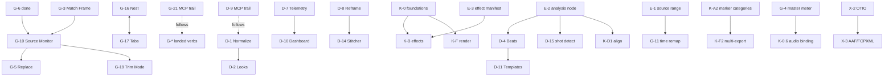

# Video Editor Roadmap

**Status:** Live authoritative backlog  
**Date:** 2026-07-10

## 0. Implementation progress — `feat/video-editor-module`

Landed and pushed on this branch (most recent first). Each row is committed with tests green; adversarially verified where noted.

| Area | Status | Commit | Notes |
|---|---|---|---|
| **03 §4.5.3** grade operand space (A-3) | ✅ done | `a05ec8e` | grade ops run straight-alpha (unpremult→op→repremult); shared `ALPHA_EPS` with GPU shader |
| **03 §4.5.4** live canvas linear (A-1) | ✅ done | `5a62494` | document renders to offscreen sRGB target, blitted into egui; canvas blends in linear like headless. *Follow-up:* CPU compositor isolated-layer path is P7-deferred (§4.3) |
| **26 §8 K-0.1** export wiring | ✅ done | `fca5eda` | `EngineCmd::Export` renders via shadow session + progress/cancel; one path shared engine+MCP; e2e ffprobe test |
| **26 §8 K-0.2** render passthrough effects | ✅ done | `fca5eda`+`5a83c50` | all 6 declared effects render: Luma/Chroma/Mask + Blur/Sharpen/Glow; shared separable Gaussian (`ops::blur` + dual-pass GPU `textureLoad`); CPU/GPU parity |
| **26 §8 K-0.3** GPU Merge blend modes (E-9) | ✅ done | `9b2ec60` | GPU Merge honours all 26 modes; CPU/GPU parity sweep across 6 IR enums |
| **26 §8 K-0.4** Wipe/Push passes | ✅ done | `ca6538b` | real `WipeMix`/`PushMix` IR + CPU kernels + WGSL twins; CPU/GPU parity per direction×t; no P3 cross-dissolve fallback |
| **26 §8 K-0.5** `lut_provider` threading | ✅ done | `ca6538b` | `LutProvider` trait + `compile_with_luts`; session `LutCache` warms on snapshot change; grade `Lut3d` resolves to real tables (or inert identity) |
| **26 §8 K-0.6** audio FX chain + mixer + meter | ✅ done | `367511d`+`bf1d89b` | mixer owns track/master fx, discontinuity policy, declick tail; G-4 meter publish + 31 §3 latency compensation closed |
| **26 §8 K-0.7** export audio mux + loudness | ✅ done | `d9f1826` | offline `Mixer::render_block` mix for export range; mux via existing encoder audio sidecar; two-pass `LoudnessTarget` constant gain with true-peak ceiling |
| **26 §8 K-0.8** `EngineCmd::Probe` | ✅ done | `d9f1826` | probe file → `set_asset_meta` + content hash; invalidate decode source |
| **26 §8 K-0.9** `sync_lock` propagation | ✅ done | `ca6538b` | `expand_sync_lock_ripple` in core; insert/extract/ripple_delete/ripple_trim all expand; GUI + MCP ride the same batch |
| **30** effect manifest (E-3/X-4) | ✅ done | `48fb5da`,`49bd585` | schema + 7 authored manifests + `EffectKind`↔`EffectId` bridge + migration/inert-unknown; MCP `list_effect_kinds`/`set_effect_param` generated with range refusal. *Remaining:* full raster bridge catalogue (K-B16 beyond the 6-kernel slice) |
| **31 §2/§3** DSP reset/latency contracts (E-10) | ✅ done | `1ccbeea` | mandatory `reset(AudioDiscontinuity)` + latency/tail across all units |
| **35** markers, effect scopes, groups | ✅ done | `9b2ec60`,`367511d`,`49bd585` | marker categories/anchors, clip markers, group tree; Track/master/asset effect scopes applied in compile; V4→V5 migration; version bumped |
| **36** error model (taxonomy) | ✅ done | `a05ec8e`+residual | `core::diag` taxonomy + catalogue; `EngineStatus.last_error: Option<Diagnostic>` wired |
| **37** robustness | ✅ done | `a05ec8e` | capability floor, gpu_state, atomic_write, child reaping, scale targets, CI split |
| **38** sequence semantics | ✅ done | `435a3a6`+`ca6538b` | transition handle-clamp, fade-out-at-gap, nest outer-format, frame-rate conform diagnostics, nest dedup; LoadNotice + transition-out-at-cut validation/migration |
| **39 §2.2** unknown-preserving variants | ✅ done | `a05ec8e` | forward-compat inert round-trip |
| **40 §7** spec verification infra | ✅ done | `a05ec8e` | `tools/spec-extract`, drift + acceptance-index scripts |
| **41** accessibility | ✅ done | `1ccbeea`,`a05ec8e` | curve-editor/node-editor focus fixes, keyboard-gate + contrast lints |
| **42 §10** localization (text metrics) | ✅ done | `a05ec8e` | `core::text_metrics` Unicode cell measurement + caption wiring |
| **28 §9** MCP transport hardening | ✅ done | `a05ec8e` | bearer token, no permissive CORS |
| **29 QA-1** acceptance-story harness | 🟡 scaffold | `a05ec8e` | harness + fixtures scaffolded; `video-p1-contract` gate removed |
| **GUI** export progress + diag surface | ✅ done | `1acd25f` | live progress/cancel dialog; diagnostic badge view-model |
| **G-4** master meter publish | ✅ done | `bf1d89b` | feeder publishes `StereoMeter` → `EngineStatus.master_level`; GUI `master_level()` reads it; MCP `get_audio_meters` when live |
| **31 §3** latency compensation | ✅ done | `bf1d89b` | per-track delay lines equalise paths to max latency; `graph_latency_samples` on status for A/V offset |
| **K-B16** raster bridge | ✅ done (catalogue) | `7a7f38d`+`73e6a66` | **38 bridged ids** with manifests + Linear/Transfer operand spaces; multi-point curves (5 knots + contrast); GPU for surface/lens/smart_sharpen + prior twins. Residual polish only: richer curves UI widgets in inspector, exact bilateral/disc parity goldens |
| **E-1** source-range contract | ✅ done | `dd7ef59` | `graph::source_range` — `FrameRange`, per-op identity default, graph union, soft cap (16); TimeOffset still compile-expanded |
| **E-4** threading capability | ✅ done | `dd7ef59` | `ir::Threading` + `threading_for_op` (Any / PerInstance / Serial; undeclared → Serial) |
| **K-G6** interlaced detection | ✅ done | `dd7ef59`+`85b0cea`+`466fbeb` | `ScanType` + probe + pool badge; **deinterlace IR node auto-inserted** for interlaced assets |
| **Effects browser ↔ MANIFESTS** | ✅ done | `85b0cea` | Effects drawer driven by full `MANIFESTS` catalogue (K-B16 ids), grouped by `EffectCategory`; drag/double-click uses `ClipEffect::from_manifest`; inspector labels resolve via manifest name |
| **G-17** sequence tabs | ✅ done (shell) | `85b0cea` | Timeline header tab strip: open/activate/close tabs, `+` create, context Duplicate/Rename; nested breadcrumb pop; `ops_bridge` create/duplicate helpers |
| **K-F1** render queue | ✅ done | `bf1d89b`+`7bbd978`+`f867e95` | `export::RenderQueue` multi-job FIFO; GUI queue inspector panel + multi-format/marker enqueue |
| **K-F2** marker multi-export | ✅ done | `7bbd978` | export dialog "per ranged marker" checkbox → one job per marker×format via RenderQueue |
| **K-F3** multi-format render | ✅ done | `7bbd978` | format checklist → one job per checked `Sequence.formats` entry via RenderQueue |
| **K-F4** job options | ✅ done | `f867e95` | `RenderJobOptions` (proxies, preview res, encoder speed, raw args) on `ExportJob`; dialog collapsible |
| **K-F5** hardware encoders | ✅ done | `f867e95` | probe NVENC/VAAPI/VideoToolbox/QSV; prefer-HW fail-closed; detection report + raw-args hatch |
| **32 §4** playback policy | ✅ done | `f867e95` | `playback::policy::PlaybackPolicy` constants (prefill/drops/ring) + unit pin |
| **32 §7** scale-invariance guard | ✅ done | `f867e95` | Draft vs downsampled Full tolerance tests (CPU+GPU) on geometry+blur fixture |
| **K-G6** deinterlace node | ✅ done | `466fbeb`+`5626717` | `IrOp::Deinterlace` CPU + **GPU WGSL twins**; source-range; auto-insert for interlaced assets |
| **E-2** analysis foundation | ✅ done (substrate) | `466fbeb` | `graph::analysis` — typed `AnalysisResult` (Histogram/Levels), content-hash cache, pull-based pure functions. Consumers (scopes/scene/loudness) wire next |
| **K-E4** extract frame | ✅ done | `466fbeb` | `export::extract_frame` PNG path (export colour convert); GUI `video.extract_frame` / `…_to_bin` (Ctrl+Shift+E) via program-monitor readback |
| **E-1** prefetch ← source-range | ✅ done | `5626717` | `lead_from_source_range` / `combined_prefetch_lead`; session cut-ahead lead = max(cut-ahead, graph window) so deinterlace expands decode warm |
| **K-G6** GPU deinterlace | ✅ done | `5626717` | WGSL twin of spatial methods (OneField / LinearBlend / YadifSpatial) on `IrOp::Deinterlace` — preview no longer blit-combs |
| **K-E1** vectorscope guides | ✅ done | `5626717` | I/Q lines + 75%/100% boxes + labels on scopes panel vectorscope overlay |
| **K-C2** usage count | ✅ done (slice) | `5626717` | derived clip-reference count on media pool (`×N` / ON TL badge); tags/ratings still open |
| **K-C2** ratings + filter | ✅ done | `0f8b6b9` | `MediaAsset.rating` 1–5 + free-form tags field; undoable `SetAssetRating`; pool filter (unused / min ★) + context-menu rate |
| **K-C5** remove unused | ✅ done (slice) | `0f8b6b9` | `ops::unused_assets` / `remove_unused_assets`; media-pool **Remove unused (N)** toolbar button (undo batch) |
| **K-E3** composition grids | ✅ done (slice) | `0f8b6b9` | Monitor toolbar cycles thirds / golden / off over program picture |
| **K-E1** histogram channels | ✅ done (slice) | `0f8b6b9` | Y/R/G/B component toggles on scopes histogram |
| **K-A12** Timecode | ✅ done (core) | `cb2a862` | `Timecode` type with real SMPTE drop-frame for 29.97/59.94; `Sequence.start_timecode`; MCP `;` is DF (not synonym); monitor readout uses start offset |
| **K-A13** Split A/V | ✅ done | `cb2a862` | `ops::split_av_link` unlinks full A/V group; timeline context **Split A/V** |
| **K-C5** cache report | ✅ done (slice) | `cb2a862` | `media::summarize_cache` + media-pool **Cache…** collapsing report |
| **K-E1** Rec.601 matrix UI | ✅ done (slice) | `cb2a862` | Vectorscope Rec.709 / Rec.601 switch (GPU path still 709; CPU matrix helper landed) |
| **K-A6** Edit Duration dialog | ✅ done | `bb13d2a` | `ops::edit_clip_timing` (trim / move / slip / ripple_end) + floating form (position / source in / out / duration + ripple); context menu, clip inspector, command `video.edit_duration` |
| **K-A7** Grab item / arrow nudge | ✅ done | `73d3118` | Keyboard grab (`Shift+G`): ←→ frame (Shift×5), ↑↓ same-kind track, Enter commits one move undo (link partners ride), Esc cancels; ghost preview + context menu |
| **K-A12** DF parse fix + **K-C5** unused-asset scan | ✅ done | `7d58470` | Review fixes. DF parse rejected ~5.9% of valid labels (guard missed `s == 0`, so `00:01:05;01` failed); round-trip now sweeps two whole 10-minute drop blocks. `unused_assets` scanned clip sources only, so **every LUT was reported unused and deleted** — now walks grades at all four scopes, embedded graph grades and `MediaIn`/`Lut` ops, sorted for a deterministic batch |
| **CI** feature-branch gating | ✅ done | `8b6e572` | **Root cause of the dead test files:** `ci.yml` triggered only on `push: branches: [main]` + `pull_request`, and this branch never opened a PR — so **all 238 commits ran on no CI**. Now gates `feat/**` (1-OS on branch pushes, full 3-OS on main/PRs). Five stale test expectations repaired; tree reformatted to satisfy the blocking fmt gate (`199ffd7`) |
| **29 QA-1** acceptance-story harness | ✅ done (script + GUI arms) | `8b6e572`+AS arms | Script arm 32/32; GUI structural arms for AS-1/AS-2/AS-3 in `video_ui_paths.rs`. *Remaining:* rendered-output parity across script vs GUI |
| **12** `video` kill-switch | ✅ resolved (delete) | `8b6e572` | Closes the 3c audit action. It was a *cargo* feature, not a runtime disable, and 11 §7 places it on `photonic-app`, which has no `photonic-video` dependency at all — unbuildable as specified. Decision machine-enforced with `spec-assert: feature-absent` guards rather than left as prose |
| **K-B1/K-B2** track/master/asset effect stacks | ✅ done | `19f9fd5`+`ff6ea4f` | `VfxOwner { Clip \| Track \| Master \| Asset }`; `SetEffect` coalesces; inspector + MCP `effect_stack`. **Applicability gate landed** (`ff6ea4f`): catalogue uses `ALL_SCOPES`; `CLIP_ONLY` retained for curation. Grade at track/master/asset: core+MCP; GUI editor residual |
| **E-2** first real consumer | ✅ done | `19f9fd5` | Closes K-Band 2's exit condition (*"at least one real consumer shipped on it — E-2 → loudness-on-export"*). Typed audio `AnalysisResult::Loudness` with an audio content-hash key and cache reuse that skips the second measurement pass; measured values unchanged by construction. Unblocks D-4, D-15, K-D1 |
| **K-G5** undo history surface | ✅ done | `19f9fd5` | The commit-graph panel already existed and was already routed; this closed the gaps that stopped it being an undo-history surface — keyboard navigation of the whole tree (it is *painted*, so it was mouse-only), `HistoryEntryKind` so a shared edit tree distinguishes timeline from vector edits, branch-tip count. Navigation produces **zero** undo units, pinned by test |
| **K-A4** snap targets | ✅ done | `19f9fd5` | Adds ranged-marker ends, zone in/out, clip markers projected to sequence time, keyframes across all four lane owners, sequence start. Duplicate ticks collapse to highest-priority tier. `Alt+←/→` prev/next snap |
| **Grade mask ↔ logical frame** | ✅ done | `2670c2d` | **Wrong-pixels fix.** Power-window masks were normalized against the pool-*bucketed* texture, not the picture: 1080 buckets to 1088, so every masked grade landed 0.741% off vertically at 1920×1080. `cpu_gpu_parity` was blind to it — its grade rows use `mask: None` and its 8×8 canvas buckets to a *square* 64×64. Found while drafting [197](../../proposals/197-k-b8-nested-subgraph-masking.md) |
| **K-B15** paste attributes | ✅ done | `17f6681` | `ops::paste_clip_attributes` + `ClipAttributes`/`AttrSelector`; MCP `paste_attributes`; palette verbs reusing the existing timeline clipboard. Carries effects/grade/transform/audio; **excludes** speed (a timing edit in a look edit's clothing), `composition` (a `GraphId` into the shared arena — carrying it would alias two clips onto one graph) and transitions (`validate_transitions` rejects a `transition_out` at a cut, so an over-broad paste really could break the invariant mid-batch — a test asserts that exclusion is load-bearing) |
| **K-C8** still-cache key | ✅ done | `17f6681` | Keyed on `(AssetId, logical_w, logical_h)` and now *decoded* at that size instead of always at full native resolution. The key is the **logical** size, never the bucketed one — a bucketed key would serve the wrong scale |
| **K-E2** per-clip scope tap | ✅ done | `17f6681` | The engine `get_scopes(clip, at)` surface `color_page.rs` had been waiting on. `CompiledFrame` records `clip_taps` (post-grade, pre-fold) and `program_tap` (post-master-grade, pre-caption); the tap is an *ancestor* of the output so it costs zero extra evaluation. `EngineCmd::SetScopeTap` is view state, not an undo unit. Deliberately **not** an E-2 consumer: a tap is a pointer to an already-rendered texture, and a ~330 KB payload keyed on playhead position would never hit while scrubbing |
| **K-B12** easing presets | ✅ done | `17f6681` | `EasePreset` over the existing `Interp` — the four published CSS curves plus Hold/Linear. A preset is a **name**, not a stored form, so nothing new persists and no migration is needed. Overshoot families (back/elastic/bounce) are *omitted* rather than approximated with a cubic, per K-B12's own watch-out |
| **GPU scopes ↔ logical frame** | ✅ done | `17f6681` | **Second wrong-pixels fix, same bug class.** Scope compute dispatched over the pool bucket, so every histogram/waveform/vectorscope counted transparent padding as real pixels (~0.7% phantom bin-0 spike at 1080p, far worse on small canvases). Would have silently discredited the per-clip tap |
| **K-A2** marker system depth | ✅ done | `260c80f` | The marker *model* was already rich and the *surface* was empty. Adds the `MarkerCategory` CRUD nothing had (`AddMarkerCategory`/`RemoveMarkerCategory`/`SetMarkerCategory` + `ops::seed_marker_categories`, so `MarkerCategory::default_seed` finally has a caller), a **clip-marker writer** (`AddClipMarker`/`RemoveClipMarker`/`SetClipMarker` — `Clip::markers` had readers and no producer), a `panels/video/markers.rs` list with search / category / scope filters, sort, click-to-navigate at **zero** undo units, and ruler category colours + glyphs + range bars. Delete-a-category carries an explicit `MarkerRetarget` per affected marker in **both** scopes, so 35 §1.3's "never silently remapped" is enforced by the command rather than by prose, and one undo restores both the category and every reference. **Ranged markers are now reachable at all** — `set_marker`, the panel's duration field and `video.add_range_marker` all produce `duration > 0`, the unit K-F2's shipped `export_per_marker` fans out over and which nothing could previously create. Nine new MCP tools. Also fixes `SplitClip`, which cloned a clip's markers wholesale: both halves got the same `MarkerId`s and the right half's clip-relative positions were `left_dur` too far in — it now partitions, and `MergeSplit` folds them back. **Residual, deliberately out of this slice:** marker *export* with `{{timecode}}`/`{{comment}}`/`{{frame}}` templates (K-A2 states the template vocabulary is shared with [K-F2](26-kdenlive-mlt-parity.md#k-f2--marker-zone-and-per-segment-multi-export) naming, so it should land with that owner, not twice); **add markers at gaps**; a **marker lock** (its only stated consumer is the [K-A3](26-kdenlive-mlt-parity.md#k-a3--spacer-tool-and-space-operations) spacer tool, which is not built — a lock flag with no tool to respect it is an untestable field); and the panel's multi-select + thumbnails |
| **K-D5** boundary declick | ✅ done | `260c80f` | 31 §4's declick, implemented inside `Mixer::render_block` on the tail-ring plumbing step 4 landed. Gated on measured `delta_db` across the boundary rather than ramping unconditionally, so a hard edit stays hard instead of being dulled |
| **K-C6** relink offline media | ✅ done | `260c80f` | Batch relink: `offline_assets` / `plan_relink` / `relink_plan_commands` (pure, filesystem injected), a folder scan with a **preview before commit**, and one undo unit for a whole folder. Matches by exact name → case-insensitive → content hash. A byte change is **gated, not silently accepted** — accepting re-identifies the asset and clears the now-wrong `MediaProbe` in the same undo step. New MCP `find_offline_media` / `relink_media_batch` |
| **K-B4** effect presets | ✅ done | `260c80f` | Preset library in `<config>/Photonic/effect_presets.json` — **user state, not document state**, following [206](../../proposals/206-k-g3-layout-presets.md): managing the library is no undo unit, *applying* a preset is exactly one. Its own file rather than `preferences.json`, since `AppPreferences::load` ends in `unwrap_or_default()` and presets are the state most likely to fail to parse as effects are added. Unknown effect ids load inert-and-preserved (39 §2.2), never dropped. Favourites are an ordering over the catalogue |
| **K-B14** freeze frame | ✅ done | `a5c9d69` | `ops::freeze_frame` holds the source frame at clip-relative `at` for the clip's whole duration via `source_in` + `SpeedMap::Constant(0)` — not a new effect kind; zero-rate integration and compile's unbounded-handle path already existed (G-11 / 38 §1.1). GUI: context menu, clip inspector, command `video.freeze_frame`, FREEZE on-clip badge. MCP `freeze_frame`. One undo unit; already-frozen-at-same-frame is a no-op. Mid-clip freeze-then-resume stays expressible via keyframed zero-rate segments on `set_clip_speed`. Generators (solid/text/adjustment) accept the same verb |
| **K-B17** alpha view + unpremultiply | ✅ done | `b1094b5` | Catalogue already had `util.alpha_view` + `util.unpremultiply` (CPU raster-bridge + GPU filter passes). This closes the **monitor view mode** half: `PresentChannel::{Color,Alpha}` on `VideoPresenter`, program-monitor **α** toggle, command `video.alpha_view`. View state (zero undo units). Effects remain the per-clip path for keying polish |
| **K-A3** spacer / space ops | ✅ done | `82c0f35` | Core: `shift_after` / `insert_space` / `remove_space` / `remove_all_spaces_after` / `remove_clips_after` (unlocked tracks only; sequence markers ride insert/remove). GUI: ops_bridge + commands `video.insert_space` (1s) / `remove_space` / `remove_all_spaces_after` / `remove_clips_after`. MCP same four tools. Spacer *drag tool* deferred with G-13 modal palette. Unit tests for shift/pack/delete/lock skip |
| **K-B3** effect zones | ✅ done | `e6596ae` | `ClipEffect.zone: Option<(Tick,Tick)>` half-open in the stack's evaluation domain; `active_at` + compile `apply_stack` folds out-of-zone effects (same as disabled). `ops::set_effect_zone` + MCP `set_effect_zone`. Additive serde. Effect *groups* (shared params across several effects) deliberately deferred |
| **K-B5** compare-effect split | ✅ done | `78e589f` | Dual compile: full + `skip_clip_looks` (clip effects/grade omitted; upstream nodes share content hash). `EngineCmd::SetCompareEffects` + `EngineFrame.compare_clean`. GUI vertical wipe (A\|B toolbar, draggable divider, `video.compare_effects`). View state only |
| **K-A8** subclips | ✅ done | `ba17ffc` | `MediaAsset.parent` + `subclip_range`; `ops::create_subclip` shares content_hash/proxy; nested refused. MCP `create_subclip`; media-pool context "Create subclip (first half)"; `subclip_default_timing` for insert. Save-zone-from-source-marks UI residual |
| **K-A10** fixed playhead + edge pan | ✅ done | `8555481` | `TimelineView.fixed_playhead` + `center_on_playhead` during transport; edge-zone auto-pan while clip-dragging; toolbar **Fixed** + command `video.toggle_fixed_playhead` (view state, zero undo) |
| **K-B6** param expressions + reset | ✅ done | `53f4ad3` | `param_expr` evaluator (`+−*/()`, `%name` / bare vars, range **refuse** not clamp); middle-click → seed default; wired clip-inspector effect floats + transform rows + color CDL DragValues |
| **K-B11** keyframe interchange | ✅ done | `c2299d8` | `KeyframeClipboard` + `copy_keyframes`/`paste_keyframes` (path map + offset/re-anchor, one undo batch); keyframe editor Copy path/all + Paste/Paste@0; MCP `copy_keyframes`/`paste_keyframes` |
| **K-C2** TagId registry | ✅ done | `deb8945` | `TagId` + `MediaTag` project registry; `MediaAsset.tag_ids`; `set_asset_tags_resolved` upserts names→ids; pool Tags menu + MCP `set_asset_tags` |
| **K-C7** import triage | ✅ done | `2fb684e` | `MediaProbe` persists `is_vfr`/`pixel_format`/`has_alpha`; pure `triage_probe` (VFR=Info not convert); pool badges from findings; additive serde |
| **K-D3** per-stream / channel / offset | ✅ done | `0f23028` | `ClipAudio.stream` → ffmpeg `-map 0:a:N`; `offset` via `source_seek_with_offset` on offline + feeder; `ChannelMap::{LeftOnly,RightOnly}` |
| **K-D4** stems export | ✅ done | `0f23028` | `ExportPreset.stems` → `write_stems_for_export` from `job` path (one WAV per audio track); `render_export_audio_filtered` + real file test |
| **K-E1** audio spectrum + scope depth | ✅ done | `6d54e73`+Rec.601 GPU | Spectrum tab; **GPU Rec.601 vectorscope twin** via `vectorscope_gpu_logical_matrix` |
| **Applicability** gate | ✅ done | `ff6ea4f` | `add_effect_scoped` refuses scopes outside `manifest.applies`; catalogue uses `ALL_SCOPES` (K-B1-compatible); `CLIP_ONLY` retained for curation |
| **K-B7** luma-map wipe maths | ✅ done | `ff6ea4f`+binding | Analytical maps + `soft_mix`; `TransitionKind::LumaWipe` → `IrOp::LumaWipeMix` (CPU + GPU WGSL twin); lower/endpoint tests |

**K-Band 1 is closed.** 26 §19.1's "cheap and structural" band required each listed verb to have a GUI route, an MCP tool and a test; K-B12, K-B15, K-C8 and K-E2 were the last four open and all four now meet it.

| **36 last_error → Diagnostic** | ✅ done | residual | `EngineStatus.last_error: Option<Diagnostic>`; probe/export fail_diag; monitor badge via `diag_badge` |
| **K-F polish** | ✅ done (options) | residual | `RenderJobOptions`: burn_in / add_to_bin / two_pass / inhibit_sleep; GUI checkboxes; Linux sleep-inhibit; drawtext burn-in; two_pass intent logged. *Remaining:* full multipass encode redesign (K-F7 territory) |

**Not yet started (gated only):** K-A1/A5, K-C1/C4/C5, K-G1–G4, X-1/X-2/X-3, K-B8/B9 *(Band-5 await acceptance or patent)*; K-B10/K-D2 *(product-blocked)*; K-D1/D-*/G-20 *(legal-or-fixture-blocked)*; **K-F7** one-eval-many-outputs *(engine residual — needs multi-encode design)*.

**Band-5 mini-specs — the whole band is now drafted.** 26 §19.1 requires one *accepted before code*, so every one of these items was blocked on a document rather than on effort. All **14** are written and **await acceptance**; none authorizes code until accepted. K-B16, K-G6 and K-G5 are the band's already-implemented members.

| Item | Mini-spec | Format impact | Gate |
|---|---|---|---|
| **K-A1** chunked preview render | [193](../../proposals/193-k-a1-chunked-timeline-preview-rendering.md) | additive in v5 | 23 §10.3 codec record — reduced to an *amendment* of the K-F5 rows, since both preview profiles map to encoders already shipping |
| **K-A5** general/nested groups | [194](../../proposals/194-k-a5-general-and-nested-clip-groups.md) | additive in v5 | none; one product call on AvLink trim propagation |
| **K-C1** clip-jobs framework | [195](../../proposals/195-k-c1-clip-jobs-framework.md) | additive in v5 | none; needs 28 §3.1 `PathPolicy`, which is specified but unimplemented |
| **X-2** OTIO interchange | [196](../../proposals/196-x-2-opentimelineio-interchange.md) | none | none — Photonic-authored reader/writer, so no 23 §3.3 evidence record |
| **K-B8** nested-subgraph masking | [197](../../proposals/197-k-b8-nested-subgraph-masking.md) | additive in v5 | none |
| **K-B9** rotoscoping spline masks | [198](../../proposals/198-k-b9-rotoscoping-spline-masks.md) | additive in v5 | **algorithm/patent review** per 23 §11.1 — the one Band-5 item that keeps a hard pre-code gate |
| **X-1** MLT XML / `.kdenlive` import | [199](../../proposals/199-x-1-mlt-xml-kdenlive-import.md) | none | none; published DTD only, Photonic-authored fixtures |
| **X-3** EDL (+ AAF/FCPXML via X-2) | [200](../../proposals/200-x-3-edl-aaf-fcpxml.md) | none | none; ships no OTIO adapter runtime |
| **K-C4** generator clips | [201](../../proposals/201-k-c4-generator-clips.md) | additive in v5 | **none — gate designed away.** Runtime synthesis from published standards bundles zero bytes, so 23 §7.2 never engages |
| **K-C5** project archiving | [202](../../proposals/202-k-c5-project-archiving.md) | additive in v5 | none |
| **K-G1** project profiles | [203](../../proposals/203-k-g1-project-profiles.md) | additive in v5 | none |
| **K-G4** project templates | [204](../../proposals/204-k-g4-project-templates.md) | additive in v5 | **resolves S11** — proposes `<config>/Photonic/templates/` via the existing `crash_dir()`, and templates bundling no media bytes |
| **K-G2** project notes | [205](../../proposals/205-k-g2-project-notes.md) | additive in v5 | none |
| **K-G3** layout presets | [206](../../proposals/206-k-g3-layout-presets.md) | **none at all** — user preference, not a document property | none |

**OpenCut harvest (CapCut-class ideas) — drafted 2026-08-03; wave-1 code 2026-08-03.** Research pass against OpenCut main (rewrite scaffold) + opencut-classic (archived web NLE). Photonic already leads on pro engine/MCP depth; the harvest is **selective algorithms + UX velocity**, not a port. Clean-room fence and non-goals live in the index.

| Item | Proposal | Status | Notes |
|---|---|---|---|
| Index + fence | [207](../../proposals/207-opencut-harvest-index.md) | ✅ | Provenance, delivery order, explicit non-goals |
| SDF / JFA mask feather | [208](../../proposals/208-sdf-jfa-mask-feather.md) | 🟡 partial | CPU `ops::feather_coverage` (JFA + smoothstep); **`util.outline` on SDF path** (30 §5) with **GPU WGSL twin** (solid band + Hermite AA matching the CPU oracle; exterior Euclidean to α≥0.5 isosurface; `cpu_gpu_parity::util_outline_sdf_cpu_gpu_parity`). Residual: `feather_coverage` still has no `IrOp` consumer — its callers (K-B9/K-B8) are Band-5 gated |
| Large-radius blur quality | [209](../../proposals/209-large-radius-blur-quality.md) | ✅ | `blur_plan` multi-iter (+ step on CPU); GPU multi-iter; tests green |
| Timeline velocity pack | [210](../../proposals/210-timeline-interaction-velocity-pack.md) | 🟡 partial | Bookmarks category + `video.add_bookmark` (B); on-clip gain envelope paint; **§5 drag ergonomics closed** — snap guide fires only on an actual capture and marks the target, trim hit 12px (41 R-9; 24px vertical already met by the 28px track-height floor), cross-track drop outline, Esc cancels a mouse drag. **Multi-clip drag-move landed** — plural `ops::move_clips` (+ `track_delta` same-kind lane offset) + `ops_bridge` + `move_clips` MCP verb (G-21); ordered trailing-edge-first / higher-lane-first so the per-command `Sequence::validate()` debug-assert never fires on a transient overlap (194 K-A5's finding, confirmed). **Vertical multi-move closed** (shared track_delta, one undo). Residual: group move behind K-A5 |
| Keyframe graph editor | [211](../../proposals/211-keyframe-graph-editor.md) | ✅ (pre-existing) | Bezier graph editor already shipped; extended with clip-audio gain row |
| Keymap schema migrations | [212](../../proposals/212-keymap-schema-migrations.md) | ✅ | `keymap_schema_version` + `migrate_keymap` on prefs load |
| Social-first AS-1 velocity | [213](../../proposals/213-social-first-editing-velocity.md) | ✅ | Empty Import hero, coach marks, auto-place import, toolbar Captions/Export, Social format labels, AS-1 structural test |
| Declarative frame job | [214](../../proposals/214-declarative-compositor-job-boundary.md) | deferred | IR already is the job |

Wave-1 land order executed: **209 → 212 → 210 → 208 → 211 → 213**.

### Findings from the mini-spec rounds

Drafting against real code surfaced defects and doc-vs-code contradictions. Recorded here so they are not lost in the proposals:

- **A shipping wrong-pixels bug (K-B8 §2.3c).** `apply_grade_op_gpu` sizes from the *pool-bucketed* texture (`grade_gpu.rs:593`) while the CPU reference runs at logical size, and masked grade shaders evaluate the window against a full-quad uv. `TextureDesc::bucket` rounds up to 64, so 1080 → 1088 and a PowerWindow lands **0.741% off at 1920×1080**. `cpu_gpu_parity` cannot see it: its grade rows use `mask: None`, and its 8×8 canvas buckets to a *square* 64×64 where the error vanishes. Left as an `#[ignore]`d test plus a follow-up so the fix gets its own commit.
- **`MaskRef` is dead data.** `GradeMask::RotoMatte` resolves to `None` (`photonic-render/src/grade.rs:494`), so Photonic today has no working way to mask part of a frame except a static elliptical power window inside a grade op.
- **A third non-undoable document mutation.** 39 §1.6 names two violations of SPEC's "every document mutation, without exception, is undoable". `Document.workspaces` is a third — mutated directly in `panel_actions.rs:5919-5940` with no `Command` and no history entry.
- **K-A1:** the content hash encodes neither the eval canvas (`GpuEvaluator::evaluate` takes `canvas` as a *runtime* argument) nor media bytes (only `AssetId`). Harmless in-memory, but would let a **disk** chunk be written at Draft resolution and served as Full, or survive a relink to different bytes. 33 §3.1's chunk key is insufficient as written.
- **K-A5:** `TimelineCmd::apply` debug-asserts `Sequence::validate()` after *every* command and `Command::Batch` applies members one at a time — so a group move batched as per-clip commands transiently overlaps and panics in debug. Group fan-out must be single plural commands, not batches.
- **K-A5:** 35 §3.5 claims AvLink trim propagation "is today's behaviour and must not regress". It is not — three places in the code deliberately do the opposite.
- **K-G2:** 39 §1.2 specifies undo coalescing as time-bounded (500 ms gap, 5 s span). None of it exists — there is no clock in `history/stacks.rs`; coalescing is bounded only by pointer-down/pointer-up.
- **K-G2/K-G3:** `AppPreferences::load` ends in `unwrap_or_default()`, and serde's `#[serde(default)]` covers a *missing* field, not one that fails to parse — so a downgrade after using any newly-added drawer discards **every** preference. Both specs adopt the same `#[serde(other)]` fix.

## 1. Authority and precedence

This file owns live video backlog status, priority, gates, and delivery order. Detailed contracts remain in linked owner docs. Repo-root `ROADMAP.md` remains historical vector/MCP rationale.

Precedence:

1. [SPEC.md](SPEC.md) — product capabilities, constraints, non-goals.
2. [00-overview.md](00-overview.md) through [13-ux-components.md](13-ux-components.md) — normative architecture/design.
3. This roadmap — live status, gates, priority, waves.
4. **Accepted policy and contracts** — [23-legal-open-source-implementation-routes.md](23-legal-open-source-implementation-routes.md), [24-preview-media-load.md](24-preview-media-load.md), [29-qa-spec.md](29-qa-spec.md). These carry an explicit acceptance record; a draft may not override them.
5. **Draft implementation contracts and audits** — [19-editing-velocity-shot-management.md](19-editing-velocity-shot-management.md)–[22](22-dji-advanced-workflows.md), [25](25-performance.md)–[28](28-security-model.md), [30](30-effect-catalogue.md)–[42](42-localization.md). Normative once accepted; advisory until then.
6. [17-nle-parity-round2.md](17-nle-parity-round2.md) and [18-dji-parity.md](18-dji-parity.md) — historical gap rationale only.
7. [DESIGN.md](../../../DESIGN.md) — visual tokens.

**Reserved document numbers:** `28` — **filled**: [28-security-model.md](28-security-model.md). `29` — **filled**: [29-qa-spec.md](29-qa-spec.md), renumbered from `14-qa-spec.md` on 2026-07-20 per [27 H-1](27-spec-audit.md#7-doc-set-hygiene). Neither number is free.

**Owner docs for the K/E/X inventory** (30–35) hold the implementation contracts; [26](26-kdenlive-mlt-parity.md) remains the inventory and ranking, and this roadmap remains live status.

Status semantics:

| Status | Meaning |
|---|---|
| `done` | User outcome and required surfaces exist; protected from regression. |
| `partial` | Useful code exists; required surface, parity, fixtures, or acceptance remains. |
| `open` | Implementation not started beyond scaffolding. |
| `product-blocked` | Conflicts with current SPEC non-goal; no implementation authorization. |
| `legal-or-fixture-blocked` | Design is valid, but release/auto-apply waits on rights, provenance, representative fixtures, or frozen thresholds. |

## 2. NLE inventory

| ID | Status | Live residual | Owner |
|---|---|---|---|
| G-1 | partial | Core planner consolidation; close-all/simplify MCP; acceptance | [19 §4](19-editing-velocity-shot-management.md#4-g-1--add-edit-close-gap-and-simplify-sequence) |
| G-2 | partial | Linked-A/V policy; core/MCP closure | [19 §5](19-editing-velocity-shot-management.md#5-g-2--keyboard-trims) |
| G-3 | partial | Source Monitor consumption; overlap priority | [19 §6](19-editing-velocity-shot-management.md#6-g-3--match-frame-and-reveal-in-project) |
| G-4 | done | Live master meter from mixer feeder via EngineStatus | [19 §7](19-editing-velocity-shot-management.md#7-g-4--program-monitor-master-meter) |
| G-5 | partial | Alt-drop, probe/EOF acceptance | [19 §8](19-editing-velocity-shot-management.md#8-g-5--replace-with-clip--replace-edit) |
| G-6 | done | Protected source-patch/target routing | [19 §2](19-editing-velocity-shot-management.md#2-current-implementation-status) |
| G-7 | partial | GUI create command/menu; paint clarity; goldens | [19 §9](19-editing-velocity-shot-management.md#9-g-7--adjustment-layer-clips) |
| G-8 | partial | Accessibility/extreme-range/per-tab acceptance | [19 §10](19-editing-velocity-shot-management.md#10-g-8--timeline-navigator) |
| G-9 | partial | Shared-state/a11y regression closure | [19 §11](19-editing-velocity-shot-management.md#11-g-9--effect-controls-unification) |
| G-10 | partial | Single-surface marks/peek/Match Frame/Insert from marks shipped + unit tests; dual-pane + source-audio clock still deferred | [20 §4](20-pro-workflows.md#4-g-10--source-monitor-and-true-source-marks), [24](24-preview-media-load.md) |
| G-11 | partial | Rubber-band UI; audio mapping; goldens | [20 §5](20-pro-workflows.md#5-g-11--speed-and-time-remap-ramps) |
| G-12 | partial | Pin-To, protected time, vector templates | [20 §6](20-pro-workflows.md#6-g-12--title-text-and-responsive-graphics-clips) |
| G-13 | open | Modal tool palette and cursors | [19 §12](19-editing-velocity-shot-management.md#12-g-13--modal-timeline-tool-palette-and-cursor-hints) |
| G-14 | partial | Select-forward and display options | [19 §13](19-editing-velocity-shot-management.md#13-g-14--track-select-forward-and-display-menu) |
| G-15 | partial | G-15A attach + detach (GUI/MCP); G-15B toggle; G-15C on-import L7 + policy checkbox; **batch attach-by-name / external camera proxies (`.lrv`/`.lrf`, see 26 K-C3)**; full ingest modal/thresholds still open | [19 §14](19-editing-velocity-shot-management.md#14-g-15--proxy-workflow-polish), [24](24-preview-media-load.md) |
| G-16 | partial | Nest/open/breadcrumb GUI; MCP | [20 §7](20-pro-workflows.md#7-g-16--nested-sequence-ui) |
| G-17 | partial | Tab strip in timeline header (activate/close/create/duplicate/rename); multi-doc tab persistence still open | [20 §8](20-pro-workflows.md#8-g-17--sequence-tabs-and-multiple-open-sequences) |
| G-18 | open | Transcript projection and ripple edits | [20 §9](20-pro-workflows.md#9-g-18--text-based-transcript-editing) |
| G-19 | open | Dedicated two-up Trim Mode | [20 §10](20-pro-workflows.md#10-g-19--dedicated-trim-mode) |
| G-20 | legal-or-fixture-blocked | S4 accepted; synthetic/owned sync corpus and decoder budget | [20 §11](20-pro-workflows.md#11-g-20--multicam) |
| G-21 | partial | Continuous MCP trail for landed NLE verbs. Latest: `move_clips` (+ optional `track_delta` vertical multi-move, 210 §5) | [19 §15](19-editing-velocity-shot-management.md#15-g-21--mcp-parity-for-new-editing-operations) |

Round-one status: **13 of 20 shipped** after G-6. [14](14-nle-parity.md) is superseded; [15](15-thumbnails-waveforms.md) and [16](16-insert-overwrite-editing.md) are delivered.

## 3. DJI inventory

| ID | Status | Live residual/gate | Owner |
|---|---|---|---|
| D-1 | legal-or-fixture-blocked | Photonic transform accuracy/provenance/naming; optional vendor LUT license | [21 §4](21-dji-core-workflows.md#4-d-1--dji-log-and-hlg-normalization) |
| D-2 | legal-or-fixture-blocked | Rights-cleared/Photonic-authored looks; D-1 first | [21 §5](21-dji-core-workflows.md#5-d-2--device-scoped-creative-look-picker) |
| D-3 | legal-or-fixture-blocked | S1 accepted; per-asset rights-cleared content | [21 §6](21-dji-core-workflows.md#6-d-3--starter-music-and-ambient-sfx-library) |
| D-4 | legal-or-fixture-blocked | Beat analyzer, provenance, snap; licensed music fixture/tolerance | [21 §7](21-dji-core-workflows.md#7-d-4--beat-detection-beat-markers-and-beat-snap) |
| D-5 | done | Manual leveling + deterministic auto-crop v1; auto estimate deferred | [21 §8](21-dji-core-workflows.md#8-d-5--completed-horizon-leveling-context) |
| D-6 | partial | Image-sequence ingest/decode/deflicker. **Owns the image-sequence/stop-motion clip outright** — 26 K-C4 is generators only | [21 §9](21-dji-core-workflows.md#9-d-6--hyperlapse-and-timelapse-assembly) |
| D-7 | legal-or-fixture-blocked | DJI dialect fixtures, parser, telemetry binding/HUD | [21 §10](21-dji-core-workflows.md#10-d-7--dji-telemetry-srt-and-text-hud) |
| D-8 | legal-or-fixture-blocked | S5 accepted; standalone CPU/GPU kernels and safety preflight implemented/approved; native still delivery, effect integration, and owned panorama corpus remain | [21 §11](21-dji-core-workflows.md#11-d-8--dji-panorama-reframe-and-little-planet) |
| D-9 | partial | Continuous DJI MCP trail; privacy/doc parity | [21 §12](21-dji-core-workflows.md#12-d-9--mcp-parity-for-dji-core-verbs) |
| D-10 | open | Requires D-7; offline map-tile provider/cache license | [22 §4](22-dji-advanced-workflows.md#4-d-10--full-telemetry-dashboard) |
| D-11 | open | Requires D-4; template schema/location/legal manifests | [22 §5](22-dji-advanced-workflows.md#5-d-11--beat-conformed-edit-templates) |
| D-12 | partial | Photonic gyro JSON + `.gcsv` adapters, analysis math, lens model, `IrOp::StabilizeWarp` CPU/GPU with parity, GUI inspector and 4 MCP tools all land. **Remaining**: `telemetry-parser` dependency audit for container-embedded telemetry, per-entry intake for a bundled CC0 lens snapshot, and a rights-cleared gyro corpus — no advertised-device claim until those pass | [22 §6](22-dji-advanced-workflows.md#6-d-12--gyro-metadata-stabilization) |
| D-13 | legal-or-fixture-blocked | S3 accepted; color vectors, encoder matrix, measured budgets | [22 §7](22-dji-advanced-workflows.md#7-d-13--hdrhlg-10-bit-color-pipeline) |
| D-14 | legal-or-fixture-blocked | S5 accepted; capture fixtures; depends D-8 | [22 §8](22-dji-advanced-workflows.md#8-d-14--panorama-stitcher) |
| D-15 | legal-or-fixture-blocked | Labeled boundary/quality corpus and frozen thresholds. **Also owns the generic split-at-detected-cuts workflow** (26 K-B13); consider gating that half on a lighter corpus than the highlight reel needs | [22 §9](22-dji-advanced-workflows.md#9-d-15--shot-detection-and-deterministic-highlight-reel) |

## 3a. Kdenlive/MLT inventory (K/E/X)

Owner: [26-kdenlive-mlt-parity.md](26-kdenlive-mlt-parity.md). Round-3 parity pass against Kdenlive 26.04 and the MLT framework, written clean-room under [23](23-legal-open-source-implementation-routes.md). `K-*` = Kdenlive-derived feature gaps, `E-*` = MLT-derived engine lessons, `X-*` = interop/format. Statuses are per band-group; where a group mixes states the row says so, and [26 §19](26-kdenlive-mlt-parity.md#19-priority-and-dependencies) is authoritative for per-item placement.

| ID | Status | Live residual / gate | Owner |
|---|---|---|---|
| K-0 | ✅ done | **9/9 seams closed** (K-0.1–0.9). See [§0](#0-implementation-progress--feat-video-editor-module) | [26 §8](26-kdenlive-mlt-parity.md#8-k-0--foundations) |
| K-A | partial | **Timecode + Split A/V + Edit Duration + Grab + snaps + markers + space ops + K-A8 subclips + K-A10 fixed playhead landed**. Open: preview chunks (K-A1), groups (K-A5); spacer drag waits on G-13 | [33](33-timeline-preview-render.md) (K-A1), [26 §9](26-kdenlive-mlt-parity.md#9-k-a--timeline) |
| K-B | partial | **K-B1–B6 stacks/zones/presets/compare/expressions, Applicability gate, K-B7 luma wipe IR+CPU+GPU, K-B11 interchange, K-B12 easing, K-B14 freeze, K-B15 paste, K-B16 catalogue, K-B17 alpha done.** Open: K-B8/B9 (Band-5); K-B10 product-blocked; K-B13 via D-15 | [30](30-effect-catalogue.md), [26 §10](26-kdenlive-mlt-parity.md#10-k-b--effects-and-compositing) |
| K-B10 | **product-blocked** | Motion tracking conflicts with the SPEC non-goal on object tracking; needs an S-series amendment before authorization. **Distinct from D-12**, whose S2 carve-out explicitly excludes it | [26 §K-B10](26-kdenlive-mlt-parity.md#k-b10--motion-tracking) |
| K-C | partial | Ratings/filter/remove-unused + **TagId registry** + **K-C7 import triage** + cache size report + **K-C8 size-keyed still cache** + **K-C6 batch relink**. Open (Band-5 gates): clip-jobs [195](../../proposals/195-k-c1-clip-jobs-framework.md), generators [201](../../proposals/201-k-c4-generator-clips.md), archiving [202](../../proposals/202-k-c5-project-archiving.md) | [26 §11](26-kdenlive-mlt-parity.md#11-k-c--media-and-bin) |
| K-D | partial | Mixer + DSP bound (K-0.6), latency compensation, **K-D5 boundary declick**, **K-D3 stream/offset** (decode map + seek), **K-D4 stems** (job writes stem WAVs). Open: clip-inspector multi-stream UI polish | [31](31-audio-architecture.md), [26 §12](26-kdenlive-mlt-parity.md#12-k-d--audio) |
| K-D1 | legal-or-fixture-blocked | Dual-system-sound align of an arbitrary two-clip selection. Reuses G-20's engine but sits **outside** S4's multicam carve-out, so it needs its own tracking | [26 §K-D1](26-kdenlive-mlt-parity.md#k-d1--align-by-sound-and-by-timecode) |
| K-D2 | **product-blocked** | Timeline audio recording conflicts with the SPEC non-goals "Audio recording (import + TTS only in v1)" and "Live capture / streaming input". Needs an **S13** amendment | [26 §K-D2](26-kdenlive-mlt-parity.md#k-d2--timeline-audio-recording--product-blocked) |
| K-E | partial | Scopes + extract + I/Q/75% + hist Y/R/G/B + comp grids + **K-E2 per-clip scope tap** + **K-E1 audio spectrum** + **GPU Rec.601 vectorscope**. Residual polish only | [26 §13](26-kdenlive-mlt-parity.md#13-k-e--monitor-and-scopes) |
| K-F | partial | **K-F1–F5 done**; polish options (sleep-inhibit / burn-in / add-to-bin / two_pass) shipped. Remaining: **K-F7** one-eval-many-outputs + true multipass encode | [26 §14](26-kdenlive-mlt-parity.md#14-k-f--render-and-export) |
| K-G | partial | **K-G5 undo-history surface done** (edit-tree browser, keyboard nav, branch tips) and **K-G6 detection + deinterlace node landed**. Open: K-G1 profiles, K-G2 notes, K-G3 layouts, K-G4 templates (S11-gated) | [26 §15](26-kdenlive-mlt-parity.md#15-k-g--project) |
| K-H | partial | Continuous MCP trail for landed K-* verbs; sweeps the pre-existing multicam / nested-sequence / duplicate-sequence tool gaps and `get_audio_meters`. `partial` by construction, as G-21/D-9 are | [26 §16](26-kdenlive-mlt-parity.md#16-k-h--mcp-trail) |
| E-1 | partial | source-range contract + **prefetch driven by graph union**; TimeOffset still compile-expanded | [32 §1](32-engine-contracts.md#1-source-range--the-one-mechanism-for-temporal-access) |
| E-2 | done | Substrate **plus its first real consumer**: loudness-on-export routes through `AnalysisResult::Loudness` with an audio content-hash key and cache reuse, closing K-Band 2's exit condition. Unblocks D-4, D-15, K-D1 | [32 §2](32-engine-contracts.md#2-analysis-nodes), [31 §5](31-audio-architecture.md#5-pull-based-analysis) |
| E-3 | partial | Manifest table + migration live (38 catalogue ids); kernel binding still video-side by id | [30 §2](30-effect-catalogue.md#2-the-manifest) |
| E-4 | done | `threading_for_op` declared for every current `IrOp` | [32 §3](32-engine-contracts.md#3-threading-capability) |
| E-5 | partial | Policy constants land in `playback::policy`; soak coverage still open | [32 §4](32-engine-contracts.md#4-playback-policy) |
| E-6 | partial | Draft/Full scale-invariance CI guard landed (`tests/scale_invariance.rs`); broaden to more geometry ops as catalogue grows | [32 §7](32-engine-contracts.md#7-scale-invariance) |
| E-7 | partial | Byte-budgeted decode window; stated playback/scrub/export seek policy | [32 §5](32-engine-contracts.md#5-seek-policy-and-decode-budgets) |
| E-8 | protected | Ten properties Photonic already holds that MLT's own docs identify as structural weaknesses. **Five are not in 26 §5's PA-list** — single working format in the graph interior, normalization as an explicit compile pass, cut-as-cheap-view, locale-independent serialization, deterministic ordered params — so §9 must protect them explicitly | [26 §E-8](26-kdenlive-mlt-parity.md#e-8--protected-properties-that-are-already-right) |
| E-10 | done | `reset(AudioDiscontinuity)` + latency/tail contracts landed with K-0.6; mixer equalises paths | [31 §2](31-audio-architecture.md#2-contract-1--discontinuity), [31 §3](31-audio-architecture.md#3-contract-2--latency) |
| E-9 | partial | K-0.3 GPU Merge honours 26 modes + `cpu_gpu_parity` sweep; keep expanding as catalogue grows | [32 §8](32-engine-contracts.md#8-cpugpu-equivalence) |
| X-1 | open | MLT XML / `.kdenlive` read-only import with an explicit unsupported-feature report | [34 §3](34-interchange.md#3-x-1--mlt-xml-and-kdenlive) |
| X-2 | open | OpenTimelineIO import/export; Photonic-authored JSON reader/writer preferred over a dependency | [34 §4](34-interchange.md#4-x-2--opentimelineio) |
| X-3 | open | EDL standalone; AAF/FCPXML via X-2 | [34 §5](34-interchange.md#5-x-3--edl) |
| X-4 | partial | Versioned manifests + migration framework live; drift CI still thin | [30 §2.6](30-effect-catalogue.md#26-versioning-and-migration) |

**Ownership resolved so nothing is built twice.** **K-0.6 ⊃ G-4** — *not* an equivalence: G-4 is only "publish a real mixer output-meter snapshot through engine status", has no blockers, and ships first; K-0.6 additionally binds the FX chain and mixer panel (P8). · **K-C3 → G-15** (its "batch attach-by-name" residual). · **K-C4's image-sequence half → D-6.** · **K-B13 → D-15**, which should widen its residual to cover the generic split-at-cuts workflow. · **K-A11 → G-20.** · **K-B10 ≠ D-12** — S2 explicitly excludes object tracking. · **E-1 precedes G-11.**

## 3b. Spec-set audit (A/SD/O/U/M)

Owner: [27-spec-audit.md](27-spec-audit.md). Cross-cutting defects in the spec set itself — contradictions, spec-vs-code drift, unowned capabilities, under-specified contracts, and never-covered areas. Every finding is assigned to an existing owner doc; 27 is a tracker, not an authority.

| Group | Count | Highest sev | Nature | Resolution owner |
|---|---|---|---|---|
| `A-*` contradictions | 13 (2 P0, rest P1/P2) | **P0** | A-1 (live canvas composites in gamma, headless in linear) and A-3 (grade on premultiplied alpha) are **wrong-pixels defects the headless, all-opaque golden corpus structurally cannot see**. The remainder are doc-vs-doc or doc-vs-code drift | SPEC, 01, 02, 03, 05, 07, 10 |
| `SD-*` spec-vs-code drift | 17 (1 already fixed) | P1 | Docs describe a pre-implementation world. SD-3 (format version), SD-7 (export ownership) and SD-11 (drop-frame) actively mislead implementers | 00, 01, 02, 03, 06, 08, 09, 10, 11, 12, 13 |
| `O-*` unowned capabilities | 4 | P1 | CAP-005, CAP-018 and CAP-020 have no owning design doc. CAP-003 was **downgraded to P2** after re-verification — 04 §2.4 and `29-qa-spec.md` do define it | 01, 02, 04 |
| `U-*` under-specified | 8 | P1 | Heading-plus-a-sentence where a contract is needed. U-1 (transition timing) contradicts a validated invariant | 01, 02, 04, 05 |
| `MC-*` never covered | 10 (2 downgraded) | **P0** | Security, error taxonomy, GPU device loss, undo bounds, scale limits, perf gating, a11y, i18n, diagnostics, shortcut conflicts | new doc + 01, 02, 03, 04, 06, 11, 13, 25, product |

**Three P0 findings gate shipping, and all three now have owning specs:** A-1 and A-3 colour correctness → **[03 §4.5](03-render-color-pipeline.md#45-operand-spaces-for-blending-and-grading-normative)** (normative operand spaces, plus the fixtures that would actually observe the defects) · MC-1 security → **[28](28-security-model.md)**.

The P1 band is likewise owned: MC-2/U-2 error taxonomy → [36](36-error-model.md) · MC-3/U-5/MC-5/MC-6 robustness → [37](37-robustness.md) · U-1/O-2/U-7 sequence semantics → [38](38-sequence-semantics.md) · O-3/O-4/A-4 document lifecycle → [39](39-document-lifecycle.md).

**An adversarial re-verification on 2026-07-20 refuted seven of 27's original findings**, including both of its original P0s. They are rewritten in place with notes on what was wrong — see [27 §1](27-spec-audit.md#1-why-this-document-exists). Treat 27's code citations as needing re-derivation before use; its document citations held up.

**A new owner doc is required for M-1** — no existing doc has a plausible home for a security model. Proposed `28-security-model.md`.

## 3c. Later audits and cross-cutting contracts

| Group | Owner | Note |
|---|---|---|
| `QA-*` — audit of 12, 13, 29 | banners in [12](12-agent-execution-plan.md), [13](13-ux-components.md), [29](29-qa-spec.md) | 20 findings. **QA-1's P0 is now half-closed** (`8b6e572`): the harness does exist and all three stories pass 32/32 — the finding was right that it gated nothing, but wrong that it did not exist. `scripts/run-acceptance-stories.sh --strict` is the gate. **Still open:** 29 §3 defines CAP-019 as the *pair* (script run vs GUI run, compared), and the GUI arm covers AS-1 structurally only — no AS-2/AS-3 GUI arm and no rendered-output parity in either. Both recommended code actions are done: the `video-p1-contract` gate was removed earlier, and doc 12's kill-switch is resolved as delete |
| Spec drift + acceptance tracking | [40](40-spec-verification.md) | **10–11** of 27's 17 drift findings are structurally checkable; the repo already proves the pattern with `docs/mcp-api.md`. [40 §2.1](40-spec-verification.md#21-what-this-tool-would-not-have-caught) records what it would **not** have caught, and [§3.6](40-spec-verification.md#36-the-complement-lints-and---all-features) gives the two cheaper mechanisms that catch those |
| Accessibility (MC-7) | [41](41-accessibility.md) | Two **verified code defects**: curve-editor arrow-nudge dies when the widget gains focus; node-editor keyboard shortcuts require the mouse to hover. DESIGN.md's palette fails WCAG AA on 7 token pairs |
| Localization (MC-8) | [42](42-localization.md) | — |

## 4. Corrected priority bands

| Band | Order | Exit condition |
|---|---|---|
| A — unblock editing spine | G-10 (single-surface marks/peek per 24); residual G-1–G-4; D-1 validation route; preview/load budgets in 24 | Source marks + fast Draft preview unambiguous; live meter/core parity; D-1 transform fixture gate |
| B — shot management | G-5, G-7, G-13–G-15, residual G-9 | Discoverable GUI + shared core/MCP paths |
| C — pro/core DJI depth | G-11, G-12, G-16+G-17, D-4, D-7, D-6, D-2 | Per-item fixtures and prerequisites green |
| D — gated differentiators | D-10, D-11, G-18, G-19, D-15; G-20/D-3/D-8/D-12/D-13/D-14 after item evidence gates | Legal/fixture/content evidence and mini-spec acceptance green |
| Trail | G-21, D-9, K-H | Tool/schema/docs/tests land with each verb, never as late epics |

K/E/X band placement is a strict mapping onto [26 §19.1](26-kdenlive-mlt-parity.md#19-priority-and-dependencies)'s bands, which own the per-item detail:

| Roadmap band | 26 band |
|---|---|
| **A** | K-Band 0, plus E-6 and K-E2 pulled forward (both are correctness, not polish) |
| **B** | K-Band 1 remainder, then K-Band 2 (the E-* primitives) |
| **C** | K-Band 3, then K-Band 4 |
| **D** | K-Band 5 and the X-* interop set |
| — | 26's **Blocked** row (K-B10, K-D2, K-D1) is **not banded**; it is not backlog until its gate clears |

K-C3 does not appear here: it is tracked under **G-15**, not as a K/E/X row.

## 5. Dependency graph

Accepted 2026-07-12: S1–S5. Residual hard gates: item-specific legal/fixture evidence; D-1 vendor bytes→S6. D-4 and D-11 never run in parallel; D-7 and D-10 never run in parallel.

## 6. Conflict-free delivery waves

Owner-doc prefixes are stable scheduling IDs. Same-prefix rows sharing files serialize inside that owner plan.

| Wave | Work |
|---|---|
| `19-W0`–`19-W2` | Core velocity planners, live meter, G-13/G-14, proxy identity/UI, NLE MCP/QA |
| `20-W0`–`20-W3` | Source preview, responsive titles, transcript, G-10/G-11, nesting/tabs, G-19, MCP/QA |
| `20-WG` | G-20 after item-specific sync corpus and decoder-budget evidence |
| `21-C0`–`21-C2` | Registry/file-set foundation; D-1 normalization then D-2 looks |
| `21-C3`–`21-C7` | D-3 after rights evidence; D-4 beats; D-6 sequences; D-7 telemetry; D-8 authorized Slice 0 then fixture-gated expansion |
| `21-C8` | D-5 shared pure auto-crop + MCP `level_horizon`; prove GUI/MCP equality |
| `22-A0`–`22-A2` | D-7 prerequisite/D-10 dashboard; D-4 prerequisite/D-11 templates |
| `22-A3`–`22-A6` | D-12/D-13/D-14 after item-specific legal/fixture gates; D-15 after fixtures |
| `22-A7` | D-11/D-15 integration after both independent contracts and fixtures are green |
| `26-K0` | K-0 seam closure, sequenced with the owning P4–P8 phase work |
| `26-K1`–`26-K2` | Band-1 correctness/quick wins; then the E-* engine primitives, each with one shipped consumer |
| `26-K3`–`26-K4` | Workflow depth, then render/delivery after K-0.1/K-0.7 |
| `26-K5` | Mini-spec-gated larger items and the X-* interop set; one accepted mini-spec per item before code |

D-9 ships with each applicable `21-C*` feature wave. It is a continuous parity trail, never a late standalone epic.

## 7. Legal, content, and product gates

[23-legal-open-source-implementation-routes.md](23-legal-open-source-implementation-routes.md) is the accepted implementation policy for permissive dependencies, Photonic-owned alternatives, S1–S5 scope, clean-room controls, rights manifests, and item stop/go checks. Product/legal/engineering acceptance recorded 2026-07-12; empirical fixture/dependency/release evidence remains required.

### D-1 transform routes

Preferred route: Photonic-authored analytical math from published colorimetry, or clean-room calibration from independently captured chart footage and published facts. Native transform and optional Photonic-authored sampled `.cube` share one identity and equivalence fixtures. Vendor LUT values must never be sampled, reconstructed, or used as calibration oracle.

Optional route: user-installed or redistribution-licensed vendor LUT, with declared input/output signal domain. No vendor bytes ship without permission. Photonic transforms require accuracy, held-out, CPU/GPU, provenance, trademark, and compatibility-naming review; never label them “official DJI LUTs.”

Other gates:

- D-2: Photonic-authored/commissioned looks or licensed vendor assets.
- D-3: SPEC amendment plus per-asset rights manifest.
- D-4/D-7/D-12/D-14/D-15: representative legally usable fixtures and frozen tolerances.
- D-10: offline tile provider/cache license; render cannot require network.
- D-11: template location/format and bundled asset manifests.
- Telemetry/GPS/transcripts stay local; no content logging or upload.

### K/E/X gates

- **K-B10** and **K-D2**: each needs its own accepted S-series SPEC amendment before any code (object tracking and audio recording are current non-goals). No amendment, no authorization.
- **K-D1**: same sync corpus and frozen confidence thresholds as G-20; it is the same engine.
- **K-B7** luma-map wipes and **K-C4** generators: any *bundled* image or audio byte needs an `AssetRightsManifest` per [23 §7.2](23-legal-open-source-implementation-routes.md#72-manifest). Prefer runtime synthesis from the cited standards, which avoids the gate.
- **K-G4** project templates: template storage location and bundled-asset manifests must be settled first — the same gate S11 places on D-11.
- **K-F5** hardware encoders and **K-A1** preview-chunk codecs: codec/patent/distribution record per [23 §10.3](23-legal-open-source-implementation-routes.md#103-patent-and-distribution-gate); availability is preflighted and fails closed, never inferred at runtime.
- **X-1** MLT XML import: implement from the published DTD only; fixtures must be Photonic-authored, never scraped from a GPL project's test suite.
- **X-2** OTIO and **K-E1** audio spectrum: if a dependency is chosen over a Photonic-authored implementation, it needs a [23 §3.3](23-legal-open-source-implementation-routes.md#33-required-evidence-record) evidence record first. `rustfft` remains an `ADOPT` candidate, not an approval.

## 8. Architecture decisions and defaults

| ID | Decision/default | State |
|---|---|---|
| S1 | Narrow offline starter-audio carve-out from [§23 S1](23-legal-open-source-implementation-routes.md#s1--d-3-starter-audio). | Accepted 2026-07-12 |
| S2 | Gyro-metadata-only stabilization carve-out from [§23 S2](23-legal-open-source-implementation-routes.md#s2--d-12-stabilization). | Accepted 2026-07-12 |
| S3 | Explicit per-sequence HDR working state from [§23 S3](23-legal-open-source-implementation-routes.md#s3--d-13-hdr-and-10-bit). | Accepted 2026-07-12 |
| S4 | Local-file multicam carve-out from [§23 S4](23-legal-open-source-implementation-routes.md#s4--g-20-multicam). | Accepted 2026-07-12 |
| S5 | Still-panorama stitch/reframe carve-out from [§23 S5](23-legal-open-source-implementation-routes.md#s5--d-8d-14-still-panoramas). | Accepted 2026-07-12 |
| S6 | Prefer validated Photonic analytical/clean-room transforms; vendor LUT optional and license-gated. | Resolved default |
| S7 | G-10 source marks are session-only/non-undoable in v1. | Resolved |
| S8 | G-5 preserves slot: final video frame holds; audio is silent after EOF. | Resolved |
| S9 | G-12 uses additive Responsive Position + Protected Time schema from 20; freeze before implementation. | Contract drafted |
| S10 | D-10 requires an offline-capable map-tile provider/cache license. | Open gate |
| S11 | D-11 template storage/location must be chosen before bundled templates. | Open gate |
| S12 | Status audit resolved by this roadmap; code signals remain `partial` until full acceptance. | Resolved |
| S13 | Narrow carve-out for local voiceover recording to a timeline track (K-D2). | **Drafted** in [23 §4.7](23-legal-open-source-implementation-routes.md#47-proposed-amendments-s13s14--drafted-not-accepted); recommendation **accept**; awaiting product decision |
| S14 | Narrow carve-out for planar region tracking as an analysis node (K-B10), distinct from D-12's gyro-only stabilization. | **Drafted** in [23 §4.7](23-legal-open-source-implementation-routes.md#47-proposed-amendments-s13s14--drafted-not-accepted); recommendation **defer** until E-2 ships with a simpler consumer; patent review mandatory |

## 9. Protected surfaces

Do not regress:

- G-6 source-patch boxes, explicit targets, lock/kind validation, deterministic fallback.
- Track locks/hatch, Solo, linked A/V, labels, FX badges. (Sync-lock: see the note below.)
- Trim/ripple/roll/slip/slide; Delete/ripple-delete; copy/cut/paste.
- Insert/Overwrite/Lift/Extract; razor split; markers.
- Thumbnails/waveforms; monitor scrub; playback resolution; Fit/100%; shortcut rebinding.
- D-5 manual horizon correction + deterministic centered auto-crop.
- Existing vector editing, file compatibility, undo, offline operation, ffmpeg sidecar-only rule.

Additionally, the **Photonic-ahead register** ([26 §5](26-kdenlive-mlt-parity.md#5-photonic-ahead-register-pa---do-not-port-backwards), **A-1 – A-9 and A-12 only**): content-hashed frame graph with per-node caching · colour-managed linear working space · GPU-first single-backend evaluation · roll and slide trim · sidechain ducking · per-sequence formats · half-open ranges · flicks `Tick` with exact rational frame rates · typed model and errors · dead-branch elimination. A reference NLE's *limitation* is not a requirement — do not port backwards.

Plus the five [26 E-8](26-kdenlive-mlt-parity.md#e-8--protected-properties-that-are-already-right) properties not covered by that list: a **single working format** in the graph interior · **normalization as an explicit, testable compile pass** · **cut as a cheap view** over an `Arc` source · **locale-independent serialization** · **deterministic ordered effect params** (required for SS-3 and stable undo diffs).

**A-10 and A-11 are deliberately excluded from this list.** They are design intent, not currently-held properties: A-10 (one deterministic audio path across playback and export) is untrue while the FX chain is inert and export strips audio; A-11 (full MCP parity) is untrue while multicam, nested-sequence and duplicate-sequence tools are missing and `get_audio_meters` never succeeds. They become protectable at K-0.6/K-0.7 and at K-H closure respectively. Protecting an aspiration hides the gap.

**`sync_lock` is also removed from the protected list** until K-0.9 lands: `toggle_sync_lock` flips a bit with no consumer, so there is currently no behaviour to regress. [17](17-nle-parity-round2.md)'s "M-9 ✅ DONE" refers to the control, not the propagation.

## 10. Definition of done

Item becomes `done` only when:

1. Core op/engine service exists with unit tests.
2. GUI route exists, or an explicit approved GUI exception is recorded.
3. MCP tool/schema/generated docs land for automatable capability.
4. One user verb produces one undo unit; undo/redo identity passes.
5. Additive serde/migration round-trip passes when model changes.
6. New pixel/audio path has IR/eval/golden/sync coverage under [11-testing-phasing.md](11-testing-phasing.md).
7. **Hard gates green; trend metrics reviewed and not regressed beyond threshold.** Per [37 §4.2](37-robustness.md#42-recommendation-two-tiers-and-be-honest-about-which-is-which), the two are different: *hard gates* are deterministic and machine-independent (graph-compile budget, SS-3 A/V drift, export determinism, cache invariants, scale-invariance and CPU/GPU parity) and **block in PR CI**; *trend metrics* are hardware-dependent (eval ms/frame, seek latency, decode throughput, export wall time) and alert on a >20% regression against a rolling median rather than failing the build. The previous wording — "budgets remain green" — was unachievable against [11 §4](11-testing-phasing.md), which makes benches advisory, and gating on CI-runner noise trains people to ignore CI.
8. Offline, privacy, licensing, content, and product gates pass.
9. Protected surfaces regressions are absent.
10. Goal-backward L1–L4 verification proves stated user outcome, including GUI/MCP parity.
